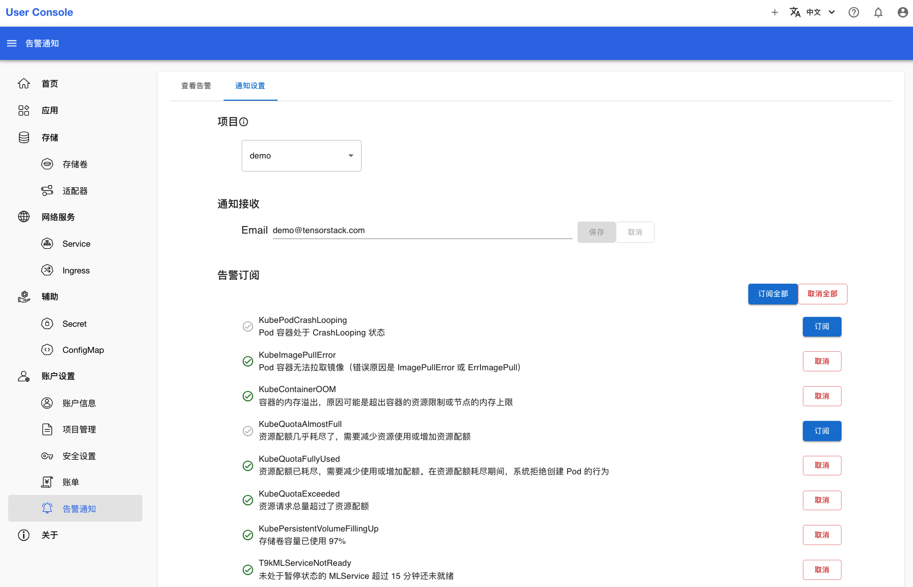

# 告警通知

点击左侧的**账户设置 > 告警通知**，可以查看告警信息。你也可以通过点击上方白色导航栏的右侧的<svg xmlns="http://www.w3.org/2000/svg" viewBox="0 0 24 24"><path d="M10 21h4c0 1.1-.9 2-2 2s-2-.9-2-2m11-2v1H3v-1l2-2v-6c0-3.1 2-5.8 5-6.7V4c0-1.1.9-2 2-2s2 .9 2 2v.3c3 .9 5 3.6 5 6.7v6l2 2m-4-8c0-2.8-2.2-5-5-5s-5 2.2-5 5v7h10v-7Z"/></svg>跳转到这个页面：

<figure class="screenshot">
  
</figure>

展开告警信息，可以看到更详细的说明。包括告警信息的开始时间、状态、标签、注释：

<figure class="screenshot">
  
</figure>

点击上方的**通知**标签页，可以设置告警信息的订阅状态：

<figure class="screenshot">
  
</figure>

填写邮箱地址，勾选你想订阅的告警信息，点击最下方的**保存修改**。被订阅的告警信息触发后，TensorStack AI 平台会发送邮件到指定的邮箱地址：

<figure class="screenshot">
  
</figure>
