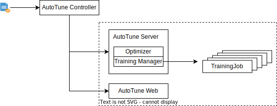

# AutoTune

为了降低 AI 开发门槛和逐渐实现机器学习自动化，TensorStack AI 平台提供了自动化机器学习（AutoML）工具 AutoTune。AutoTune 具有以下特点：

* 内置最新的自动机器学习算法，为用户自动地进行特征工程、神经网络架构搜索、超参调优和模型压缩。
* 提供可视化展示平台，实时跟踪超参数训练过程，以交互式图形和表格的形式刻画多个不同维度的信息，用户可以借此更好地比较、分析、决策出最优参数。
* 持海量实验数据的存储，让用户轻松地实现任意实验结果之间的比较。
* 融合领先的 AI 最佳实践，提供自动化、准确性和协作水平，提高企业 AI 生产效率。

## 基本结构

<figure>
  
</figure>

在上述结构图中：

* AutoTune Controller 是 AutoTuneExperiment 的控制器，可以看做是 AutoTune 实验的入口。用户在集群中创建 AutoTuneExperiment 资源后，由控制器创建 AutoTune Server 和 Web 来执行 AutoTune 实验。
* AutoTune Server 是执行实验的主体，其中包括：
    * Optimizer：超参数调优器，在限定的搜索空间内用特定的调优算法选择合适的超参数组合。
    * Training Manager：训练任务管理器，使用 Optimizer 产生的超参数，创建 TrainingJob 进行训练，并将训练结果反馈给 Optimizer 用于下一次超参数选择。AutoTune 可以同时创建多组 TrainingJob 来测试不同的超参数组合以加快训练效率。目前 AutoTune 支持使用 [TensorFlowTrainingJob](../../t9k-job/tensorflowtrainingjob.md)、[PyTorchTrainingJob](../../t9k-job/pytorchtrainingjob.md) 和 [XGBoostTrainingJob](../../t9k-job/xgboosttrainingjob.md) 进行训练。
* AutoTune Web 是 AutoTune 的可视化界面，你可以通过此界面实时查看实验状态，对比各组超参数对实验产生的影响。
