# 存储

存储系统负责为 Apps 提供数据持久化。它包括[存储卷（PVC）](./pvc.md)和[适配器（StorageShim）](./storageshim.md)两种类型的资源，这些资源确保 Apps 能够可靠地存储和访问数据。存储卷支持 Apps 动态地申请新的数据存储空间，而适配器则帮助 Apps 连接和使用已有的外部存储系统（例如 S3）。

通过有效管理这些存储资源，用户能够灵活地处理大规模模型、数据集文件和其他 AI 开发过程中产生的数据，从而支持各种 AI 应用的高效运行和数据密集型任务的顺利进行。

## 架构

存储系统架构如下图所示：

<figure class="architecture">
  
</figure>

Apps 的数据持久化保存在 PVC 中。PVC 的生命周期与 Apps 是相互独立的，PVC 不会因为 Apps 的删除而被删除。一个 PVC 可以被多个 Apps 同时使用，多个 Apps 对同一个 PVC 的修改是互相可见的。

用户既可以通过直接创建 PVC 来在 TensorStack AI 平台存储系统中动态申请一块新的存储空间，也可以通过创建 StorageShim 来连接一个第三方存储系统（例如 S3 的某个 bucket 下的某个路径，或 CephFS 的某个文件夹），StorageShim 负责根据用户提供的访问凭证（存储在 Secret 中）自动创建并配置好一个 PVC 以供 Apps 使用。
