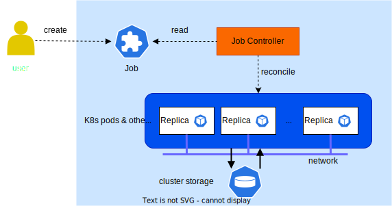

# T9k Job

TensorStack AI 平台定义了一系列 CRD（称为 Job）以支持<a target="_blank" rel="noopener noreferrer" href="https://en.wikipedia.org/wiki/Batch_processing">批处理（Batch Processing）</a>计算任务，特别是 AI 领域的大规模分布式并行训练类型性质的计算。

<figure class="architecture">
  
  <figcaption>图 1：Job 系统的基本原理。用户提交 Job 的定义；Job Controller 1）分析 Job 定义；2）请求计算资源（CPU、RAM、GPU、高速网络、存储...）；3）启动、监控、暂停、继续 、终止、调试 Job。</figcaption>
</figure>

<aside class="note info">

Job

Kubernetes 也定义了一个原生资源 <a target="_blank" rel="noopener noreferrer" href="https://kubernetes.io/zh-cn/docs/concepts/workloads/controllers/job/">batch/v1 Job</a> 以支持通用计算性质的批处理任务。本手册提到 Job 时，一般可根据上下文区分；当上下文不足以提供区分时，本手册将会明确使用 **T9k Job** 或者 **batch/v1 Job**。

</aside>

## Job 类型

为了支持不同框架的计算任务，TensorStack 提供了一系列 Job：

* TrainingJob：一类使用分布式计算框架进行机器学习的 T9k Job。
    * [PyTorchTrainingJob](./pytorchtrainingjob.md)：服务于 <a target="_blank" rel="noopener noreferrer" href="https://pytorch.org/">PyTorch</a> 分布式训练框架的 T9k Job。
    * [TensorFlowTrainingJob](./tensorflowtrainingjob.md)：服务于 <a target="_blank" rel="noopener noreferrer" href="https://www.tensorflow.org/guide/distributed_training">TensorFlow</a> 分布式训练框架的 T9k Job。
    * [XGBoostTrainingJob](./xgboosttrainingjob.md)：服务于 <a target="_blank" rel="noopener noreferrer" href="https://xgboost.readthedocs.io/en/latest/">XGBoost</a> 分布式计算框架的 T9k Job。
    * [ColossalAIJob](./colossalaijob.md)：服务于 <a target="_blank" rel="noopener noreferrer" href="https://colossalai.org/">ColossalAI</a> 分布式训练框架的 T9k Job。
    * [DeepSpeedJob](./deepspeedjob.md)：服务于 <a target="_blank" rel="noopener noreferrer" href="https://www.deepspeed.ai/">DeepSpeed</a> 分布式训练框架的 T9k Job。
* [MPIJob](./mpijob.md)：MPIJob 使用户能够方便地在集群环境中使用 <a target="_blank" rel="noopener noreferrer" href="https://www.open-mpi.org/">OpenMPI</a> 进行并行计算。
* [BeamJob](./beamjob.md)：用于在集群中通过 <a target="_blank" rel="noopener noreferrer" href="https://beam.apache.org/documentation/sdks/python/">Apache Beam Python SDK</a> 运行分布式计算任务，并支持多种底层计算引擎（例如 Apache Spark, Apache Flink）。
* [GenericJob](./genericjob.md)：一个通用的 T9k Job 资源，支持各种并行计算场景及 T9k 高级调度策略。
    * GenericJob 十分灵活，用户可以使用 GenericJob 实现 MPIJob、PyTorchTrainingJob 等特定功能的 T9k Job；但其自动化程度低，需要手工设置很多参数。
    * GenericJob 的目的是提供一个总是可行的 “通用” 机制，以支持一些其他特定功能 T9k Job 还未支持的新的计算场景。 

## 运行模式

T9k Job 支持多种运行模式（`spec.runMode`）：

* 立即（Immediate）模式：默认、基本模式。Job 被分配资源后，将会立即开始运行。
* 调试（Debug）模式：帮助用户创建 Job 环境，但不立即执行，用户可以在训练环境中手动启动 Job 或者运行调试代码。
* 暂停（Pause）模式：暂停执行 Job；在一些场合下（如集群资源不足），用户可随时暂停 Job，待条件允许再继续执行 Job。
* 弹性（Elastic）伸缩模式：可以动态调整 Job 规模。

以下是各类型 Job 支持的模式列表：

| Job 类型              | 立即模式 | 调试模式 | 暂停模式 | 弹性伸缩模式 |
| --------------------- | -------- | -------- | -------- | ------------ |
| GenricJob             | *        | *        | *        |              |
| PyTorchTrainingJob    | *        | *        | *        | *            |
| TensorFlowTrainingJob | *        | *        | *        |              |
| XGBoostTrainingJob    | *        | *        | *        |              |
| MPIJob                | *        | *        | *        |              |
| ColossalAIJob         | *        | *        | *        |              |
| DeepSpeedJob          | *        | *        | *        | *            |
| BeamJob               | *        |          |          |              |

各种模式的具体使用方式，请参考对应 Job 类型的文档。
