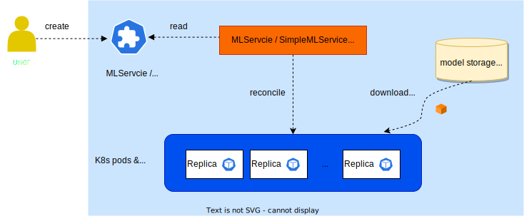

# T9k Service

TensorStack AI 平台的模型部署模块可以帮助你快速地将训练完成的 AI 模型部署为推理服务。

针对不同的应用场景，有以下两种 TensorStack API 可供使用：

* **[MLService](./mlservice.md)** 是完善的模型推理服务，可用于生产环境，具有以下特性：
    * 基于 Serverless 架构，服务容量（serving capacity）可根据负载自动伸缩；
    * 自动暴露服务到集群外部，快速上线。
* **[SimpleMLService](./simplemlservice.md)** 是精简的模型推理服务，可用于快速测试、固定容量部署等场景。具有以下特性：
    * 服务副本数目（replica）固定；
    * 集群外部访问需要额外配置 Ingress 等资源。

同时，TensorStack AI 平台对模型部署提供自动化的运维支持，包括性能和资源的监控告警以及故障检测，以保障推理服务长期可靠运行。

## 架构

模型部署模块的架构如下图：

<figure class="architecture">
  
</figure>

根据用户提供的[模型存储](storage.md)位置和 AI 框架等设置，模型部署模块的控制器（controller）协调模型下载并启动模型推理服务。

## 下一步

* 了解 [SimpleMLService](simplemlservice.md)
* 了解 [MLService](mlservice.md)
* 了解 [模型存储](storage.md)
