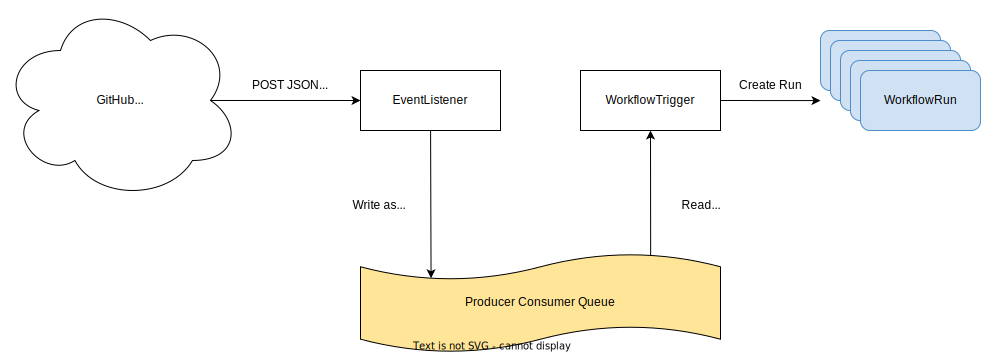

# WorkflowTrigger

Workflow Trigger 模块额外提供了一种基于特定事件自动触发执行 [WorkflowRun](./workflowrun.md) 的能力，便于用户在一些特定场景下的自动化工作流运行。

## 架构

Workflow Trigger 模块提供了 EventListener 和 WorkflowTrigger 自定义扩展资源，整体架构如下图所示：

<figure> 

</figure>

其中：

* EventListener 作为事件入口接收 JSON 格式的 HTTP POST 请求，同时将请求信息转换成 <a target="_blank" rel="noopener noreferrer" href="https://github.com/cloudevents/spec">CloudEvents</a> 格式并转发至事件队列。
* WorkflowTrigger 绑定一个或多个 EventListener 作为事件源，接收来自这些 EventListener 的 <a target="_blank" rel="noopener noreferrer" href="https://github.com/cloudevents/spec">CloudEvents</a> 格式的事件消息，并触发一个 WorkflowRun 的运行。特别地，支持对事件内容进行过滤，以及解析事件的某些字段的值填充到 WorkflowRun 的参数中。

## 快速开始

下面将通过几个简单的步骤来演示 Workflow Trigger 模块的基本使用方法。下面创建的所有资源请确保属于同一个命名空间。

### 1）创建 WorkflowTemplate

创建文件 workflow-template-sample.yaml：

```yaml
apiVersion: batch.tensorstack.dev/v1beta1
kind: WorkflowTemplate
metadata:
  name: workflow-template-sample
spec:
  description: This WorkflowTemplate creates and runs a Pod.
  params:
    - name: message
      default: "TensorStack"
  type: Pod
  pod:
    containers:
      - name: hello
        image: ubuntu:latest
        resources:
          limits:
            cpu: 100m
            memory: 100Mi
        command: ["echo"]
        args: ["Hello $(params.message)!"]
```

上面的示例定义了一个名为 `message` 的参数，同时将该参数值以 `$(params.message)` 的形式传递到 Pod 的容器的 `args` 参数上，执行下面的命令创建 WorkflowTemplate：

```bash
kubectl apply -f workflow-template-sample.yaml
```

该 WorkflowTemplate 将作为一个静态模板用于执行一次 WorkflowRun 的运行。

### 2）创建 EventListener

创建文件 event-listener-sample.yaml：

```yaml
apiVersion: tensorstack.dev/v1beta1
kind: EventListener
metadata:
  name: event-listener-sample
spec:
  replicas: 1
```

执行下面的命令创建一个 EventListener：

```yaml
kubectl apply -f event-listener-sample.yaml
```

### 3）创建 WorkflowTrigger

创建文件 workflow-trigger-sample.yaml：

```yaml
apiVersion: tensorstack.dev/v1beta1
kind: WorkflowTrigger
metadata:
  name: workflow-trigger-sample
spec:
  eventSources:
  - eventListenerName: event-listener-sample
  replicas: 1
  serviceAccountName: managed-project-sa
  workflowRunSpec:
    params:
    - name: message
      value: $(body.hello)
    workflowTemplateRef: workflow-template-sample
```

上面的示例以 `$(body.hello)` 的形式将 HTTP 请求体中的 `hello` 字段值传递到 param `message` 上，执行下面的命令创建 WorkflowTrigger：

```bash
kubectl apply -f workflow-trigger-sample.yaml
```

### 4）触发事件

通过执行下面的命令来查询 EventListener HTTP 服务的访问地址：

```yaml
$ kubectl get eventlisteners event-listener-sample -o json | jq .status.address
{
  "inClusterURL": "http://event-listener-sample-eventlistener-2dbfe.default.svc.cluster.local",
  "url": "https://<tensorstack-host>/t9k/workflow/triggers/default/event-listener-sample"
}
```

其中 `url` 字段为集群外部访问 EventListener HTTP 服务的地址，使用 curl 命令向此地址发送 HTTP 请求来模拟触发事件：

```bash
curl -X POST https://<tensorstack-host>/t9k/workflow/triggers/default/event-listener-sample \
  -d '{"hello": "world"}'
```

其中 `-d '{"hello": "world"}'` 标识 HTTP 请求的 JSON 格式的 body 内容为 `{"hello": "world"}`，`hello` 字段值 `"world"` 将作为参数传递到 WorkflowRun，HTTP 服务将返回 success 表示请求已经发送成功。

### 5）查看 WorkflowRun

上面的步骤全部执行成功以后，WorkflowTrigger 将会触发一次 WorkflowRun 的运行，通过下面的命令进行查询：

```bash
$ kubectl get workflowruns
NAME                                                  PHASE
event-listener-sample-workflow-trigger-sample-87a0d   Succeeded
```

根据返回的结果可以看出，WorkflowRun 已经创建成功。该 WorkflowRun 将根据上面 WorkflowTemplate 静态模块的内容创建一个 Pod，通过下面的命令进行查询：

```bash
$ kubectl get pod -l batch.tensorstack.dev/workflowRun=event-listener-sample-workflow-trigger-sample-87a0d
NAME                                                            READY   STATUS      RESTARTS   AGE
event-listener-sample-workflow-trigger-sample-87a0d-pod-6stvb   0/1     Completed   0          3m23s
```

根据返回的结果可以看出，Pod 已经创建成功，通过查询该 Pod 日志来校验参数传递：

```bash
$ kubectl logs event-listener-sample-workflow-trigger-sample-87a0d-pod-6stvb
Hello world!
```

Pod 日志成功打印出 `“world”` 内容，其为手动触发事件中发送的 HTTP 请求的 body 内容，参数成功传递。

至此，Workflow Trigger 模块的基本使用方法已经介绍完成，阅读下面的章节来获取更详细的配置信息。

## EventListener

EventListener 内部运行着一个 HTTP 服务，用于接收第三方的请求，同时将请求消息转换成 <a target="_blank" rel="noopener noreferrer" href="https://github.com/cloudevents/spec">CloudEvents</a> 并将它们转发至事件队列。当前 EventListener 只支持 **JSON** 格式的 HTTP **POST** 请求。

### 创建 EventListener

下面是一个基本的 EventListener 示例：

```yaml
apiVersion: tensorstack.dev/v1beta1
kind: EventListener
metadata:
  name: event-listener-sample
spec:
  replicas: 1
  resources:
    requests:
      memory: "100Mi"
      cpu: "100m"
    limits:
      memory: "200Mi"
      cpu: "200m"
```

在该例中：

* `replicas` 字段定义所要创建的 Pod 副本数量，默认是 1。
* `resources` 字段定义每个 Pod 的资源限制，上述示例为缺省时的默认值。

### EventListener 状态

通过 EventListener 的状态字段可以获取其访问地址和运行状态信息，示例如下：

```yaml
status:
  address:
    inClusterURL: http://<eventlistener-service-name>.default.svc.cluster.local
    url: https://<tensorstack-host>/t9k/workflow/triggers/default/<eventlistener-name>
  conditions:
  - lastTransitionTime: "2022-12-05T10:23:49Z"
    message: The EventListener is Ready
    status: "True"
    type: Ready
```

其中：

* `status.address` 表示 EventListener 所创建的 HTTP 服务的访问地址，第三方可向此地址发送请求，其中：
    * `inClusterURL` 是只能从集群内部访问的地址。
    * `url` 是可以从集群外部访问的地址。
* `status.conditions` 表示 EventListener 的状态：
    * `type: Ready` 表示 EventListener 是否就绪，可能的值有 `True`、`False`、`Unknown`。

## WorkflowTrigger

WorkflowTrigger 从一个或多个 EventListener 事件源获取事件消息，并触发一个 WorkflowRun 的运行。

WorkflowTrigger 支持对每个 EventListener 配置过滤条件，只有符合过滤条件的事件消息才会被进一步处理；WorkflowTrigger 同时支持将事件消息的某些字段解析并填充到 WorkflowRun 的参数执行。

### 创建 WorkflowTrigger

下面是一个基本的 WorkflowTrigger 示例：

```yaml
apiVersion: tensorstack.dev/v1beta1
kind: WorkflowTrigger
metadata:
  name: workflow-trigger-sample
spec:
  eventSources:
  - eventListenerName: event-listener-sample
  replicas: 1
  resources:
    requests:
      memory: "100Mi"
      cpu: "100m"
    limits:
      memory: "200Mi"
      cpu: "200m"
  serviceAccountName: managed-project-sa
  workflowRunSpec:
    workflowTemplateRef: workflow-template-sample
```

在该例中：

* `eventSources` 字段定义了该 WorkflowTrigger 需要订阅事件消息的事件源集合，其中：
* `eventListenerName` 表示上述 EventListener 的名称，该 EventListener 必须与该 WorkflowTrigger 同命名空间、且已成功创建。
* `replicas` 字段定义了该 WorkflowTrigger 创建的 Pod 副本数量，默认是 1。
* `resources` 字段定义每个 Pod 的资源限制，上述示例为缺省时的默认值。
* `serviceAccountName` 字段定义了该 WorkflowTrigger 创建的 Pod 的 ServiceAccount，为创建 WorkflowRun 提供权限。
* `workflowRunSpec` 字段定义了将要创建的 WorkflowRun 的配置规约，其中：
    * `workflowTemplateRef` 表示所要运行的 WorkflowTemplate 的名称，该 WorkflowTemplate 必须与该 WorkflowTrigger 同命名空间、且已成功创建。该字段同时支持内嵌 WorkflowTemplate 规约，详见 [WorkflowRun](./workflowrun.md#创建内嵌-workflowtemplate-规约的-workflowrun)。

### 过滤事件

WorkflowTrigger 支持对来自 EventListener 的事件消息进行过滤，只有符合过滤条件的事件消息才会被进一步处理。下面是一个包含过滤条件的 WorkflowTrigger 示例：

```yaml
apiVersion: tensorstack.dev/v1beta1
kind: WorkflowTrigger
metadata:
  name: filter-workflow-trigger-sample
spec:
  eventSources:
  - eventListenerName: event-listener-sample
    filters:
    - path: body.object_attributes.work_in_progress
      type: bool
      values:
      - "false"
    - path: body.labels.0.id
      type: number
      values:
      - "219"
      - "3"
      - "99"
    - path: body.object_kind
      type: string
      values:
      - "merge_request"
  serviceAccountName: managed-project-sa
  workflowRunSpec:
    workflowTemplateRef: workflow-template-sample
```
 
在该例中，`spec.eventSources.filters` 定义了该 EventListener 的过滤条件集合，其中：

* `path` 表示 HTTP 请求路径，例如 header.X-Github-Event、body.pull_request.state。
* `type` 表示该路径指向字段的值的类型，当前支持 bool、number、string。
* `values` 表示该路径指向字段的值的可允许值的集合，其为 string 类型。

每个 EventListener 的 `filters` 互不影响，针对某一个 EventListener，其所有的 `filters` 必须全部通过才算符合条件。

### 解析参数

WorkflowTrigger 支持对来自 EventListener 的事件消息进行解析，并将指定字段的值通过参数的形式传递到 WorkflowRun。下面是一个包含解析参数的 WorkflowTrigger 示例：

```yaml
apiVersion: tensorstack.dev/v1beta1
kind: WorkflowTrigger
metadata:
  name: param-workflow-trigger-sample
spec:
  eventSources:
  - eventListenerName: event-listener-sample
  serviceAccountName: managed-project-sa
  workflowRunSpec:
    params:
    - name: bool-name
      value: $(body.test.boolT)
    - name: number-name
      value: $(body.test.numberT)
    - name: string-name
      value: $(body.test.stringT)
    workflowTemplateRef: workflow-template-sample
```

在该例中，`spec.workflowRunSpec.params` 定义了将创建的 WorkflowRun 的参数集合，其中：

* `name` 表示参数名称。
* `value` 表示参数的值，可通过 `$()` 形式从事件消息中获取指定字段的值。当前不支持 `$()` 嵌套。

### WorkflowTrigger 状态

通过 WorkflowTrigger 的状态字段可以获取其运行状态信息，示例如下：

```yaml
status:
  conditions:
  - lastTransitionTime: "2022-12-05T10:26:46Z"
    message: The WorkflowTrigger is Ready
    status: "True"
    type: Ready
```

其中：

* `status.conditions` 表示 WorkflowTrigger 的状态：
    * `type: Ready` 表示 WorkflowTrigger 是否就绪，可能的值有 `True`、`False`、`Unknown`。
