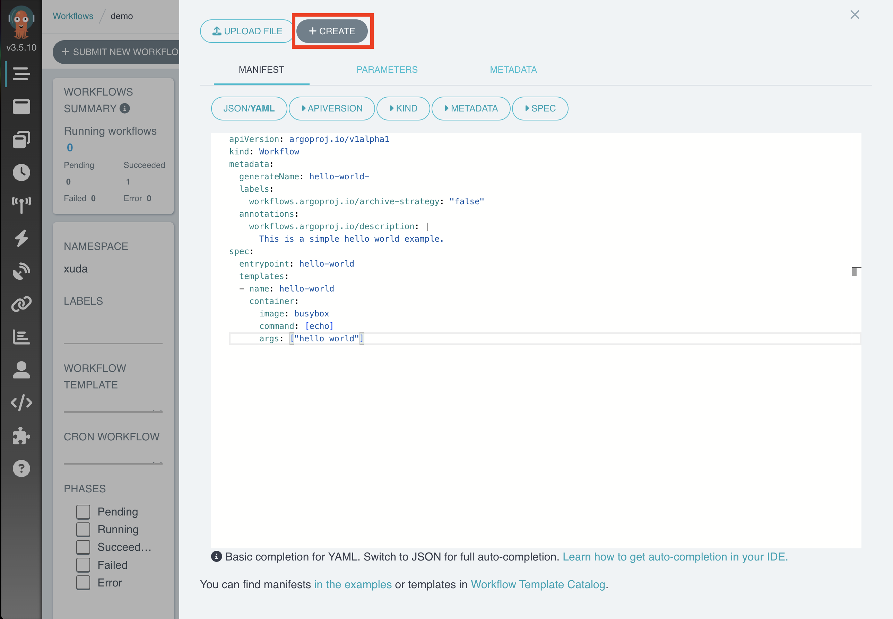
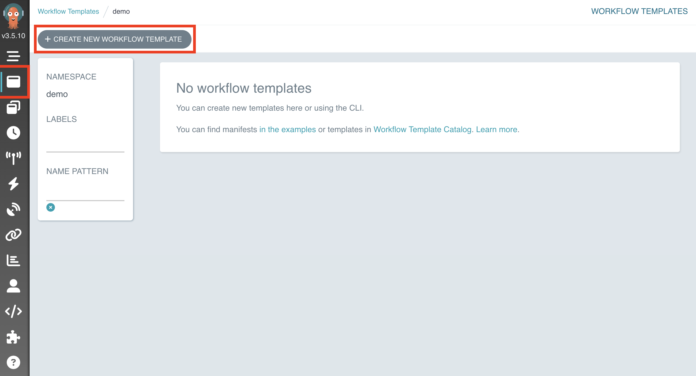

# Argo Workflows

<a target="_blank" rel="noopener noreferrer" href="https://argoproj.github.io/workflows//">Argo Workflows</a> 是一个被广泛使用的开源工作流编排引擎。本应用提供一个直观的可视化界面，用于创建、运行查看工作流状态或日志，也无需手动编辑 YAML 配置文件。Workflow 的界面展示了用户所关心的所有工作流相关信息，并且引导用户填写创建工作流所需的各个字段，从而简化了操作流程。

## 使用方法

待 App 就绪后，点击右侧的 <span class="twemoji"><svg class="MuiSvgIcon-root MuiSvgIcon-colorPrimary MuiSvgIcon-fontSizeMedium css-jxtyyz" focusable="false" aria-hidden="true" viewBox="0 0 24 24" data-testid="OpenInNewIcon"><path d="M19 19H5V5h7V3H5c-1.11 0-2 .9-2 2v14c0 1.1.89 2 2 2h14c1.1 0 2-.9 2-2v-7h-2zM14 3v2h3.59l-9.83 9.83 1.41 1.41L19 6.41V10h2V3z"></path></svg></span> 进入控制台：

<figure class="screenshot">
  
</figure>

### 创建完整 Workflow

点击 “SUBMIT NEW WORKFLOW” 来创建一个 Workflow：

<figure class="screenshot">
  
</figure>

在 Argo Worklfows 中，你可以直接在 Workflow 中填写全部运行所需信息，或者先创建一个 WorkflowTemplate 作为模板、然后创建一个 Workflow 引用该模板并填写必要的参数。

首先，点击 “Edit using full workflow options”，直接在 Workflow 中填写全部运行所需信息：

<figure class="screenshot">
  
</figure>

将下面的 Workflow YAML 示例复制到编辑框中，并点击 “CREATE” 创建：

```yaml
apiVersion: argoproj.io/v1alpha1
kind: Workflow
metadata:
  generateName: hello-world-
  labels:
    workflows.argoproj.io/archive-strategy: "false"
  annotations:
    workflows.argoproj.io/description: |
      This is a simple hello world example.
spec:
  entrypoint: hello-world
  templates:
  - name: hello-world
    container:
      image: busybox
      command: [echo]
      args: ["hello world"]
```

上述 Workflow 示例会打印一行 `hello world`。

创建成功后自动跳转至 Workflow 详情页面，你可以在此查看 Workflow 的运行状态、日志等信息：

<figure class="screenshot">
  
</figure>

### 创建 WorkflowTemplate 和 Workflow

接下来演示如何先创建一个 Workflowtemplate，然后再创建一个 Workflow 引用它。

点击左侧导航栏中的第二个图标进入 WorkflowTemplate 列表页面：

<figure class="screenshot">
  
</figure>

点击 “CREATE NEW WORKFLOWTEMPLATE” 创建一个 WorkflowTemplate：

<figure class="screenshot">
  
</figure>

将下面的 WorkflowTemplate YAML 复制到编辑框中，并点击 “CREATE” 创建：

```yaml
apiVersion: argoproj.io/v1alpha1
kind: WorkflowTemplate
metadata:
  name: workflow-template-print-message
spec:
  entrypoint: print-message
  templates:
  - name: print-message
    inputs:
      parameters:
      - name: message
    container:
      image: busybox
      command: [echo]
      args: ["{{inputs.parameters.message}}"]
```

上述 WorkflowTemplate 示例要求传入一个名为 `message` 的参数，并将参数的值打印出来。

然后，以[上一节](#创建完整-workflow)相同的方式创建下面的 Workflow：

```yaml
apiVersion: argoproj.io/v1alpha1
kind: Workflow
metadata:
  generateName: workflow-template-hello-world-
spec:
  entrypoint: hello-world-from-templateRef
  templates:
  - name: hello-world-from-templateRef
    steps:
      - - name: call-print-message
          templateRef:
            name: workflow-template-print-message
            template: print-message
          arguments:
            parameters:
            - name: message
              value: "hello world"
```

上述 Workflow 示例引用了之前的 WorkflowTemplate，并设置了参数 `message` 的值为 `hello world`。因此，该 Workflow 的运行结果与上一节相同。


## 下一步

* 查看 [Argo Workflows 官方文档](https://argo-workflows.readthedocs.io/en/latest/)
* 查看 [Argo Workflows 示例](https://github.com/argoproj/argo-workflows/tree/main/examples)
