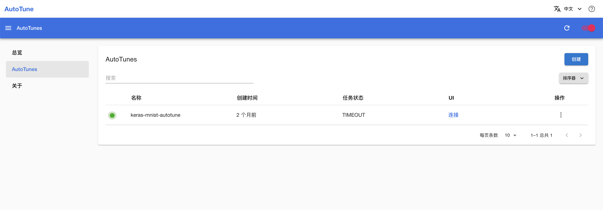

# AutoTune

AutoTune 是一个自动化机器学习（AutoML）工具，是平台的原生应用。它提供了一个用户友好的界面，方便用户创建自动化机器学习实验、查看实验的详细信息。

## 使用方法

待 App 就绪后，点击右侧的 <svg class="MuiSvgIcon-root MuiSvgIcon-colorPrimary MuiSvgIcon-fontSizeMedium css-jxtyyz" focusable="false" aria-hidden="true" viewBox="0 0 24 24" data-testid="OpenInNewIcon"><path d="M19 19H5V5h7V3H5c-1.11 0-2 .9-2 2v14c0 1.1.89 2 2 2h14c1.1 0 2-.9 2-2v-7h-2zM14 3v2h3.59l-9.83 9.83 1.41 1.41L19 6.41V10h2V3z"></path></svg> 进入控制台：

<figure class="screenshot">
  
</figure>

用户可以在控制台创建 AutoTuneExperiment 以进行自动化机器学习。

<!-- 控制台的使用方法请参阅 -->

## 下一步

* 了解 [AutoTuneExperiment](../api/autotuneexperiment.md)
