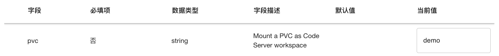

# Code Server

<a target="_blank" rel="noopener noreferrer" href="https://github.com/coder/code-server">Code Server</a> 是一个基于浏览器的开源开发环境，它将 Visual Studio Code 的强大功能带到了云端。这个工具允许开发者通过网页访问完整的 VS Code 编辑器，无需在本地安装任何软件。Code Server 支持多种编程语言和框架，并且可以在远程服务器或云平台上运行，使得开发者能够在任何设备上进行编码工作。

在实际应用中，Code Server 特别适合远程工作和协作开发场景。它支持多人同时编辑同一项目，并且可以轻松集成版本控制系统如 Git。Code Server 还保留了 VS Code 的插件生态系统，用户可以安装和使用各种扩展来增强开发体验。此外，由于代码和开发环境都在服务器上，Code Server 可以帮助团队统一开发环境，减少因本地环境差异导致的问题。


## 使用方法

待 App 就绪后，点击右侧的 <span class="twemoji"><svg class="MuiSvgIcon-root MuiSvgIcon-colorPrimary MuiSvgIcon-fontSizeMedium css-jxtyyz" focusable="false" aria-hidden="true" viewBox="0 0 24 24" data-testid="OpenInNewIcon"><path d="M19 19H5V5h7V3H5c-1.11 0-2 .9-2 2v14c0 1.1.89 2 2 2h14c1.1 0 2-.9 2-2v-7h-2zM14 3v2h3.59l-9.83 9.83 1.41 1.41L19 6.41V10h2V3z"></path></svg></span> 进入网页 UI，即可进行开发工作。

<figure class="screenshot">
  
</figure>

网页 UI 的使用方法请参阅 <a target="_blank" rel="noopener noreferrer" href="https://code.visualstudio.com/docs">Visual Studio Code Docs</a> 和 <a target="_blank" rel="noopener noreferrer" href="https://coder.com/docs/code-server/FAQ">FAQ of Code Server</a>。

## 配置和使用说明

### 镜像

App 可以选用的镜像请参阅 README 的镜像列表部分。

每个镜像都包含 Code Server 和特定的环境（机器学习框架或 conda 环境），预装了一些 Python 包、命令行工具和平台工具，并且创建并使用一个新的用户：

* 每个镜像预装的 Python 包各不相同，请执行 `pip list` 命令以查看。
* 所有镜像均预装了以下命令行工具：

| 名称    | 介绍                                                                   |
| ------- | ---------------------------------------------------------------------- |
| curl    | 用于从或向服务器传输数据，支持多种协议。                               |
| git     | 分布式版本控制系统，用于跟踪和协作开发软件项目的源代码。               |
| git-lfs | Git 的扩展，用于版本控制大型文件。                                     |
| htop    | 一个交互式的系统监视器，用于实时查看和管理运行中的进程。               |
| kubectl | 用于管理 Kubernetes 集群和应用程序的命令行工具。                       |
| nano    | 一个简单易用的命令行文本编辑器，用于创建和编辑文本文件。               |
| rclone  | 用于在本地和云存储之间同步、管理文件的命令行程序，支持多种云存储服务。 |
| rsync   | 用于高效同步和传输文件，支持本地和远程文件。                           |
| s3cmd   | 用于管理 Amazon S3 云存储服务。                                        |
| ssh     | 用于安全地远程访问和管理服务器。                                       |
| tmux    | 终端复用器，允许在一个终端窗口中运行多个终端会话。                     |
| unzip   | 用于解压缩 ZIP 文件。                                                  |
| vim     | 一款高效、可定制的文本编辑器，常用于编程和文本编辑。                   |
| wget    | 用于从网络上下载文件，支持 HTTP、HTTPS 和 FTP 协议。                   |
| zip     | 用于创建和管理 ZIP 压缩文件。                                          |

* 所有镜像均预装了最新版本的[平台工具](../tool/index.md)。
* 所有镜像均创建 GID 为 1000、名称为 t9kuser 的用户组，以及属于该用户组、UID 为 1000、名称为 t9kuser、HOME 目录为 `/t9k/mnt` 的用户，并使用该用户。

### 挂载 PVC

**必须**为 App（的容器）挂载一个 PVC 作为工作空间。下面的配置示例挂载 PVC demo 作为工作空间：

```yaml
pvc: "demo"

...
```

<figure class="screenshot">
  
</figure>

PVC 的挂载路径为 `/t9k/mnt`，即镜像使用的 t9kuser 用户的 HOME 目录。

挂载的 PVC 负责存储开发相关的文件，这些文件可以是通过 Code Server 的 UI 上传或创建的，也可以是通过 Code Server 的终端从网络下载或运行程序产生的。此外，挂载的 PVC 还负责存储 conda 环境和 conda 包的文件（位于 `/t9k/mnt/.conda` 路径下）、Python 包的文件（位于 `/t9k/mnt/.local/lib/python3.11` 路径下），以及[扩展](#扩展)的文件（位于 `/t9k/mnt/.local/share/code-server` 路径下）。如果你需要安装较多、较大的 conda 包、Python 包或扩展，请确保挂载的 PVC 留有足够的存储空间。

T9k Job、T9k Service 等工作负载可以和 App 挂载同一个 PVC 以共享存储。例如创建一个 PyTorchTrainingJob，其利用通过 JupyterLab 准备好的训练脚本和数据集文件以启动训练；或者创建一个 SimpleMLService，其读取下载好的模型文件以启动推理服务。

### 用户权限

在 App 的容器环境中，用户的 UID:GID 为 1000:1000，这会导致系统级操作受到限制（权限不足）。例如，用户无法使用 `apt install` 命令安装开发所需的库，无法执行 `rm` 命令删除没有写权限的文件（这些文件可能是由挂载了同一个 PVC 且使用 root 用户的 Job 产生的）。

在某些情况下，进行系统级操作是必要或便利的，解决方案是为 App 选用**标签带有 `-sudo` 后缀**的镜像，在需要提升权限的命令前加上 `sudo`，以 root 身份执行该命令。

<aside class="note warning">
<div class="title">警告</div>

使用 `sudo` 命令可能会带来安全风险，请仅在必要时使用，并确保了解每个命令的作用。

</aside>

### 扩展

[和 VS Code 一样](https://code.visualstudio.com/docs/editor/extension-marketplace)，你也可以在 Code Server 中安装、管理、配置和使用扩展。所有镜像还预装了以下扩展：

| 名称                                                      | 介绍                                                                                                |
| --------------------------------------------------------- | --------------------------------------------------------------------------------------------------- |
| Chinese (Simplified) Language Pack for Visual Studio Code | 此中文（简体）语言包为 VS Code 提供本地化界面。                                                     |
| Jupyter                                                   | 为当前 Jupyter Notebook 支持的语言内核提供基本的支持，并允许使用任何 Python 环境作为 Jupyter 内核。 |
| Jupyter Cell Tags                                         | 为 Notebook 单元格标签提供支持，以便使用 papermill、nbconvert、nbgrader 等工具。                    |
| Jupyter Keymap                                            | 为 Notebook 提供键盘映射，以匹配 Jupyter Notebook 中的键盘绑定。                                    |
| Jupyter Notebook Renderers                                | 为 Jupyter Notebook 的输出提供渲染器。                                                              |
| Jupyter Slide Show                                        | 为 Notebook 单元格添加幻灯片类型。                                                                  |
| Python                                                    | 为 Python 语言提供丰富支持，为其他 Python 扩展提供接入点                                            |
| Python Debugger                                           | 使用 debugpy 进行 Python 调试。                                                                     |

<aside class="note">
<div class="title">注意</div>

[VS Code 扩展市场](https://marketplace.visualstudio.com/vscode)和 [Code Server 扩展市场](https://xextensions.coder.com/)是分开的；并非所有 VS Code 扩展都适用于 Code Server。

</aside>
