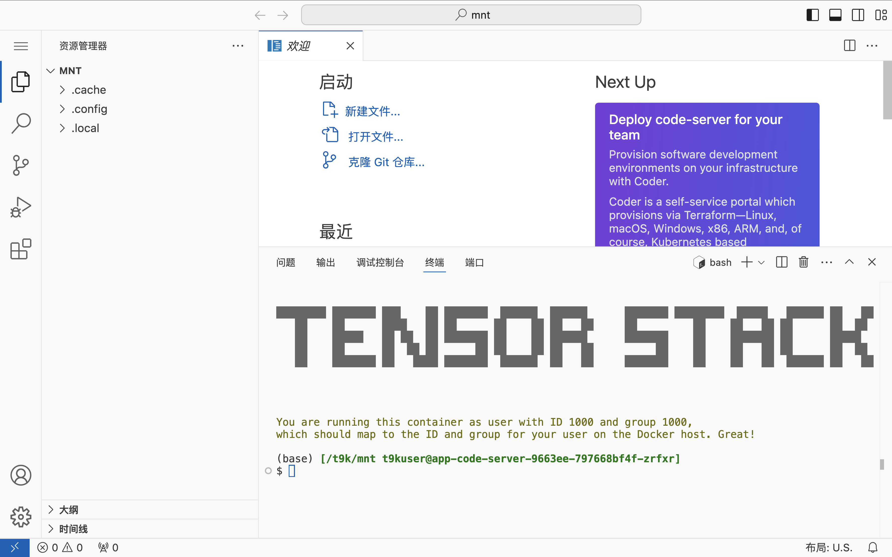

# Code Server

<a target="_blank" rel="noopener noreferrer" href="https://github.com/coder/code-server">Code Server</a> 是一个基于浏览器的开源开发环境，它将 Visual Studio Code 的强大功能带到了云端。这个工具允许开发者通过网页访问完整的 VS Code 编辑器，无需在本地安装任何软件。Code Server 支持多种编程语言和框架，并且可以在远程服务器或云平台上运行，使得开发者能够在任何设备上进行编码工作。

在实际应用中，Code Server 特别适合远程工作和协作开发场景。它支持多人同时编辑同一项目，并且可以轻松集成版本控制系统如 Git。Code Server 还保留了 VS Code 的插件生态系统，用户可以安装和使用各种扩展来增强开发体验。此外，由于代码和开发环境都在服务器上，Code Server 可以帮助团队统一开发环境，减少因本地环境差异导致的问题。

## 使用方法

待 App 就绪后，点击右侧的 <svg class="MuiSvgIcon-root MuiSvgIcon-colorPrimary MuiSvgIcon-fontSizeMedium css-jxtyyz" focusable="false" aria-hidden="true" viewBox="0 0 24 24" data-testid="OpenInNewIcon"><path d="M19 19H5V5h7V3H5c-1.11 0-2 .9-2 2v14c0 1.1.89 2 2 2h14c1.1 0 2-.9 2-2v-7h-2zM14 3v2h3.59l-9.83 9.83 1.41 1.41L19 6.41V10h2V3z"></path></svg> 进入网页 UI，即可进行开发工作。

<figure class="screenshot">
  
</figure>

网页 UI 的使用方法请参阅 [Visual Studio Code Docs](https://code.visualstudio.com/docs) 和 [Visual Studio Code for the Web](https://code.visualstudio.com/docs/editor/vscode-web)。

## 使用说明

* App 最多可以使用 0.2 个 CPU（核心）和 200 MiB 内存资源，不可使用 GPU 等加速设备。
* 在 App 的容器环境中，用户的 uid:gid 为 1000:1000（fsgroup 为 2000），这意味着系统级操作受到限制（权限不足）。
