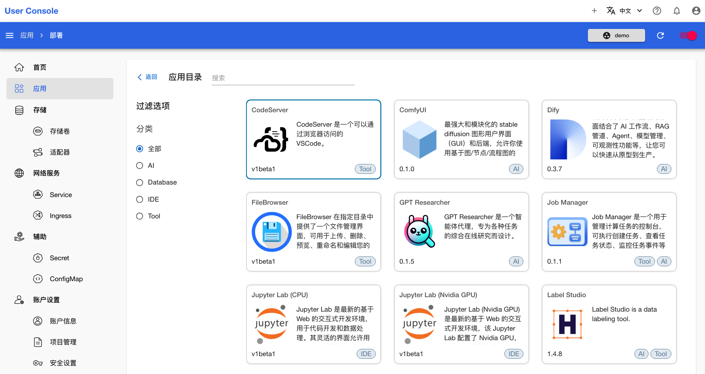
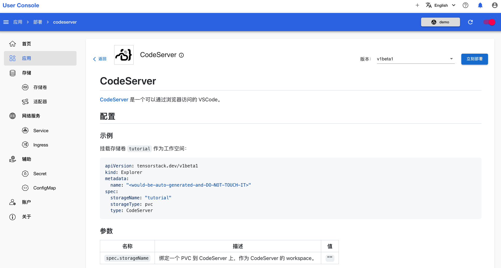
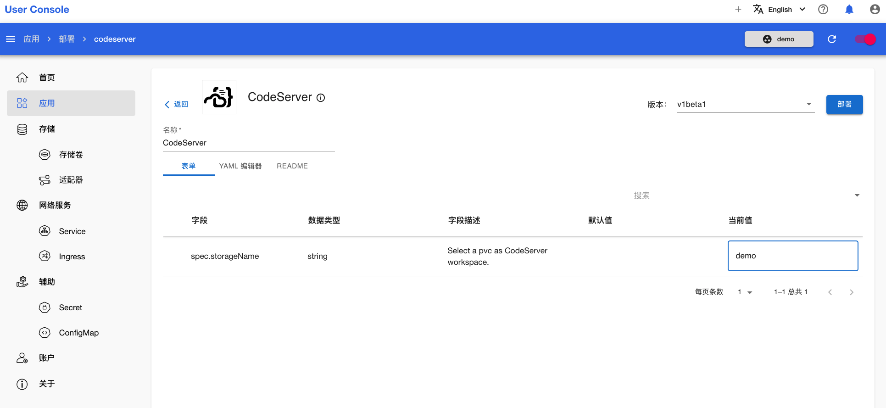
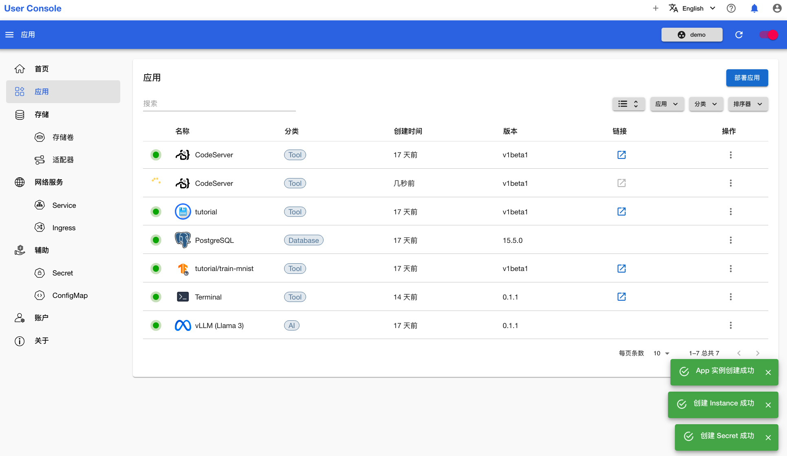
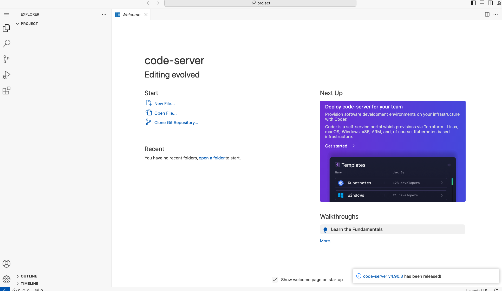

# 部署 CodeServer

CodeServer 是一个可以通过浏览器访问的 VSCode 服务。本教程演示如何部署 CodeServer 应用。

点击 **CodeServer** 应用，进入 App 详情页面：

<figure class="screenshot">
  
</figure>

在 App 详情页面，你可以看到如何配置 CodeServer，这包含了示例 YAML 及参数说明。确认信息后，点击右上角的**立刻部署**进入创建页面：

<figure class="screenshot">
  
</figure>

通过**表单**配置 CodeServer。为 `spec.storageName` 字段赋值 `demo`，即之前创建的存储卷的名称。然后点击右上角的**部署**：

<figure class="screenshot">
  
</figure>

等待创建成功的 CodeServer 应用就绪：

<figure class="screenshot">
  
</figure>

应用就绪后，点击右侧的 <svg class="MuiSvgIcon-root MuiSvgIcon-colorPrimary MuiSvgIcon-fontSizeMedium css-jxtyyz" focusable="false" aria-hidden="true" viewBox="0 0 24 24" data-testid="OpenInNewIcon"><path d="M19 19H5V5h7V3H5c-1.11 0-2 .9-2 2v14c0 1.1.89 2 2 2h14c1.1 0 2-.9 2-2v-7h-2zM14 3v2h3.59l-9.83 9.83 1.41 1.41L19 6.41V10h2V3z"></path></svg>，即可使用该应用：

<figure class="screenshot">
  
</figure>
