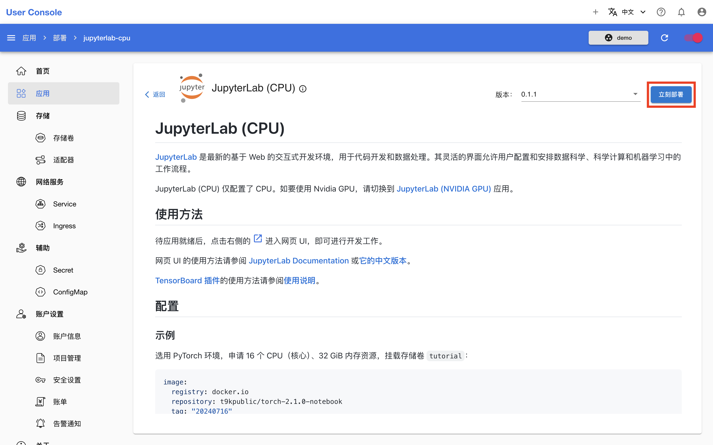
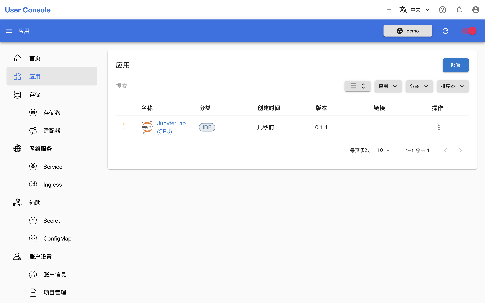
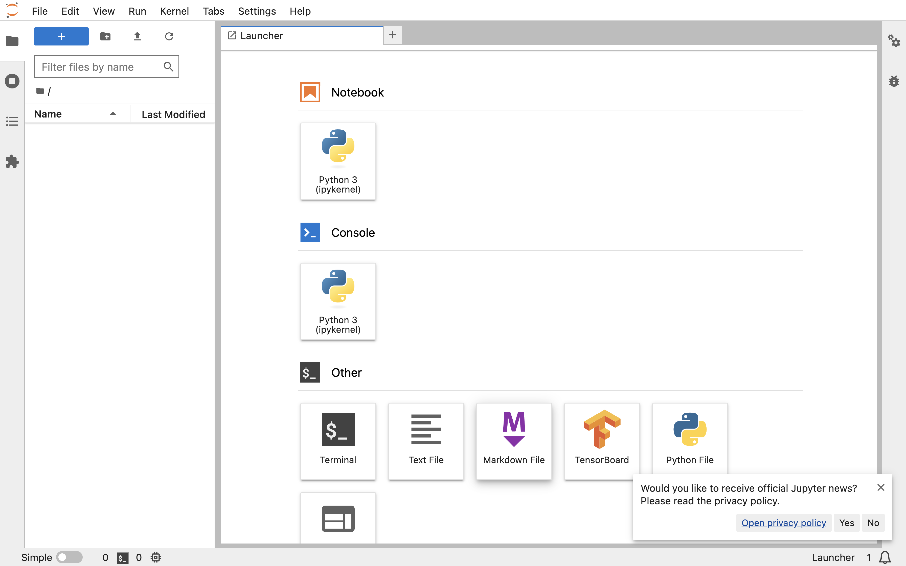
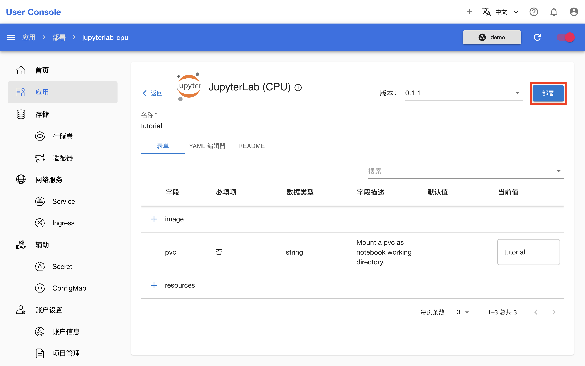
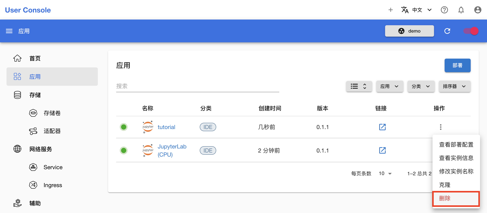

# 部署和删除 Apps

本教程演示如何部署和删除 Apps。

## 部署

在左侧导航菜单点击**应用**进入 Apps 管理页面，这里展示了所有运行中的 Apps。点击右上角的**部署**，查看所有可部署的 Apps：

<figure class="screenshot">
  
</figure>

<figure class="screenshot">
  
</figure>

这里以最常用的交互式开发环境（IDE）App JupyterLab (CPU) 为例进行部署。点击 **JupyterLab (CPU)** App 卡片进入 README 页面：

<figure class="screenshot">
  
</figure>

App 的 README 主要包含三个方面的信息：对于 App 的简要介绍，App 的使用方法，以及 App 的配置方法。部署过程中应重点关注如何配置 App，根据配置说明、配置示例、参数说明、镜像列表等，确定满足自己需求的配置。假定选用 PyTorch 环境，申请 16 个 CPU（核心）、32 GiB 内存资源，挂载存储卷 `demo`。点击右上角的**立刻部署**进入部署页面：

<figure class="screenshot">
  
</figure>

在部署页面，填写配置可以通过**表单**或者 **YAML 编辑器**。前者提供了一个详细的参数设置界面，可以直接编辑各个参数：

<figure class="screenshot">
  
</figure>

后者则需要编辑 YAML 文件，适合熟悉 YAML 格式的用户：

<figure class="screenshot">
  
</figure>

不论以哪种方式，填写配置完成后，点击右上角的**部署**：

<aside class="note tip">

提示

填写配置的过程中可以点击**README**标签页再次查看 App 的配置方法，已经填写的内容会被保留。

</aside>

等待部署完成的 JupyterLab (CPU) App 就绪：

<figure class="screenshot">
  
</figure>

待 App 就绪后，按照 README 提供的 App 的使用方法开始使用，即点击右侧的 <svg class="MuiSvgIcon-root MuiSvgIcon-colorPrimary MuiSvgIcon-fontSizeMedium css-jxtyyz" focusable="false" aria-hidden="true" viewBox="0 0 24 24" data-testid="OpenInNewIcon"><path d="M19 19H5V5h7V3H5c-1.11 0-2 .9-2 2v14c0 1.1.89 2 2 2h14c1.1 0 2-.9 2-2v-7h-2zM14 3v2h3.59l-9.83 9.83 1.41 1.41L19 6.41V10h2V3z"></path></svg> 进入网页 UI，参阅 [JupyterLab Documentation](https://jupyterlab.readthedocs.io/en/latest/) 或[它的中文版本](https://jupyterlab.pythonlang.cn/en/latest/)进行操作。

<figure class="screenshot">
  
</figure>

### 克隆

如要部署一个与运行中的某个 App 配置相同或相似的 App，可以选择克隆该运行中的 App，而无需重复上面的操作。

假定再部署一个 JupyterLab (CPU) App，挂载存储卷 `tutorial`，其他配置不变。点击运行中的 JupyterLab (CPU) App 右侧的 <svg xmlns="http://www.w3.org/2000/svg" viewBox="0 0 24 24"><path d="M12 16a2 2 0 0 1 2 2 2 2 0 0 1-2 2 2 2 0 0 1-2-2 2 2 0 0 1 2-2m0-6a2 2 0 0 1 2 2 2 2 0 0 1-2 2 2 2 0 0 1-2-2 2 2 0 0 1 2-2m0-6a2 2 0 0 1 2 2 2 2 0 0 1-2 2 2 2 0 0 1-2-2 2 2 0 0 1 2-2Z"></path></svg> **> 克隆**，进入部署页面，此时配置已经按照该 App 填写，因此修改 `pvc` 字段的值为 `tutorial` 即可。然后为了便于辨识，修改其**名称**为 `tutorial`。最后点击右上角的**部署**：

<figure class="screenshot">
  
</figure>

<figure class="screenshot">
  
</figure>

<aside class="note">

注意

用户可以修改 App 的默认名称，该名称仅有便于用户辨识的作用，并不是 App 的唯一标识符；App 的名称可以任意重名。这可以类比到在某些智能手机系统或桌面中，你可以安装两个微信，并且可以将第二个微信重命名为“微信”、“微信2”、“QQ”或其他任意的名称。

本文档将上面部署的第一个 App 称为“JupyterLab (CPU) App”，第二个 App 称为“名称为 `tutorial` 的 JupyterLab (CPU) App”。

</aside>

## 删除

回到 Apps 管理页面，点击 App 右侧的 <svg xmlns="http://www.w3.org/2000/svg" viewBox="0 0 24 24"><path d="M12 16a2 2 0 0 1 2 2 2 2 0 0 1-2 2 2 2 0 0 1-2-2 2 2 0 0 1 2-2m0-6a2 2 0 0 1 2 2 2 2 0 0 1-2 2 2 2 0 0 1-2-2 2 2 0 0 1 2-2m0-6a2 2 0 0 1 2 2 2 2 0 0 1-2 2 2 2 0 0 1-2-2 2 2 0 0 1 2-2Z"></path></svg> **> 删除**，删除相应的 App：

<figure class="screenshot">
  
</figure>
