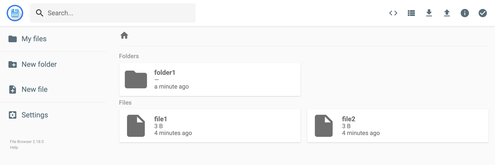
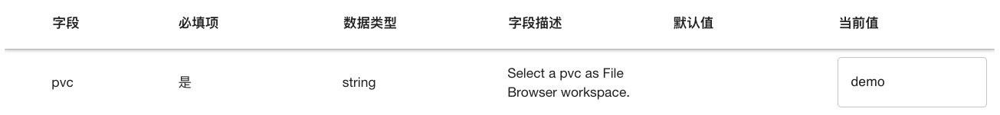

# File Browser

<a target="_blank" rel="noopener noreferrer" href="https://github.com/filebrowser/filebrowser">File Browser</a> 是一个轻量级的基于网络的文件管理系统，为用户提供了一个简单而功能强大的界面来管理服务器上的文件和目录。它允许用户通过网页浏览器远程访问、上传、下载、编辑和共享文件，无需使用复杂的 FTP 客户端或命令行工具。

File Browser 的直观界面使文件管理变得简单高效，用户可以轻松执行拖放上传、创建文件夹、重命名文件等操作。它还提供了文件预览功能，支持多种文件格式的在线查看，如文本、图片、音频和视频。

<figure class="screenshot">
  
</figure>

## 使用方法

待 App 就绪后，点击右侧的 <span class="twemoji"><svg class="MuiSvgIcon-root MuiSvgIcon-colorPrimary MuiSvgIcon-fontSizeMedium css-jxtyyz" focusable="false" aria-hidden="true" viewBox="0 0 24 24" data-testid="OpenInNewIcon"><path d="M19 19H5V5h7V3H5c-1.11 0-2 .9-2 2v14c0 1.1.89 2 2 2h14c1.1 0 2-.9 2-2v-7h-2zM14 3v2h3.59l-9.83 9.83 1.41 1.41L19 6.41V10h2V3z"></path></svg></span> 进入网页 UI，即可管理文件。

<figure class="screenshot">
  
</figure>

网页 UI 的使用方法简单直观，请用户自行尝试。

## 配置和使用说明

### 挂载 PVC

**必须**为 App（的容器）挂载一个 PVC 作为工作空间，App 的网页 UI 展示了该 PVC 中的所有文件。下面的配置示例挂载 PVC demo 作为工作空间：

```yaml
pvc: demo

...
```

<figure class="screenshot">
  
</figure>

### 用户权限

在 App 的容器环境中，用户的 UID:GID 为 1000:1000（fsgroup 为 2000），这意味着没有权限修改所有者和所有组都是 root 的文件（这些文件可能由挂载了同一个 PVC 且使用 root 用户的 Job 产生）。

### 上传和下载

根据管理员配置，App 有可能限制上传的单个文件的大小。与此同时，上传和下载过程也容易因为网络波动而出错，建议 > ~2GB（也取决于具体网络环境）的单个文件使用其他方法上传或下载。

App 不限制单次上传的文件数量，并且支持上传整个目录，在小文件数量较多的情况下也不容易出错；单次下载多个文件时下载的是包含这些文件的压缩包，可以选择压缩格式。

## 下一步

* 学习如何[上传和下载文件](../guide/theme/upload-and-download-file.md)
