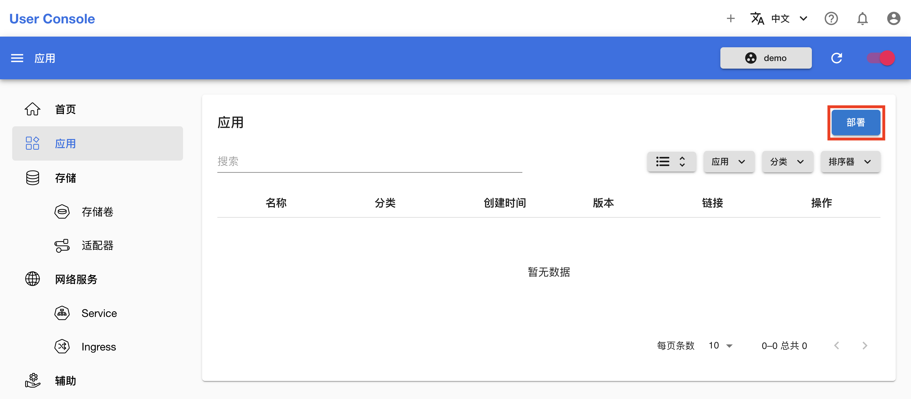
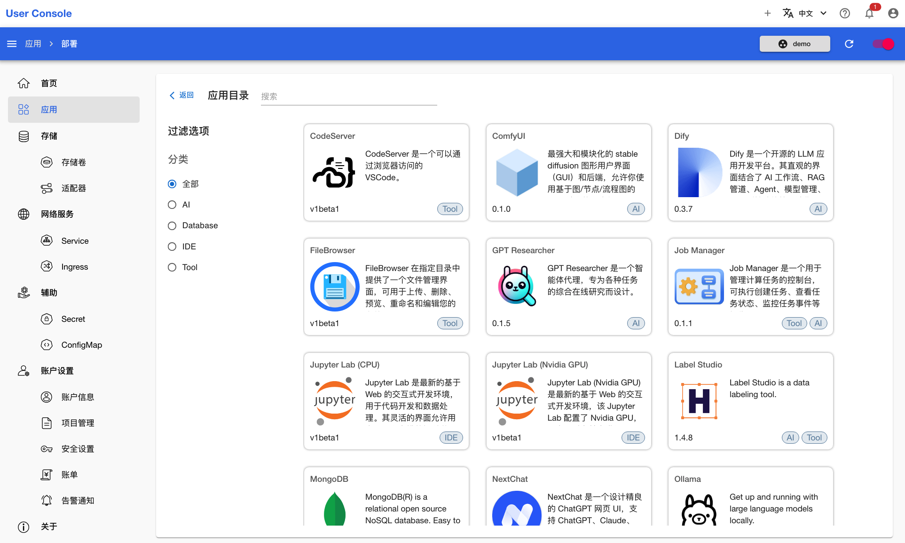

# 应用

应用是平台用以提供各种功能的核心资源。这里的应用既包括直接 AI 模型驱动的应用程序（AI 应用），例如 vLLM、Open WebUI、Stable Diffusion WebUI，也包含在 AI 研究、开发过程中可能使用到的软件、工具，例如 JupyterLab、TensorBoard、Dify。利用这些应用，用户能够完成模型开发、训练和部署，AI 应用构建和部署，与 AI 模型交互等任务，全面开展与 AI 有关的工作。

用户在完成某一项任务时经常需要使用多个应用，并且这些应用以共享存储、网络调用等方式进行协作，下面是一个示意图：

<figure class="architecture">
  
</figure>

例如在任务[进行数据并行训练](../task/train-model/dp-training.md)中，JupyterLab 应用、TensorBoard 应用和 PyTorchTrainingJob 资源共享存储，即挂载同一个 PVC，这样由 JupyterLab 应用拉取的训练代码可以被 PyTorchTrainingJob 所执行，由 PyTorchTrainingJob 产生的 tfevents 文件可以被 JupyterLab 应用和 TensorBoard 应用所读取并可视化展示。在任务[部署 LLM 推理服务和聊天服务](../task/deploy-model/deploy-llm.md)中，JupyterLab 应用和 vLLM 应用共享存储，由 JupyterLab 应用下载的模型文件可以被 vLLM 应用所加载；NextChat 应用调用 vLLM 应用的 LLM 推理服务，从而用户可以在一个简洁美观的 UI 中与 LLM 聊天。

点击左侧导航菜单的**应用**，查看所有已经部署的应用：

<figure class="screenshot">
  
</figure>

点击上图右上角的**部署应用**，查看所有可部署的应用：

<figure class="screenshot">
  
</figure>
