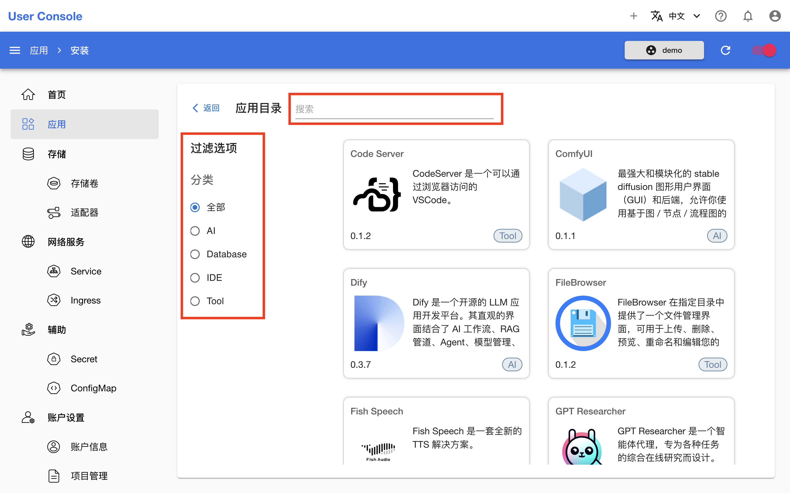

# 应用

应用是能实现某一特定功能的软件，例如文件管理工具、开发环境等。本章演示左侧导航菜单 **应用** 相关的常用功能。

点击左侧导航菜单的**应用**，查看所有已经部署的应用：

<figure class="screenshot">
  
</figure>

点击上图右上角的**部署应用**，查看所有可部署的应用：

<figure class="screenshot">
  
</figure>
