# Apps

## 概念

<b>Apps（应用）</b>是平台提供各种能力的功能模块，用户可根据自己的需求进行安装和使用。

这里的 Apps 既包括直接 AI 模型驱动的应用程序，例如 vLLM、Open WebUI、Stable Diffusion WebUI，也包含在 AI 研究、开发过程中可能使用到的软件、工具，例如 JupyterLab、PyCharm、TensorBoard、Dify 等。

并且，这些 Apps 可以通过共享存储、API 调用等方式进行协作。

用户在完成某一项任务时可以根据自己的偏好和任务的性质，灵活使用多个 Apps，进而高效地完成模型开发、训练、部署，AI 应用构建和部署等任务，全面开展与 AI 有关的工作，如下图所示：

<figure class="architecture">
  
  <figcaption>图 1：用户可以根据自己的偏好和任务的性质，灵活地使用多个 Apps 完成工作任务。</figcaption>
</figure>

例如：

1）在任务[进行数据并行训练](../task/train-model/dp-training.md)中：

- 用户在 [JupyterLab](./jupyter-lab.md) App 中进行交互式开发。
- 用户在 [Job Manager](./job-manager.md) App 中查看运行的 PyTorchTrainingJob。
- JupyterLab、PyTorchTrainingJob 和 [TensorBoard](./tensorboard.md) App 挂载同一个 PVC，通过文件系统共享数据：
  - 用户在 JupyterLab 中拉取的训练代码可以被 PyTorchTrainingJob 执行。
  - PyTorchTrainingJob 中产生的 `tfevents` 日志文件可以被 TensorBoard 所读取并可视化展示。

2） 在任务[部署 LLM 推理服务和聊天服务](../task/deploy-model/deploy-llm.md)中：

- [JupyterLab](./jupyter-lab.md) App 和 vLLM App 共享存储，在 JupyterLab 中下载的模型文件可以被 vLLM 所加载。
- NextChat 调用 vLLM 的 LLM 推理服务 API。
- 用户通过 NextChat 提供的简洁美观的 UI 中与 vLLM 部署的 LLM 聊天。

## 下一步

- [安装 JupyterLab](jupyter-lab.md)
- 了解 [网络服务](../network/index.md)
