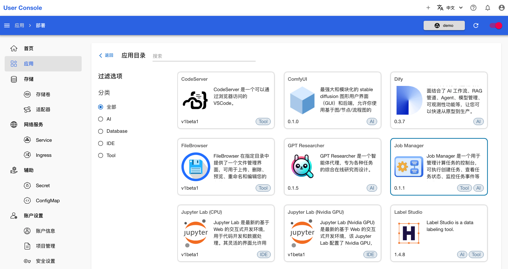
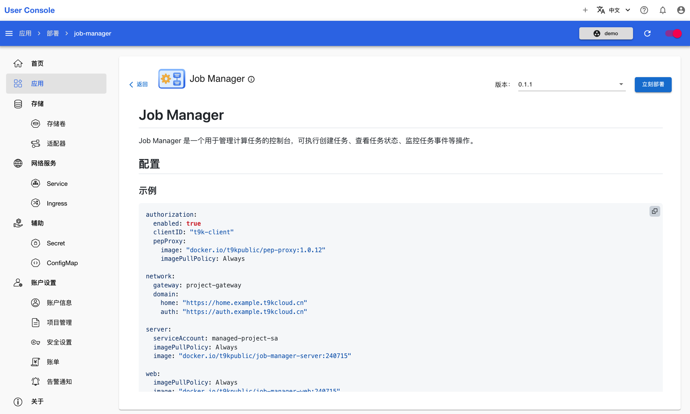
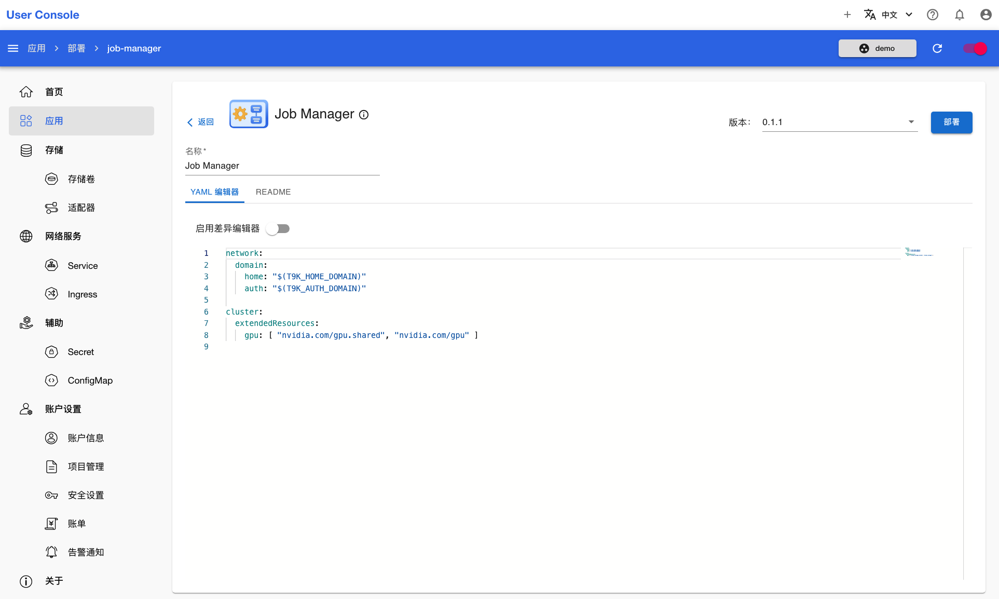
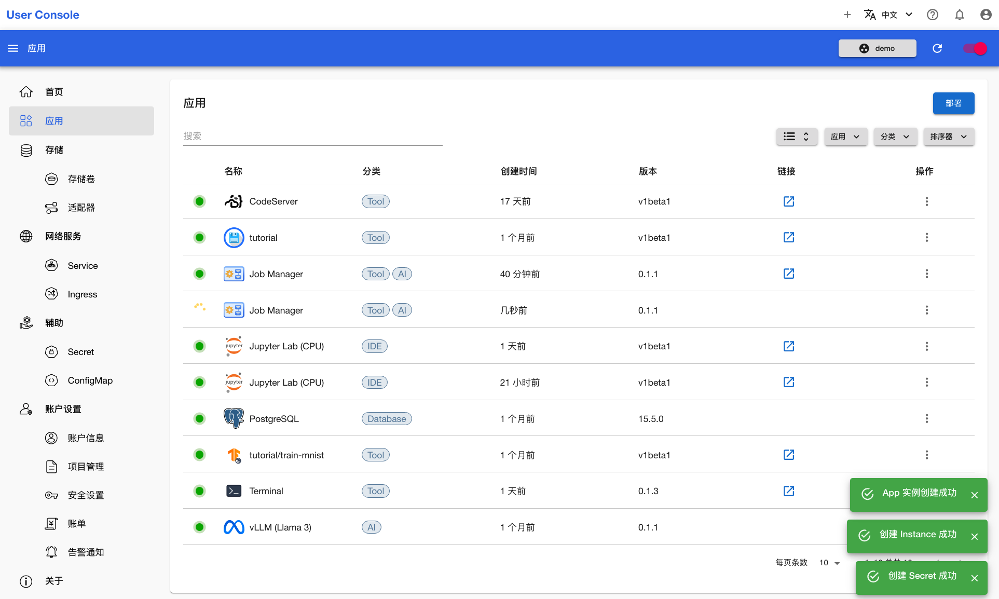
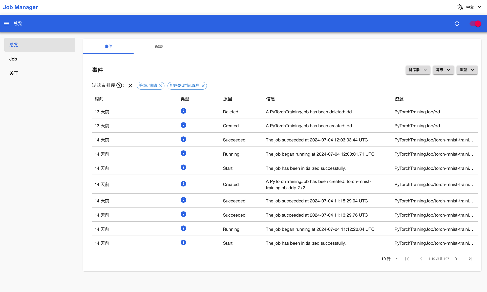

# 部署 Job Manager

Job Manager 是一个用于管理 <a target="_blank" rel="noopener noreferrer" href="https://t9k.github.io/user-manuals/latest/modules/jobs/index.html">Job</a> 的控制台，可执行创建 Job、查看 Job 状态、监控 Job 事件等操作。

点击 **Job Manager** 应用，进入 README 页面：

<figure class="screenshot">
  
</figure>

在 README 页面，你可以看到如何配置应用，这包含了示例 YAML 和参数说明。确认信息后，点击右上角的**立刻部署**进入创建页面：

<figure class="screenshot">
  
</figure>

Job Manager 的可配置参数较多，因此没有通过**表单**配置的选项。**YAML 编辑器**中已经预设了一组可用的值，你可以直接使用预设值部署。然后点击右上角的**部署**：

<figure class="screenshot">
  
</figure>

等待创建成功的 Job Manager 应用就绪：

<figure class="screenshot">
  
</figure>

应用就绪后，点击右侧的 <svg class="MuiSvgIcon-root MuiSvgIcon-colorPrimary MuiSvgIcon-fontSizeMedium css-jxtyyz" focusable="false" aria-hidden="true" viewBox="0 0 24 24" data-testid="OpenInNewIcon"><path d="M19 19H5V5h7V3H5c-1.11 0-2 .9-2 2v14c0 1.1.89 2 2 2h14c1.1 0 2-.9 2-2v-7h-2zM14 3v2h3.59l-9.83 9.83 1.41 1.41L19 6.41V10h2V3z"></path></svg>，即可使用该应用：

<figure class="screenshot">
  
</figure>

## 下一步

* 了解 <a target="_blank" rel="noopener noreferrer" href="https://t9k.github.io/user-manuals/latest/modules/jobs/index.html">Job 的定义</a>
* 使用 Job <a target="_blank" rel="noopener noreferrer" href="https://t9k.github.io/user-manuals/latest/tasks/model-training.html">运行模型训练</a>
