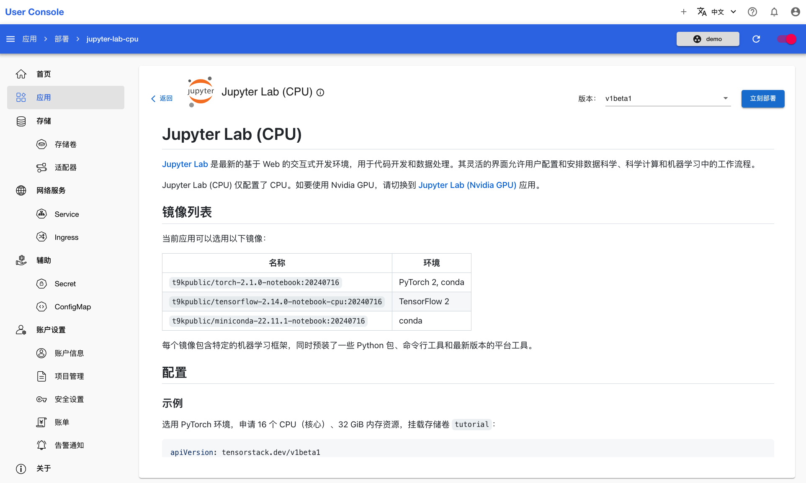
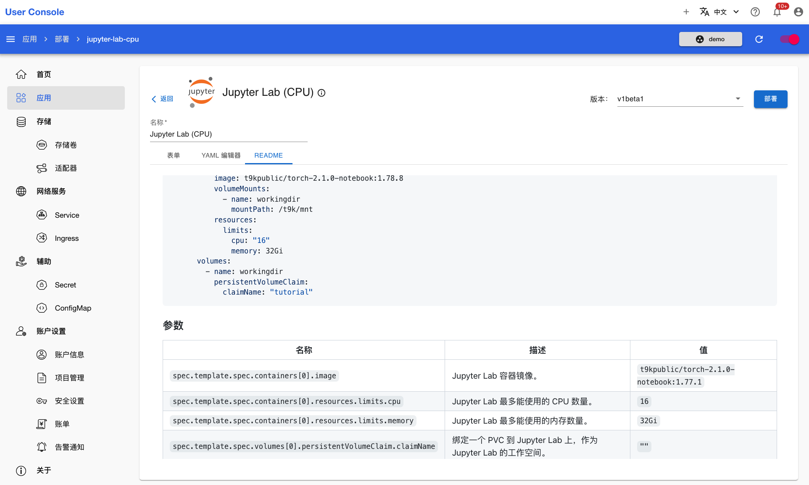
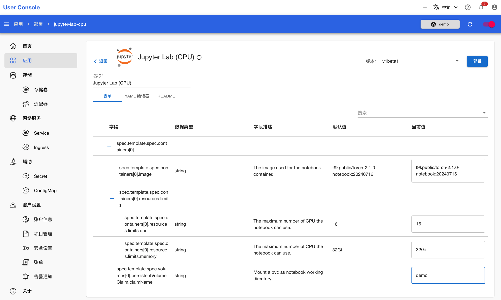
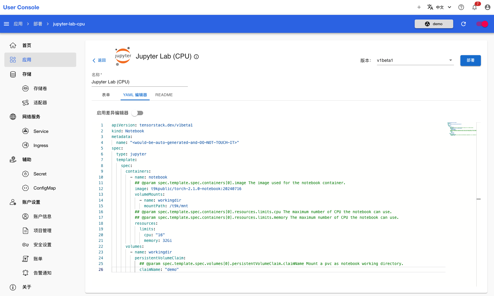
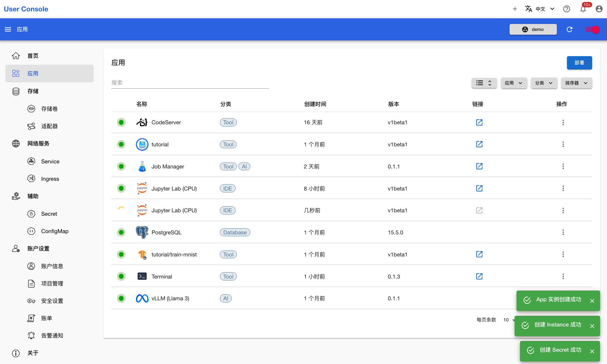
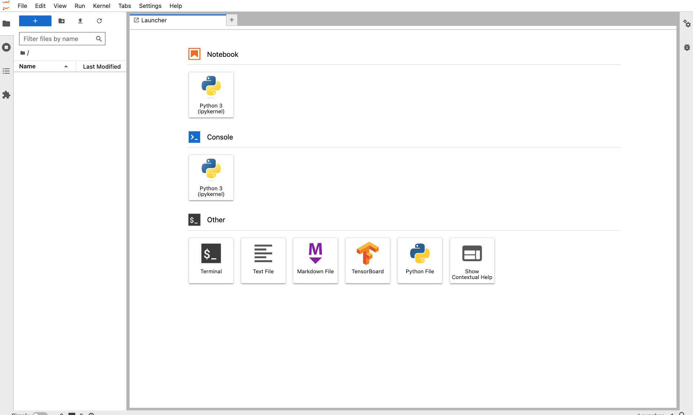

# 部署 JupyterLab

<a target="_blank" rel="noopener noreferrer" href="https://jupyterlab.readthedocs.io/en/latest/">JupyterLab</a> 是一款非常流行的机器学习开发工具，它通过友好易用的 Web 界面提供交互式计算环境，支持多种编程语言和执行环境，在机器学习、AI、数据处理、数值模拟、统计建模、数据可视化等领域被广泛使用。

JupyterLab 系列应用包括 JupyterLab (CPU)、JupyterLab (NVIDIA GPU)、JupyterLab (Enflame GCU)、和 JupyterLab (Hygon DCU)，它们之间的区别仅在于支持不同的加速设备。本教程演示如何部署 JupyterLab (CPU) 应用。

点击 **JupyterLab (CPU)** 应用，进入 App 详情页面：

<figure class="screenshot">
  
</figure>

在 App 详情页面，你可以看到如何配置应用，这包含了可用镜像列表、示例 YAML 和参数说明。确认信息后，点击右上角的**立刻部署**进入创建页面：

<figure class="screenshot">
  
</figure>

点击上方的 **README** 再次查看说明信息，这些信息可以帮助你正确地设置 JupyterLab 的运行参数：

<figure class="screenshot">
  
</figure>

<aside class="note tip">

提示

用户通常可以通过**表单**或者 **YAML 编辑器**进行应用的配置。前者提供了一个直观的界面，让你可以方便地填写和修改参数；而后者则需要你直接编辑 YAML 文件，适合熟悉 YAML 格式的资深用户使用。如果你不确定参数的含义，可以点击**README**标签页来查看各个参数的说明。

</aside>

较简单的配置方式是直接在**表单**标签页填写给出的字段：

<figure class="screenshot">
  
</figure>

熟悉 YAML 的用户可以在 **YAML 编辑器**标签页编辑相应的字段。配置完成后，点击右上角的**部署**：

<figure class="screenshot">
  
</figure>

等待创建成功的 JupyterLab 应用就绪：

<figure class="screenshot">
  
</figure>

应用就绪后，点击右侧的 <svg class="MuiSvgIcon-root MuiSvgIcon-colorPrimary MuiSvgIcon-fontSizeMedium css-jxtyyz" focusable="false" aria-hidden="true" viewBox="0 0 24 24" data-testid="OpenInNewIcon"><path d="M19 19H5V5h7V3H5c-1.11 0-2 .9-2 2v14c0 1.1.89 2 2 2h14c1.1 0 2-.9 2-2v-7h-2zM14 3v2h3.59l-9.83 9.83 1.41 1.41L19 6.41V10h2V3z"></path></svg>，即可使用该应用：

<figure class="screenshot">
  
</figure>
