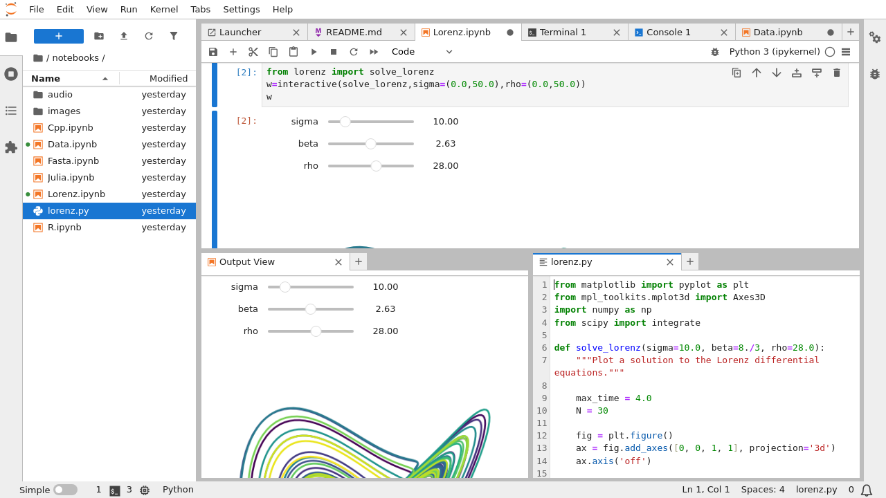

# JupyterLab

<a target="_blank" rel="noopener noreferrer" href="https://jupyterlab.readthedocs.io/en/latest/">JupyterLab</a> 是一个强大的交互式开发环境，为数据分析和科学计算提供了一站式解决方案。它集成了代码编辑、执行、可视化和文档编写等功能，使用户能够高效地进行数据探索和模型开发。JupyterLab 支持多种编程语言，如 Python、R 和 Julia，用户可以在同一个界面中无缝切换不同的语言环境。JupyterLab 在机器学习、深度学习、数据处理、数值模拟、统计建模、数据可视化等领域被广泛使用。

在日常使用中，JupyterLab 的笔记本功能尤为实用。用户可以将代码、运行结果、数据可视化和富文本说明组合在一起，形成一个完整的分析流程。这不仅有助于记录思路和实验过程，还便于与他人分享和协作。此外，JupyterLab 的文件管理系统允许用户直接在界面中组织和访问项目文件，提高了工作效率。

<figure class="screenshot">
  
</figure>

JupyterLab Apps 是一个系列，包括 JupyterLab (CPU)、JupyterLab (NVIDIA GPU)、JupyterLab (Enflame GCU) 和 JupyterLab (Hygon DCU)，它们之间的区别仅在于支持不同的加速设备：

* 所有 App 均支持 CPU。
* JupyterLab (NVIDIA GPU) 另外支持 NVIDIA GPU。
* JupyterLab (Enflame GCU) 另外支持燧原 GCU。
* JupyterLab (Hygon DCU) 另外支持海光 DCU。

请根据集群的可用资源和自身的需求选择合适的 App。

本手册的其他文档中提及的“JupyterLab App”指代 JupyterLab Apps 中最简单（不支持加速设备）的 JupyterLab (CPU) App。

## 使用方法

待 App 就绪后，点击右侧的 <svg class="MuiSvgIcon-root MuiSvgIcon-colorPrimary MuiSvgIcon-fontSizeMedium css-jxtyyz" focusable="false" aria-hidden="true" viewBox="0 0 24 24" data-testid="OpenInNewIcon"><path d="M19 19H5V5h7V3H5c-1.11 0-2 .9-2 2v14c0 1.1.89 2 2 2h14c1.1 0 2-.9 2-2v-7h-2zM14 3v2h3.59l-9.83 9.83 1.41 1.41L19 6.41V10h2V3z"></path></svg> 进入网页 UI，即可进行开发工作。

<figure class="screenshot">
  
</figure>

网页 UI 的使用方法请参阅 <a target="_blank" rel="noopener noreferrer" href="https://jupyterlab.readthedocs.io/en/latest/">JupyterLab Documentation</a> 或<a target="_blank" rel="noopener noreferrer" href="https://jupyterlab.pythonlang.cn/en/latest/">它的中文版本</a>。

[TensorBoard 插件](#tensorboard-插件)的使用方法请参阅[使用说明](https://github.com/HFAiLab/jupyterlab_tensorboard_pro/blob/v4.x/README.zh-cn.md#%E4%BD%BF%E7%94%A8%E8%AF%B4%E6%98%8E)。

## 使用说明

### 镜像

JupyterLab Apps 系列的每个 App 分别可以选用的镜像请参阅相应 [README](../guide/manage-app/install-app.md#选择并了解-app) 的镜像列表部分。

每个镜像都包含 JupyterLab 和特定的环境（机器学习框架或 conda 环境），预装了一些 Python 包、命令行工具和平台工具，并且创建并使用一个新的用户：

* 每个镜像预装的 Python 包各不相同，请执行 `pip list` 命令以查看。
* 所有镜像均预装了以下命令行工具：

| 名称    | 介绍                                                                   |
| ------- | ---------------------------------------------------------------------- |
| curl    | 用于从或向服务器传输数据，支持多种协议。                               |
| git     | 分布式版本控制系统，用于跟踪和协作开发软件项目的源代码。               |
| git-lfs | Git 的扩展，用于版本控制大型文件。                                     |
| htop    | 一个交互式的系统监视器，用于实时查看和管理运行中的进程。               |
| rclone  | 用于在本地和云存储之间同步、管理文件的命令行程序，支持多种云存储服务。 |
| rsync   | 用于高效同步和传输文件，支持本地和远程文件。                           |
| s3cmd   | 用于管理 Amazon S3 云存储服务。                                        |
| ssh     | 用于安全地远程访问和管理服务器。                                       |
| unzip   | 用于解压缩 ZIP 文件。                                                  |
| vim     | 一款高效、可定制的文本编辑器，常用于编程和文本编辑。                   |
| wget    | 用于从网络上下载文件，支持 HTTP、HTTPS 和 FTP 协议。                   |
| zip     | 用于创建和管理 ZIP 压缩文件。                                          |

* 所有镜像均预装了最新版本的[平台工具](../tool/index.md)。
* 所有镜像均创建 GID 为 1000、名称为 t9kuser 的用户组，以及属于该用户组、UID 为 1000、名称为 t9kuser、HOME 目录为 `/t9k/mnt` 的用户，并使用该用户。

### 挂载的 PVC

必须为 App（的容器）挂载一个 PVC 作为工作空间。PVC 的挂载路径为 `/t9k/mnt`，即镜像使用的 t9kuser 用户的 HOME 目录。

挂载的 PVC 负责存储开发相关的文件，这些文件可以是通过 JupyterLab 的 UI 上传或创建的，也可以是通过 JupyterLab 的终端从网络下载或运行程序产生的。此外，挂载的 PVC 还负责存储 conda 环境和 conda 包的文件（位于 `/t9k/mnt/.conda` 路径下），以及 Python 包的文件（位于 `/t9k/mnt/.cache/pip` 路径下）。如果你需要安装较多、较大的 conda 包或 Python 包，请确保挂载的 PVC 留有足够的存储空间。

T9k Job、T9k Service 等工作负载可以和 App 挂载同一个 PVC 以共享存储。例如创建一个 PyTorchTrainingJob，其利用通过 JupyterLab 准备好的训练脚本和数据集文件以启动训练；或者创建一个 SimpleMLService，其读取下载好的模型文件以启动推理服务。

### 用户权限

在 App 的容器环境中，用户的 UID:GID 为 1000:1000，这会导致系统级操作受到限制（权限不足）。例如，用户无法使用 `apt install` 命令安装开发所需的库，无法执行 `rm` 命令删除没有写权限的文件（这些文件可能是由挂载了同一个 PVC 且使用 root 用户的 Job 产生的）。在某些情况下，进行系统级操作是必要或便利的，解决方案是为 App 选用**标签带有 `-sudo` 后缀**的镜像，在需要提升权限的命令前加上 `sudo`，以 root 身份执行该命令。

<aside class="note warning">

警告

使用 `sudo` 命令可能会带来安全风险，请仅在必要时使用，并确保了解每个命令的作用。

</aside>

### TensorBoard 插件

每个镜像还预装了 JupyterLab 的 TensorBoard 插件 <a target="_blank" rel="noopener noreferrer" href="https://github.com/HFAiLab/jupyterlab_tensorboard_pro">jupyterlab_tensorboard_pro</a>，其将 TensorBoard 集成到 JupyterLab 环境中，使用户能够在同一个界面内实时监控和分析训练过程中的指标和图表，无需切换到单独的应用或浏览器标签页。

TensorBoard 插件的使用方法请参阅<a target="_blank" rel="noopener noreferrer" href="https://github.com/HFAiLab/jupyterlab_tensorboard_pro/blob/v4.x/README.zh-cn.md#%E4%BD%BF%E7%94%A8%E8%AF%B4%E6%98%8E">使用说明</a>。

你也可以选择安装一个 [TensorBoard](./tensorboard.md) App，展示的内容是相同的。

## 常见问题

请参阅 [JupyterLab 使用中的常见问题](../guide/theme/faq-in-jupyterlab-usage.md)。

## 下一步

在下列任务中学习使用 JupyterLab Apps：

* [进行数据并行训练](../guide/train-model/dp-training.md)
* [进行 LLM 大规模预训练](../guide/train-model/llm-large-scale-pretraining.md)
* [分析性能](../guide/train-model/profile.md)
* [指令微调 LLM](../guide/train-model/llm-instruction-tuning.md)
* [部署 LLM 推理服务和聊天服务](../guide/deploy-model/deploy-llm.md)
