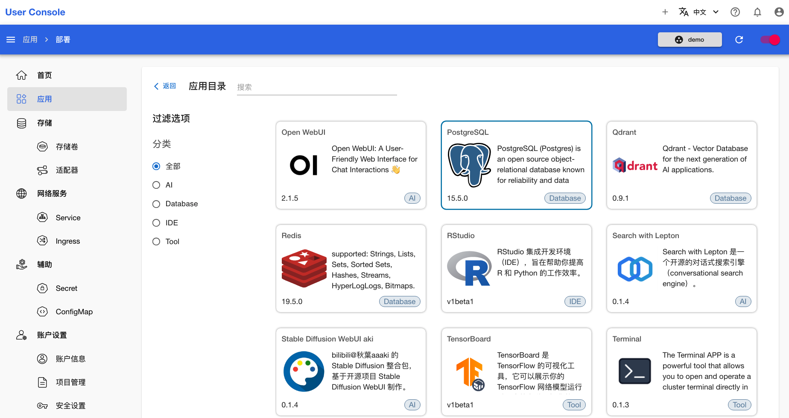
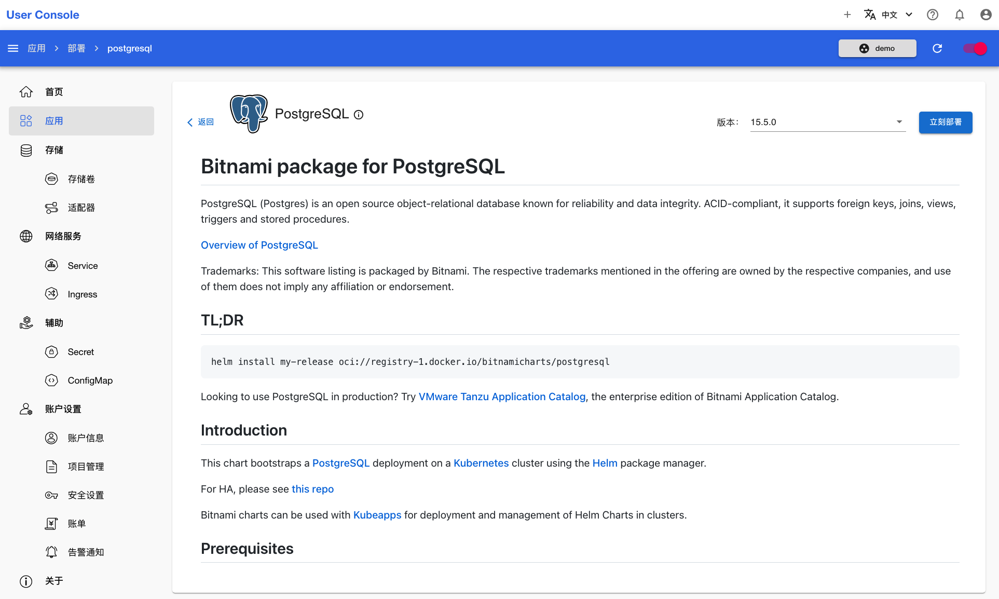
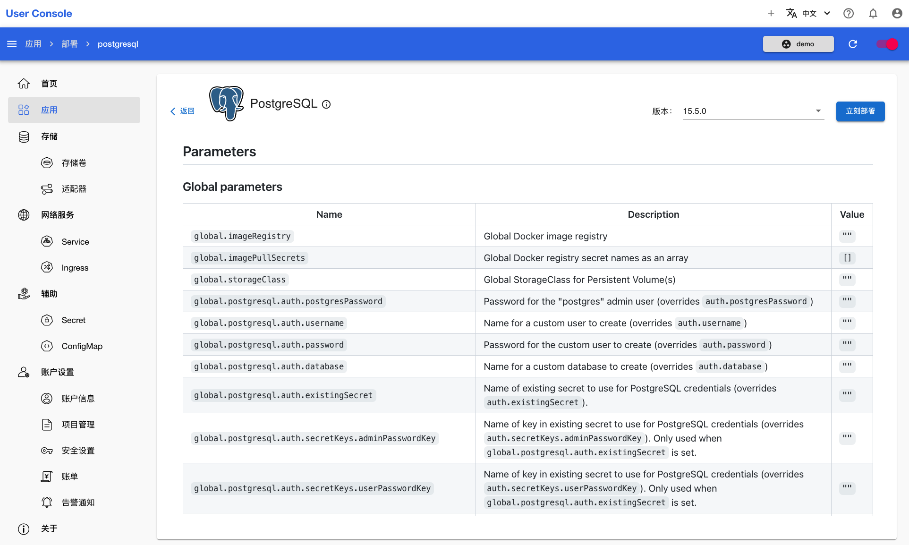
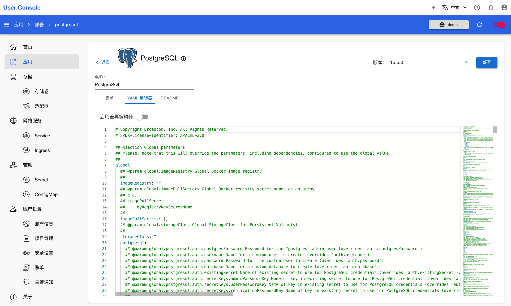
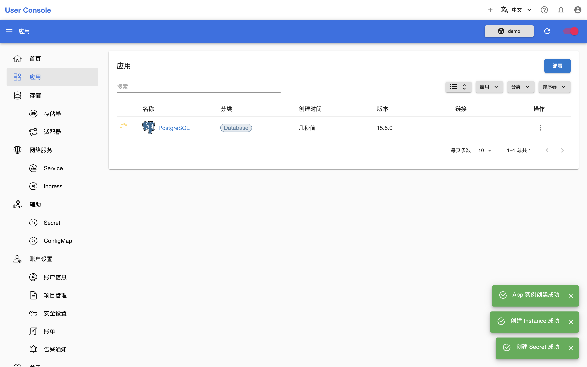

# 部署 PostgreSQL

<a target="_blank" rel="noopener noreferrer" href="https://www.postgresql.org/">PostgreSQL</a> 是一个开源对象关系数据库，以可靠性和数据完整性而闻名。本教程演示部署一个 PostgreSQL App。

点击 **PostgreSQL** App，进入 App 详情页面：

<figure class="screenshot">
  
</figure>

查看 PostgreSQL 的说明：

<figure class="screenshot">
  
</figure>

向下浏览，可以找到 **Parameters** 标题，这里提供了各个参数的含义。确认信息后，点击右上角**立刻部署**进入部署页面：

<figure class="screenshot">
  
</figure>

结合实际情况和 **README** 中的说明，通过**表单**或者 **YAML 编辑器**配置参数。我们采用默认设置进行安装，仅设置变量 `global.postgresql.auth.postgresPassword` 即可。然后点击右上角的**部署**：

<figure class="screenshot">
  
</figure>

等待创建成功的 PostgreSQL App 就绪：

<figure class="screenshot">
  
</figure>

PostgreSQL App 没有 UI，因此无法直接通过链接访问。
