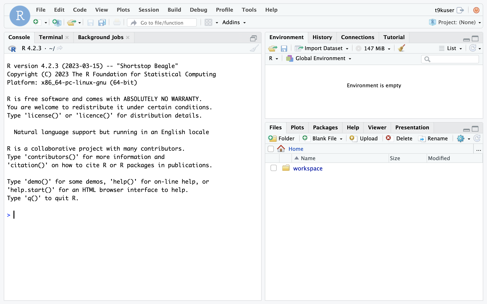

# RStudio

[RStudio](https://github.com/rstudio/rstudio) 是一个专为 R 语言设计的集成开发环境（IDE），它为数据分析师、统计学家和 R 程序员提供了一个功能丰富、用户友好的工作平台。RStudio 集成了代码编辑器、控制台、图形输出和项目管理等功能，使 R 编程和数据分析变得更加高效和直观。它的界面分为多个窗格，包括脚本编辑器、R 控制台/终端、环境/历史记录、文件/图形/包/帮助等，让用户能够同时查看和操作多个工作区域。

RStudio 的项目管理功能允许用户将相关的代码、数据和结果组织在一起，便于版本控制和协作。RStudio 还提供了强大的数据可视化工具，用户可以轻松创建各种统计图表，并直接在 IDE 中预览。此外，RStudio 支持 R Markdown，这是一个非常实用的功能，允许用户将 R 代码、分析结果和解释性文本集成到一个文档中，方便生成报告和共享分析过程。

<figure class="screenshot">
  
</figure>

## 使用方法

待 App 就绪后，点击右侧的 <span class="twemoji"><svg class="MuiSvgIcon-root MuiSvgIcon-colorPrimary MuiSvgIcon-fontSizeMedium css-jxtyyz" focusable="false" aria-hidden="true" viewBox="0 0 24 24" data-testid="OpenInNewIcon"><path d="M19 19H5V5h7V3H5c-1.11 0-2 .9-2 2v14c0 1.1.89 2 2 2h14c1.1 0 2-.9 2-2v-7h-2zM14 3v2h3.59l-9.83 9.83 1.41 1.41L19 6.41V10h2V3z"></path></svg></span> 进入网页 UI，即可进行开发工作。

<figure class="screenshot">
  
</figure>

网页 UI 的使用方法请参阅 [RStudio User Guide](https://docs.posit.co/ide/user/)。

除了网页 UI，App 还支持通过 SSH 远程连接（需要启用 SSH 服务），让你能够使用熟悉的本地终端或 IDE，像在本地开发一样进行远程开发。限于篇幅，具体步骤请参阅[如何通过 SSH 远程连接](../reference/faq/faq-in-ide-usage.md#如何通过-ssh-远程连接)。

## 配置和使用说明

### 镜像

App 可以选用的镜像请参阅 README 的镜像列表部分。

每个镜像都包含 RStudio，以及 R 和 Python 环境，预装了一些命令行工具，并且创建并使用一个新的用户：

* 所有镜像均预装了以下命令行工具：

| 名称    | 介绍                                                                   |
| ------- | ---------------------------------------------------------------------- |
| g++     | GNU C++ 编译器，用于编译 C++ 程序。                                    |
| gcc     | GNU 编译器集合，主要用于编译 C 语言程序。                              |
| git     | 分布式版本控制系统，用于跟踪和协作开发软件项目的源代码。               |
| kubectl | 用于管理 Kubernetes 集群和应用程序的命令行工具。                       |
| rclone  | 用于在本地和云存储之间同步、管理文件的命令行程序，支持多种云存储服务。 |
| ssh     | 用于安全地远程访问和管理服务器。                                       |
| unzip   | 用于解压缩 ZIP 文件。                                                  |
| wget    | 用于从网络上下载文件，支持 HTTP、HTTPS 和 FTP 协议。                   |
| zip     | 用于创建和管理 ZIP 压缩文件。                                          |

* 所有镜像均创建 GID 为 1000、名称为 t9kuser 的用户组，以及属于该用户组、UID 为 1000、名称为 t9kuser、HOME 目录为 `/t9k/mnt` 的用户，并使用该用户。

### 挂载 PVC

**必须**为 App（的容器）挂载一个 PVC 作为工作空间。下面的配置示例挂载 PVC demo 作为工作空间：

```yaml
pvc: "demo"

...
```

<figure class="screenshot">
  
</figure>

PVC 的挂载路径为 `/t9k/mnt`，即镜像使用的 t9kuser 用户的 HOME 目录。

挂载的 PVC 负责存储开发相关的文件，这些文件可以是通过 RStudio 的 UI 上传或创建的，也可以是通过 RStudio 的终端从网络下载或运行程序产生的。此外，挂载的 PVC 还负责存储 Python 包的文件（位于 `/t9k/mnt/.local/lib/python3.10` 路径下）。如果你需要安装较多、较大的 Python 包，请确保挂载的 PVC 留有足够的存储空间。

### 用户权限

在 App 的容器环境中，用户的 UID:GID 为 1000:1000，这会导致系统级操作受到限制（权限不足）。例如，用户无法使用 `apt install` 命令安装开发所需的库，无法执行 `rm` 命令删除没有写权限的文件（这些文件可能是由挂载了同一个 PVC 且使用 root 用户的 Job 产生的）。

在某些情况下，进行系统级操作是必要或便利的，解决方案是为 App 选用**标签带有 `-sudo` 后缀**的镜像，在需要提升权限的命令前加上 `sudo`，以 root 身份执行该命令。

<aside class="note warning">
<div class="title">警告</div>

使用 `sudo` 命令可能会带来安全风险，请仅在必要时使用，并确保了解每个命令的作用。

</aside>

## 常见问题

* [如何上传下载文件](../reference/faq/faq-in-ide-usage.md#如何上传下载文件)
* [如何查看挂载 PVC 的剩余存储空间](../reference/faq/faq-in-ide-usage.md#如何查看挂载-pvc-的剩余存储空间)
* [如何查看目录和文件的权限、大小等信息](../reference/faq/faq-in-ide-usage.md#如何查看目录和文件的权限大小等信息)
* [如何通过 SSH 远程连接](../reference/faq/faq-in-ide-usage.md#如何通过-ssh-远程连接)
* [无法使用 sudo 命令](../reference/faq/faq-in-ide-usage.md#无法使用-sudo-命令)
* [命令执行失败，显示 Killed](../reference/faq/faq-in-ide-usage.md#命令执行失败显示-killed)
