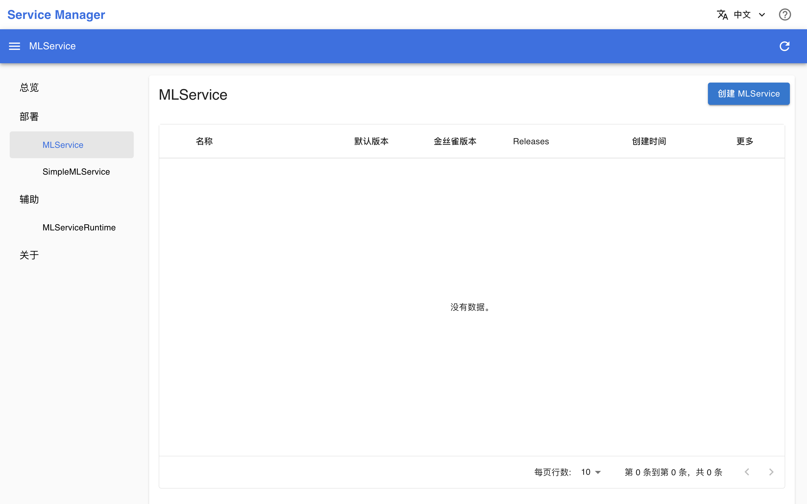

# Service Manager

Service Manager 是一个用于管理 [T9k Service](../api/t9k-service/index.md)（以下简称 Service）的控制台，是平台的原生应用。它提供了一个用户友好的界面，方便用户创建 Service（和 Runtime）、查看 Service 的详细信息，并监控计算资源的使用情况。

通过 Service Manager 的直观界面，用户可以不必在 JupyterLab 或 Terminal App 的终端中使用 kubectl 命令来创建或删除 Service（和 Runtime），或查看 Service 及其创建的 Pod 的状态或日志，也无需手动编辑 YAML 配置文件。Service Manager 的界面展示了用户所关心的所有 Service 相关信息，并且引导用户填写创建 Service 所需的各个字段，从而简化了操作流程。

## 使用方法

待 App 就绪后，点击右侧的 <svg class="MuiSvgIcon-root MuiSvgIcon-colorPrimary MuiSvgIcon-fontSizeMedium css-jxtyyz" focusable="false" aria-hidden="true" viewBox="0 0 24 24" data-testid="OpenInNewIcon"><path d="M19 19H5V5h7V3H5c-1.11 0-2 .9-2 2v14c0 1.1.89 2 2 2h14c1.1 0 2-.9 2-2v-7h-2zM14 3v2h3.59l-9.83 9.83 1.41 1.41L19 6.41V10h2V3z"></path></svg> 进入控制台。

<figure class="screenshot">
  
</figure>

控制台的使用方法请参阅[部署 PyTorch 模型](../guide/deploy-model/deploy-pytorch.md)。

<!-- ### 总览

在左侧导航菜单点击**总览**，上方有**事件**和**配额**两个标签页 -->

## 下一步

* 了解 [T9k Service 的定义](../api/t9k-service/index.md)
