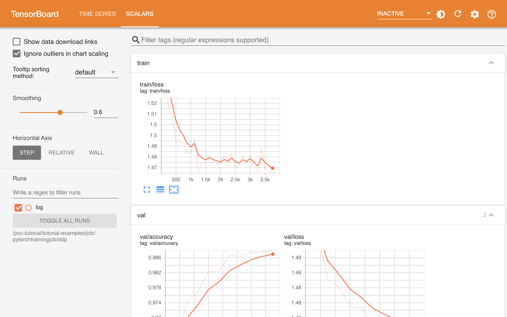

# TensorBoard

<a target="_blank" rel="noopener noreferrer" href="https://www.tensorflow.org/tensorboard?hl=zh-cn">TensorBoard</a> 是一款专为深度学习项目设计的可视化工具套件，主要用于监控和分析深度学习模型的训练过程。它能够实时展示模型训练中的各种指标，如损失函数、准确率、梯度分布等，帮助开发者直观地了解模型的性能和训练进展。TensorBoard 还提供了模型结构可视化功能，使用户能够清晰地查看复杂神经网络的架构。

<figure class="screenshot">
  
</figure>

## 使用方法

待 App 就绪后，点击右侧的 <svg class="MuiSvgIcon-root MuiSvgIcon-colorPrimary MuiSvgIcon-fontSizeMedium css-jxtyyz" focusable="false" aria-hidden="true" viewBox="0 0 24 24" data-testid="OpenInNewIcon"><path d="M19 19H5V5h7V3H5c-1.11 0-2 .9-2 2v14c0 1.1.89 2 2 2h14c1.1 0 2-.9 2-2v-7h-2zM14 3v2h3.59l-9.83 9.83 1.41 1.41L19 6.41V10h2V3z"></path></svg> 进入网页 UI，查看可视化数据。

<figure class="screenshot">
  
</figure>

对于 TensorFlow 框架，记录各种类型数据和使用网页 UI 的方法请参阅 <a target="_blank" rel="noopener noreferrer" href="https://www.tensorflow.org/tensorboard/get_started?hl=zh-cn">TensorBoard 指南</a>。

对于 PyTorch 框架，记录各种类型数据和使用网页 UI 的方法请参阅：

* <a target="_blank" rel="noopener noreferrer" href="https://pytorch.org/docs/stable/tensorboard.html">torch.utils.tensorboard</a> 文档
* <a target="_blank" rel="noopener noreferrer" href="https://pytorch.org/tutorials/intermediate/tensorboard_tutorial.html">Visualizing models, data, and training with TensorBoard</a> 教程
* <a target="_blank" rel="noopener noreferrer" href="https://pytorch.org/tutorials/intermediate/tensorboard_profiler_tutorial.html">PyTorch Profiler With TensorBoard</a> 教程

## 使用说明

你也可以在 [JupyterLab App](./jupyterlab.md#tensorboard-插件) 中创建 TensorBoard，展示的内容是相同的。

## 下一步

在下列任务中学习使用 TensorBoard App：

* [进行数据并行训练](../guide/train-model/dp-training.md)
* [进行 LLM 大规模预训练](../guide/train-model/llm-large-scale-pretraining.md)
* [分析性能](../guide/train-model/profile.md)
