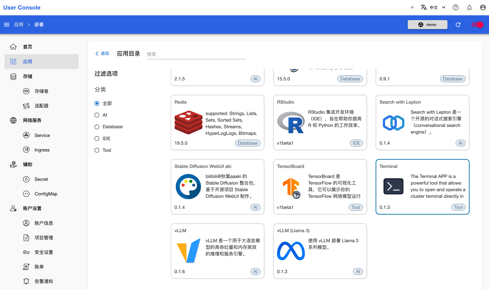
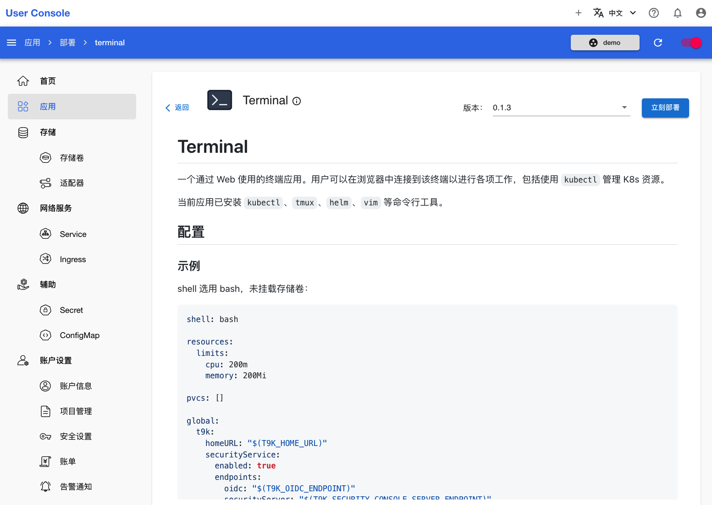
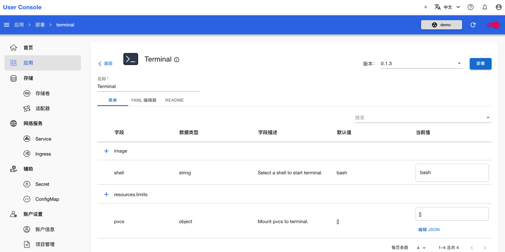
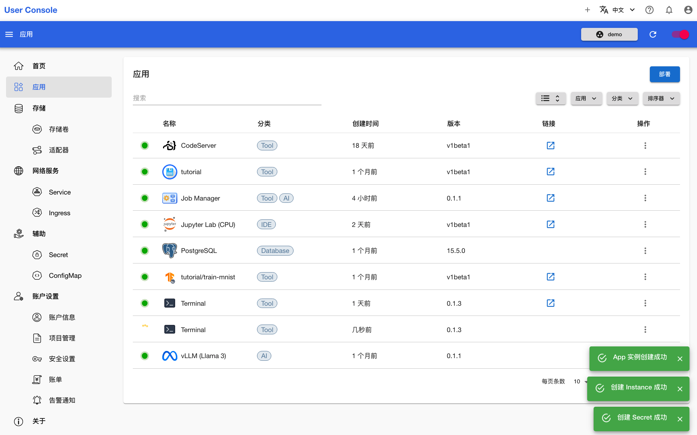
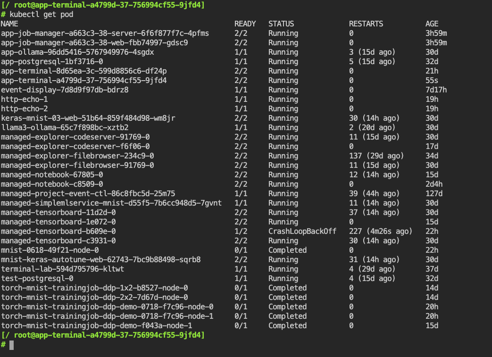

# 部署 Terminal

Terminal 是一个通过 Web 使用的终端 App。用户可以在浏览器中连接到该终端以进行各项工作，包括使用 kubectl 管理 K8s 资源。本教程演示部署 Terminal App。

点击 **Terminal** App，进入 App 详情页面：

<figure class="screenshot">
  
</figure>

在 App 详情页面，你可以看到如何配置 App，这包含了示例 YAML 和参数说明。确认信息后，点击右上角的**立刻部署**进入创建页面：

<figure class="screenshot">
  
</figure>

创建页面已经提供了默认配置，直接点击右上角的**部署**：

<figure class="screenshot">
  
</figure>

等待创建成功的 Terminal App 就绪：

<figure class="screenshot">
  
</figure>

待 App 就绪后，点击右侧的 <svg class="MuiSvgIcon-root MuiSvgIcon-colorPrimary MuiSvgIcon-fontSizeMedium css-jxtyyz" focusable="false" aria-hidden="true" viewBox="0 0 24 24" data-testid="OpenInNewIcon"><path d="M19 19H5V5h7V3H5c-1.11 0-2 .9-2 2v14c0 1.1.89 2 2 2h14c1.1 0 2-.9 2-2v-7h-2zM14 3v2h3.59l-9.83 9.83 1.41 1.41L19 6.41V10h2V3z"></path></svg>，即可使用该 App：

<figure class="screenshot">
  
</figure>
