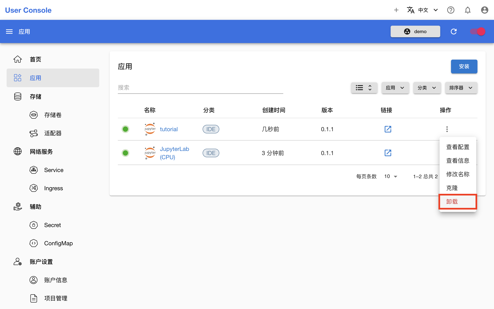
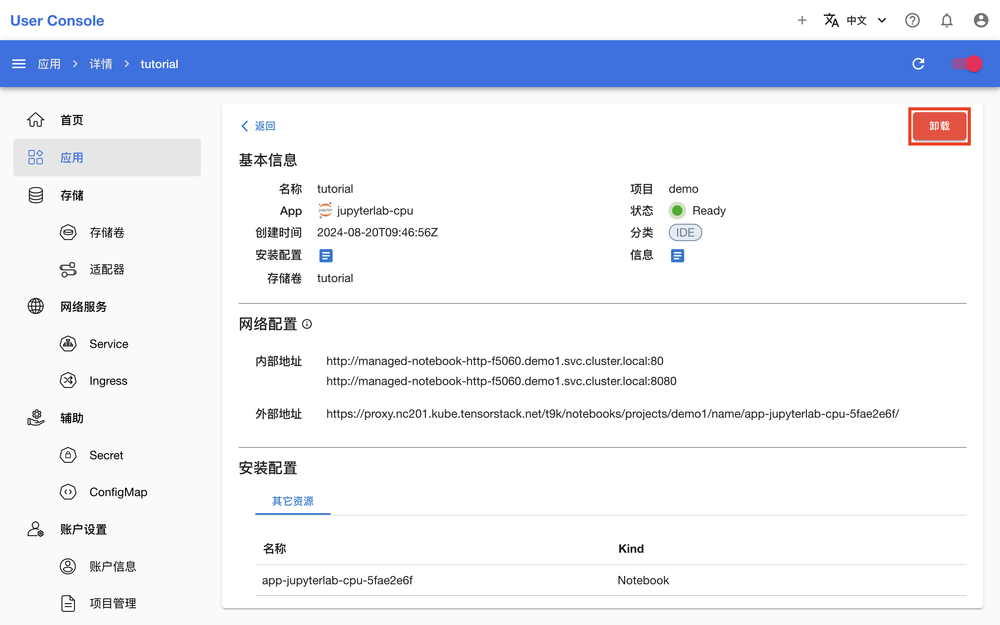

# 卸载 Apps

本教程演示如何卸载 Apps。

在左侧导航菜单点击**应用**进入 Apps 管理页面，这里展示了所有运行中的 Apps。点击 App 右侧的 <svg xmlns="http://www.w3.org/2000/svg" viewBox="0 0 24 24"><path d="M12 16a2 2 0 0 1 2 2 2 2 0 0 1-2 2 2 2 0 0 1-2-2 2 2 0 0 1 2-2m0-6a2 2 0 0 1 2 2 2 2 0 0 1-2 2 2 2 0 0 1-2-2 2 2 0 0 1 2-2m0-6a2 2 0 0 1 2 2 2 2 0 0 1-2 2 2 2 0 0 1-2-2 2 2 0 0 1 2-2Z"></path></svg> **> 卸载**，确认以卸载相应的 App：

<figure class="screenshot">
  
</figure>

也可以点击 App 的名称进入其详情页面，点击右上角的**卸载**，确认以卸载相应的 App：

<figure class="screenshot">
  
</figure>

<aside class="note warning">

警告

卸载 App 的操作不可恢复，请谨慎卸载。

某些 Apps（例如 Stable Diffusion WebUI aki）在安装时会创建 PVC 以存储持久化数据，而在卸载时这些持久化数据会随着 PVC 的删除而丢失。请在卸载前确认数据已经备份或不再需要。

</aside>
