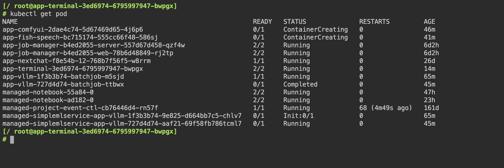

# Virtual Machine

<a target="_blank" rel="noopener noreferrer" href="https://kubevirt.io/">kubevirt</a> 是一个强大的虚拟化工具，它允许用户在 Kubernetes 容器化环境下启动一个虚拟机，并利用 Kubernetes 的扩展能力，让用户可以轻松地使用和管理虚拟机。

Virtual Machine 是一个基于 kubevirt 的虚拟机 App，允许用户快速部署一个虚拟机。

## 使用方法

### 连接虚拟机终端

用户需要同时安装 0.1.5 版本以上的 [Terminal](./terminal.md) App。

待 Virtual Machine App 就绪后，点击右侧的<span class="twemoji"><svg xmlns="http://www.w3.org/2000/svg" viewBox="0 0 24 24"><path d="M12 16a2 2 0 0 1 2 2 2 2 0 0 1-2 2 2 2 0 0 1-2-2 2 2 0 0 1 2-2m0-6a2 2 0 0 1 2 2 2 2 0 0 1-2 2 2 2 0 0 1-2-2 2 2 0 0 1 2-2m0-6a2 2 0 0 1 2 2 2 2 0 0 1-2 2 2 2 0 0 1-2-2 2 2 0 0 1 2-2Z"></path></svg></span> **> 查看信息**，复制连接虚拟机终端的命令，其格式为：

```bash
kubectl virt console <virtual-machine-name> -n <namespace>
```

待 Terminal App 就绪后，点击右侧的 <span class="twemoji"><svg class="MuiSvgIcon-root MuiSvgIcon-colorPrimary MuiSvgIcon-fontSizeMedium css-jxtyyz" focusable="false" aria-hidden="true" viewBox="0 0 24 24" data-testid="OpenInNewIcon"><path d="M19 19H5V5h7V3H5c-1.11 0-2 .9-2 2v14c0 1.1.89 2 2 2h14c1.1 0 2-.9 2-2v-7h-2zM14 3v2h3.59l-9.83 9.83 1.41 1.41L19 6.41V10h2V3z"></path></svg></span> 进入 Terminal 网页 UI：

<figure class="screenshot">
  
</figure>

粘贴并执行上述命令，以连接虚拟机终端。

### 使用图形界面

请参照[安装图形界面](#安装图形界面)配置 Virtual Machine App 并安装图形桌面。

在本地终端执行以下命令：

```bash
t9k-pf service <virtual-machine-name> 5901:5901 -n <namespace> -k
```

上述命令会将远程桌面端口暴露在本地的 5901 端口。

<aside class="note tip">
<div class="title">提示</div>

1. 虚拟机名称可以从<span class="twemoji"><svg xmlns="http://www.w3.org/2000/svg" viewBox="0 0 24 24"><path d="M12 16a2 2 0 0 1 2 2 2 2 0 0 1-2 2 2 2 0 0 1-2-2 2 2 0 0 1 2-2m0-6a2 2 0 0 1 2 2 2 2 0 0 1-2 2 2 2 0 0 1-2-2 2 2 0 0 1 2-2m0-6a2 2 0 0 1 2 2 2 2 0 0 1-2 2 2 2 0 0 1-2-2 2 2 0 0 1 2-2Z"></path></svg></span> **> 查看信息**中获取，参阅[连接虚拟机终端](#连接虚拟机终端)。
2. 上述命令需要使用 API Key，其生成方式参阅 [API Key](../security/account.md#api-key)。

</aside>

在本地打开一个 VNC Client，输入 VNC 地址 `localhost:5901` 即可打开远程桌面。

<aside class="note info">
<div class="title">信息</div>

Windows 系统中，常见的 VNC Client 有 RealVNC、TightVNC 等。

Mac 系统自带 VNC Client 功能：打开 Finder，从菜单栏点击 **Go -> Connect to Server…**（或在 Finder 中使用快捷键 **Command + K**）。

</aside>

## 使用说明

### 定制系统镜像

#### 准备工作

安装一个 Virtual Machine App，选择合适的基础镜像：

```yaml
rootDisk:
  dataVolume:
    enabled: true
    fromOCIRegistry:
      enabled: true
      image:
        registry: registry.cn-hangzhou.aliyuncs.com
        repository: t9k/ubuntu-server-cloud
        tag: 20.04-240819
    pvc:
      accessModes:
      - ReadWriteOnce
      resources:
        requests:
          storage: 5Gi
```

<aside class="note">
<div class="title">注意</div>

最终系统镜像的大小与 PVC 大小相关，系统镜像的保存原理为将整个系统盘打包成一个容器镜像，上传到 oci 仓库。PVC 中未使用的空间也被算作磁盘空间。所以请设置合适的 PVC 大小，减少后续拉取镜像的时间。

</aside>

#### 内容定制

待 Virtual Machine App 就绪后，[连接到虚拟机终端](#连接虚拟机终端)，本节后续操作都是在虚拟机终端中进行。

用户可以在虚拟机中执行安装软件、修改系统配置等操作，只要这些操作的最终修改发生在系统盘中，就可以被记录在新镜像中。

#### 镜像上传

安装一个 JupyterLab App，绑定虚拟机所使用的 PVC（PVC 名称可以从 Virtual Machine App 的详情页面获取）。

待 JupyterLab App 就绪后，进入网页 UI，在工作目录下创建 Dockerfile 文件，内容为：

```dockerfile
FROM scratch
ADD disk.img /disk/
```

使用如下 YAML 配置创建 ImageBuilder 构建镜像：

```yaml
# image-builder.yaml
apiVersion: tensorstack.dev/v1beta1
kind: ImageBuilder
metadata:
  name: vm-image
spec:
  builder:
    kaniko: {}
  dockerConfig:
    secret: t9kpublic
    subPath: .dockerconfigjson
  resources:
    limits:
      cpu: 8
      memory: 16Gi
  tag: t9kpublic/vm-jupyter:0.0.1
  workspace:
    pvc:
      contextPath: .
      dockerfilePath: ./Dockerfile
      name: <pvc-name>
```

```bash
kubectl create -f image-builder.yaml
```

在 Image Builder 执行完毕后，系统镜像会被上传并保存为 `t9kpublic/vm-jupyter:0.0.1`，在下次创建 Virtual Machine App 时可以直接设置 `rootDisk.dataVolume.fromOCIRegistry.image` 字段使用该镜像。

### 安装图形界面

#### 准备工作

安装一个 Virtual Machine App，需要进行如下配置：

1. 暴露 5901 端口
2. 增加 PVC 的大小（大于默认的 3Gi）

```yaml
rootDisk:
  dataVolume:
    enabled: true
    fromOCIRegistry:
      enabled: true
      image:
        registry: registry.cn-hangzhou.aliyuncs.com
        repository: t9k/ubuntu-server-cloud
        tag: 20.04-240819
    pvc:
      accessModes:
      - ReadWriteOnce
      resources:
        requests:
          storage: 5Gi

network:
  ports: 
  - name: "http"
    port: 5901
    protocol: "TCP"
```

本示例中的系统镜像大小为 2.6Gi，因此配置 5Gi 的 PVC 以容纳系统文件和桌面管理软件。如果用户的桌面管理程序需要更多的磁盘空间，请根据需求自行调整 PVC 大小。

#### 安装桌面并启动

待 Virtual Machine App 就绪后，[连接到虚拟机终端](#连接虚拟机终端)，本节后续操作都是在虚拟机终端中进行。

安装 xfce4 和 vnc server：

```bash
sudo apt install xfce4 xfce4-goodies tightvncserver
```

安装 xfce4 时，需要选择一个 Desktop Manager，其中：

1. gdm3 提供更全面的桌面功能，但需要消耗更多资源
2. lightdm 则是更轻量化的桌面管理服务

用户可以根据需要进行选择。

<aside class="note tip">
<div class="title">提示</div>

在国内，通常无法访问 apt 默认源，执行以下命令以更换 apt 源：

```bash
sudo cp /etc/apt/sources.list /etc/apt/sources.list.bak
sudo sed -i 's/archive.ubuntu.com/mirrors.tuna.tsinghua.edu.cn/g' /etc/apt/sources.list
sudo apt-get update
```

</aside>

启动 vncserver 进行初始化（设置密码等）：

```bash
vncserver
```

关闭 vncserver，设置使用 xfce4 桌面：

```bash
​​vncserver -kill :1
echo startxfce4 >> ~/.vnc/xstartup
```

再次启动 vncserver，此时 VNC 服务已经启动，用户可以[使用虚拟机图形界面](#使用图形界面)。

#### 其他桌面

上述教程介绍了如何使用 xfce4 桌面，该桌面比较简陋，用户可以自行寻找习惯的桌面。这里再介绍一个 Gnome 桌面，以供参考。

下载 Gnome 相关组件和 vncserver：

```bash
# 替代前一节中 sudo apt install xfce4 xfce4-goodies tightvncserver 命令
sudo apt install tightvncserver gnome-panel gnome-settings-daemon metacity nautilus gnome-terminal xserver-xorg-core -y
```

vncserver 初始化操作与前一节相同。

修改 `~/.vnc/xstartup` 文件，以使用 gnome 桌面：

```bash
#!/bin/bash

unset SESSION_MANAGER
unset DBUS_SESSION_BUS_ADDRESS

[ -x /etc/vnc/xstartup ] && exec /etc/vnc/xstartup
[ -r $HOME/.Xresources ] && xrdb $HOME/.Xresources

export XKL_XMODMAP_DISABLE=1
export XDG_CURRENT_DESKTOP="GNOME-Flashback:Unity"
export XDG_MENU_PREFIX="gnome-flashback-"

gnome-session --session=gnome-flashback-metacity --disable-acceleration-check &
```

再次启动 vncserver。
