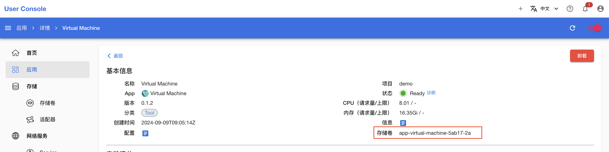

# Virtual Machine

<a target="_blank" rel="noopener noreferrer" href="https://kubevirt.io/">kubevirt</a> 是一个强大的虚拟化工具，它允许用户在 Kubernetes 容器化环境下启动一个虚拟机，并利用 Kubernetes 的扩展能力，让用户可以轻松地使用和管理虚拟机。

Virtual Machine 是一个基于 kubevirt 的虚拟机 App，允许用户快速部署一个虚拟机。

## 使用方法

### 连接虚拟机终端

用户需要同时安装 0.1.5 及以上版本的 [Terminal](./terminal.md) App。

待 Virtual Machine App 就绪后，点击右侧的<span class="twemoji"><svg xmlns="http://www.w3.org/2000/svg" viewBox="0 0 24 24"><path d="M12 16a2 2 0 0 1 2 2 2 2 0 0 1-2 2 2 2 0 0 1-2-2 2 2 0 0 1 2-2m0-6a2 2 0 0 1 2 2 2 2 0 0 1-2 2 2 2 0 0 1-2-2 2 2 0 0 1 2-2m0-6a2 2 0 0 1 2 2 2 2 0 0 1-2 2 2 2 0 0 1-2-2 2 2 0 0 1 2-2Z"></path></svg></span> **> 查看信息**，复制连接虚拟机终端的命令，其格式为：

```bash
kubectl virt console <virtual-machine-name> -n <namespace>
```

待 Terminal App 就绪后，点击右侧的 <span class="twemoji"><svg class="MuiSvgIcon-root MuiSvgIcon-colorPrimary MuiSvgIcon-fontSizeMedium css-jxtyyz" focusable="false" aria-hidden="true" viewBox="0 0 24 24" data-testid="OpenInNewIcon"><path d="M19 19H5V5h7V3H5c-1.11 0-2 .9-2 2v14c0 1.1.89 2 2 2h14c1.1 0 2-.9 2-2v-7h-2zM14 3v2h3.59l-9.83 9.83 1.41 1.41L19 6.41V10h2V3z"></path></svg></span> 进入 Terminal 网页 UI：

<figure class="screenshot">
  
</figure>

粘贴并执行上述命令，以连接虚拟机终端。

### 使用图形界面

请参照[安装图形界面](#安装图形界面)配置 Virtual Machine App 并安装图形桌面。

在本地终端执行以下命令：

```bash
t9k-pf service <virtual-machine-name> 5901:5901 -n <namespace> -k
```

上述命令会将远程桌面端口暴露在本地的 5901 端口。

<aside class="note tip">
<div class="title">提示</div>

1. 虚拟机名称可以从<span class="twemoji"><svg xmlns="http://www.w3.org/2000/svg" viewBox="0 0 24 24"><path d="M12 16a2 2 0 0 1 2 2 2 2 0 0 1-2 2 2 2 0 0 1-2-2 2 2 0 0 1 2-2m0-6a2 2 0 0 1 2 2 2 2 0 0 1-2 2 2 2 0 0 1-2-2 2 2 0 0 1 2-2m0-6a2 2 0 0 1 2 2 2 2 0 0 1-2 2 2 2 0 0 1-2-2 2 2 0 0 1 2-2Z"></path></svg></span> **> 查看信息**中获取，参阅[连接虚拟机终端](#连接虚拟机终端)。
2. 上述命令需要使用 API Key，其生成方式参阅 [API Key](../security/account.md#api-key)。

</aside>

在本地打开一个 VNC Client，输入 VNC 地址 `localhost:5901` 即可打开远程桌面。

<aside class="note info">
<div class="title">信息</div>

Windows 系统中，常见的 VNC Client 有 RealVNC、TightVNC 等。

Mac 系统自带 VNC Client 功能：打开 Finder，从菜单栏点击 **Go -> Connect to Server…**（或在 Finder 中使用快捷键 **Command + K**）。

</aside>

## 配置和使用说明

### cloud-init 初始化

虚拟机首次启动时，会根据 `cloudInit.userData` 字段的值进行系统初始化，这个过程通常需要几分钟。用户需要等待初始化完成后再使用虚拟机。

[cloud-init](https://cloud-init.io/) 是业界标准的多发行版跨平台云实例初始化方法。在启动过程中，cloud-init 会识别其运行的云环境，并相应地初始化系统，自动配置网络、存储、SSH 密钥、软件包以及其他各种系统方面。

cloud-init 的配置模块和示例请参阅 [Module reference](https://cloudinit.readthedocs.io/en/latest/reference/modules.html) 和 [Cloud config examples](https://cloudinit.readthedocs.io/en/latest/reference/examples.html)。

### 定制系统镜像

#### 准备工作

安装一个 Virtual Machine App，选择合适的基础镜像：

```yaml
rootDisk:
  dataVolume:
    enabled: true
    fromOCIRegistry:
      enabled: true
      image:
        registry: registry.cn-hangzhou.aliyuncs.com
        repository: t9k/ubuntu-server-cloud
        tag: 20.04-240819
    pvc:
      accessModes:
      - ReadWriteOnce
      resources:
        requests:
          storage: 5Gi
```

<aside class="note">
<div class="title">注意</div>

最终系统镜像的大小与 PVC 的大小有关。系统镜像的保存原理是将整个系统盘打包成一个容器镜像并上传至 OCI 仓库。需要注意的是，PVC 中未使用的空间也会计入磁盘空间。因此请合理设置 PVC 大小，以减少后续拉取镜像的时间。

</aside>

#### 内容定制

待 Virtual Machine App 就绪后，[连接到虚拟机终端](#连接虚拟机终端)，本节后续操作都是在虚拟机终端中进行。

用户可以在虚拟机中执行安装软件、修改系统配置等操作，只要这些操作的最终修改发生在系统盘中，就可以被记录在新镜像中。

#### 镜像上传

安装一个 JupyterLab App，绑定 Vritual Machine App 自动创建的 PVC（PVC 名称可以从 App 的详情页面获取）：

<figure class="screenshot">
  
</figure>

待 JupyterLab App 就绪后，进入网页 UI，在工作目录下创建 Dockerfile 文件，内容为：

```dockerfile
FROM scratch
ADD disk.img /disk/
```

使用如下 YAML 配置创建 ImageBuilder 构建镜像：

```yaml
# image-builder.yaml
apiVersion: tensorstack.dev/v1beta1
kind: ImageBuilder
metadata:
  name: vm-image
spec:
  builder:
    kaniko: {}
  dockerConfig:
    secret: t9kpublic
    subPath: .dockerconfigjson
  resources:
    limits:
      cpu: 8
      memory: 16Gi
  tag: t9kpublic/vm-jupyter:0.0.1
  workspace:
    pvc:
      contextPath: .
      dockerfilePath: ./Dockerfile
      name: <pvc-name>
```

```bash
kubectl create -f image-builder.yaml
```

在 Image Builder 执行完毕后，系统镜像会被上传并保存为 `t9kpublic/vm-jupyter:0.0.1`，在下次创建 Virtual Machine App 时可以直接设置 `rootDisk.dataVolume.fromOCIRegistry.image` 字段使用该镜像。

### 安装图形界面

#### 准备工作

安装一个 Virtual Machine App，修改如下配置：

1. 暴露 5901 端口
2. 增加 PVC 的大小（大于默认的 3Gi）

```yaml
rootDisk:
  dataVolume:
    enabled: true
    fromOCIRegistry:
      enabled: true
      image:
        registry: registry.cn-hangzhou.aliyuncs.com
        repository: t9k/ubuntu-server-cloud
        tag: 20.04-240819
    pvc:
      accessModes:
      - ReadWriteOnce
      resources:
        requests:
          storage: 5Gi

network:
  ports: 
  - name: "http"
    port: 5901
    protocol: "TCP"
```

本示例中的系统镜像大小为 2.6Gi，因此配置 5Gi 的 PVC 以容纳系统文件和桌面管理软件。如果用户的桌面管理程序需要更多的磁盘空间，请根据需求自行调整 PVC 大小。

#### 安装桌面并启动

待 Virtual Machine App 就绪后，[连接到虚拟机终端](#连接虚拟机终端)，本节后续操作都是在虚拟机终端中进行。

安装 xfce4 和 vnc server：

```bash
sudo apt install xfce4 xfce4-goodies tightvncserver
```

安装 xfce4 时，需要选择一个 Desktop Manager，其中：

1. gdm3 提供更全面的桌面功能，但需要消耗更多资源。
2. lightdm 则是更轻量化的桌面管理服务。

用户可以根据需要进行选择。

<aside class="note tip">
<div class="title">提示</div>

在国内，通常无法访问 apt 默认源，执行以下命令以更换 apt 源：

```bash
sudo cp /etc/apt/sources.list /etc/apt/sources.list.bak
sudo sed -i 's/archive.ubuntu.com/mirrors.tuna.tsinghua.edu.cn/g' /etc/apt/sources.list
sudo apt-get update
```

</aside>

启动 vncserver 进行初始化（设置密码等）：

```bash
vncserver
```

关闭 vncserver，设置使用 xfce4 桌面：

```bash
​​vncserver -kill :1
echo startxfce4 >> ~/.vnc/xstartup
```

再次启动 vncserver，此时 VNC 服务已经启动，用户可以[使用虚拟机图形界面](#使用图形界面)。

#### 其他桌面

上面介绍了如何使用 xfce4 桌面，该桌面比较简陋，用户可以自行寻找习惯的桌面。这里再介绍一个 Gnome 桌面，以供参考。

下载 Gnome 相关组件和 vncserver：

```bash
# 替代前一节中 sudo apt install xfce4 xfce4-goodies tightvncserver 命令
sudo apt install tightvncserver gnome-panel gnome-settings-daemon metacity nautilus gnome-terminal xserver-xorg-core -y
```

vncserver 初始化操作与前一节相同。

修改 `~/.vnc/xstartup` 文件，以使用 gnome 桌面：

```bash
#!/bin/bash

unset SESSION_MANAGER
unset DBUS_SESSION_BUS_ADDRESS

[ -x /etc/vnc/xstartup ] && exec /etc/vnc/xstartup
[ -r $HOME/.Xresources ] && xrdb $HOME/.Xresources

export XKL_XMODMAP_DISABLE=1
export XDG_CURRENT_DESKTOP="GNOME-Flashback:Unity"
export XDG_MENU_PREFIX="gnome-flashback-"

gnome-session --session=gnome-flashback-metacity --disable-acceleration-check &
```

再次启动 vncserver。

### 使用 GPU

按如下方式，在 `extraDevices` 字段中添加 GPU 设备信息：

```yaml
extraDevices:
  gpus:
    - deviceName: nvidia.com/GA100_A100_PCIE_40GB
      name: gpu1
```

在上述配置中，`deviceName` 字段填写 GPU 的 k8s 扩展资源名称，该扩展资源由 `kubevirt-gpu-device-plugin` 探测并扩展。`name` 字段表示设备名称，在虚拟机中不应出现两个相同的设备名称。

<aside class="note">
<div class="title">注意</div>

如果你希望在虚拟机中使用 GPU，则需要让管理员修改节点的 GPU 驱动和虚拟机配置，具体步骤如下：

1. 在节点上将 GPU 的驱动（如 `nvidia`）替换为 `vfio-pci`；
2. 在集群中安装 `kubevirt-gpu-device-plugin`；
3. 在 kubevirt 配置中打开 GPU 特性门。

有关更详细的信息，请参阅管理员文档。

</aside>

### 设置启动盘

目前，我们支持以下三种启动盘形式：

1. 使用 DataVolume 下载系统镜像并构建启动盘；
2. 使用一个容器作为启动盘；
3. 使用一个已经进行过磁盘格式化并安装了系统文件的 PVC 作为启动盘。

#### 使用 DataVolume 下载系统镜像并构建启动盘

```yaml
rootDisk:
  dataVolume:
    enabled: true
    fromOCIRegistry:
      enabled: true
      image:
        registry: docker.io
        repository: t9kpublic/ubuntu-server-cloud
        tag: 20.04-240819
    pvc:
      accessModes:
      - ReadWriteOnce
      resources:
        requests:
          storage: 3Gi
```

在上述配置中，虚拟机控制器会创建一个 PVC（名称即为 App 名称），从 `docker.io/t9kpublic/ubuntu-server-cloud:20.04-240819` 下载系统镜像并安装到 PVC 中，将该 PVC 作为虚拟机启动盘。

除 OCI 仓库以外，虚拟机还支持修改 `rootDisk.dataVolume.template.source` 从其他数据源下载系统镜像：

```yaml
rootDisk:
  dataVolume:
    enabled: true
    fromOCIRegistry:
      enabled: false
    template:
      source:
        http:
          url: https://cloud-images.ubuntu.com/releases/focal/release/ubuntu-20.04-server-cloudimg-amd64.img
      pvc:
        accessModes:
          - ReadWriteOnce
        resources:
          requests:
            storage: 3Gi
```

上述配置中，虚拟机控制器会从 `https://cloud-images.ubuntu.com/releases/focal/release/ubuntu-20.04-server-cloudimg-amd64.img` 下载系统镜像。（虚拟机默认从 OCI 仓库下载系统镜像，使用其他系统镜像下载源时，需要将 `rootDisk.dataVolume.fromOCIRegistry.enabled` 设置为 `false`。）

更多数据源的设置方式，请参阅 [DataVolumeSource](https://pkg.go.dev/kubevirt.io/containerized-data-importer-api/pkg/apis/core/v1beta1#DataVolumeSource)。

#### 使用容器作为启动盘

```yaml
rootDisk:
  containerDisk:
    enabled: true
    image: 
      registry: docker.io
      repository: t9kpublic/fedora-cloud-container-disk-demo
      tag: v0.36.4
  dataVolume:
    enabled: false
```

在上述配置中，虚拟机会使用 `docker.io/t9kpublic/fedora-cloud-container-disk-demo:latest` 镜像创建一个容器，作为启动盘。（虚拟机默认使用 DataVolume 作为启动盘，使用容器作为启动盘时，需要将 `rootDisk.dataVolume.enabled` 设置为 `false`。）

kubevirt 原生支持的、可以作为启动盘的容器镜像请参阅 [KubeVirt container-disk images](https://github.com/kubevirt/kubevirt/blob/main/containerimages/container-disk-images.md)。

`containerDisk` 属于临时存储设备，不具备持久性，即如果虚拟机重启则系统的修改丢失。

<aside class="note">
<div class="title">注意</div>

DataVolume 和 ContainerDisk 不能同时启用，否则将使用 ContainerDisk 作为系统启动盘，而 DataVolume 构建的启动盘将作为普通的磁盘。

目前不支持多启动项，如果有需求，建议启动多个虚拟机。

</aside>

#### 使用一个 PVC 作为启动盘

```yaml
rootDisk:
  containerDisk:
    enabled: false
  dataVolume:
    enabled: false

volumes:
  disks:
    - persistentVolumeClaim:
        name: "pvc-name"
      name: "volume-name"
```

在上述配置中，禁用了 ContainerDisk 和 DataVolume。这种情况下，虚拟机会将第一个以 Disk 形式绑定的 PVC 作为启动盘。该 PVC 应已经进行格式化且安装过系统，否则虚拟机无法启动。

### 设置数据卷

```yaml
volumes:
  filesystems:
    - persistentVolumeClaim:
        name: "pvc-as-fs"
      name: "fs-name"
  disks:
    - persistentVolumeClaim:
        name: "pvc-as-disk"
      name: "disk-name"

cloudInit:
  userData: |-
    ...
    runcmd:
    - "sudo mkdir /mnt/pvc"
    - "sudo mount -t virtiofs fs-name /mnt/pvc"
    - test "$(lsblk /dev/vdb)" && mkfs.ext4 /dev/vdb
    - mkdir -p /mnt/vdb
    mounts:
    - [ "/dev/vdb", "/mnt/vdb", "ext4", "defaults,nofail", "0", "2" ]
```

在上述配置中：

1. 虚拟机绑定了两个 PVC：`pvc-as-fs` 和 `pvc-as-disk`，两者分别作为文件系统和磁盘。
2. 将 PVC 以文件系统的方式绑定到虚拟机时，需要使用 `sudo mount -t virtiofs fs-name /mnt/pvc` 命令将这个 PVC 绑定到 `/mnt/pvc` 路径下。
3. 将 PVC 以磁盘的方式绑定到虚拟机时，如果 PVC 没有进行过磁盘格式化，则需要执行 `mkfs.ext4 /dev/vdb` 命令格式化 PVC，同时执行 `mount` 命令将 PVC 绑定到 `/mnt/vdb` 路径下。

<aside class="note">
<div class="title">注意</div>

1. userData 中 `bootcmd`、`runcmd` 和 `mounts` 等命令，可以在虚拟机启动后，进入虚拟机后手动执行。不过如果一条命令是其他启动项的前置条件，则必须在 `bootcmd` 中填写。
2. 磁盘名称使用 `vdb`，是因为通过 `virtio` 总线挂载的磁盘默认命名格式为 `vd<x>`，启动盘被命名为 `vda`，其他磁盘按顺序依次命名。用户也可以选择不通过 cloud-init 进行自动初始化，而是在进入虚拟机后再手动执行挂载操作。

</aside>
