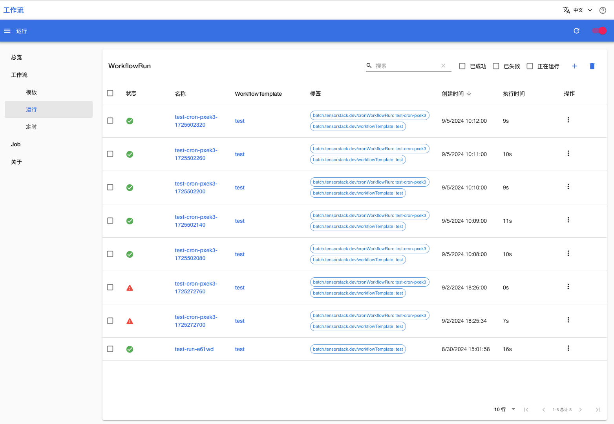

# Workflow

Workflow 是一个用于管理[工作流](../api/workflow/index.md)的控制台，是平台的原生应用。它提供了一个用户友好的界面，方便用户创建工作流、查看工作流的详细信息。

通过 Workflow 的直观界面，用户可以不必在 JupyterLab 或 Terminal App 的终端中使用 kubectl 命令来创建或删除工作流、查看工作流状态或日志，也无需手动编辑 YAML 配置文件。Workflow 的界面展示了用户所关心的所有工作流相关信息，并且引导用户填写创建工作流所需的各个字段，从而简化了操作流程。

## 使用方法

待 App 就绪后，点击右侧的 <svg class="MuiSvgIcon-root MuiSvgIcon-colorPrimary MuiSvgIcon-fontSizeMedium css-jxtyyz" focusable="false" aria-hidden="true" viewBox="0 0 24 24" data-testid="OpenInNewIcon"><path d="M19 19H5V5h7V3H5c-1.11 0-2 .9-2 2v14c0 1.1.89 2 2 2h14c1.1 0 2-.9 2-2v-7h-2zM14 3v2h3.59l-9.83 9.83 1.41 1.41L19 6.41V10h2V3z"></path></svg> 进入控制台。

<figure class="screenshot">
  
</figure>

## 下一步

* 了解[工作流的定义](../api/workflow/index.md)
