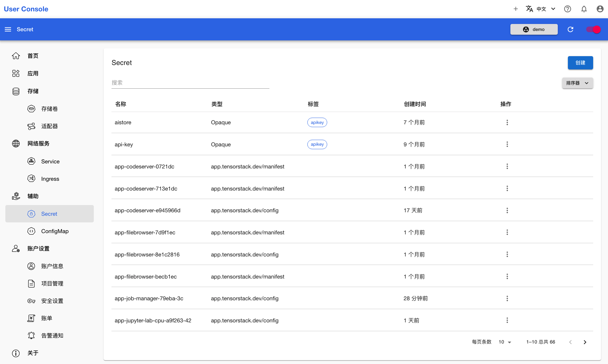

# 创建 Secret

<a target="_blank" rel="noopener noreferrer" href="https://t9k.github.io/user-manuals/latest/modules/auxiliary/secret.html">Secret</a> 是一种 Kubernetes 原生资源，用于存储少量敏感信息，比如密码、OAuth 令牌、SSH 密钥等。使用 Secret 可以避免将敏感数据直接写入到 Pod 的定义中或者应用程序代码里，从而提高了安全性。

本章演示创建一个 Ceph 客户端的 Secret。在开始之前，你需要从管理员处获取 Ceph Client 的 userID 和 userKey。

点击**辅助 > ConfigMap**，查看已有的 Secret：

<figure class="screenshot">
  
</figure>

点击右上角的创建，进入创建页面，并选择模板为 **Ceph Client**：

<figure class="screenshot">
  
</figure>

填写名称、userID 和 userKey，点击创建即可完成 Secret 的创建：

<figure class="screenshot">
  
</figure>
