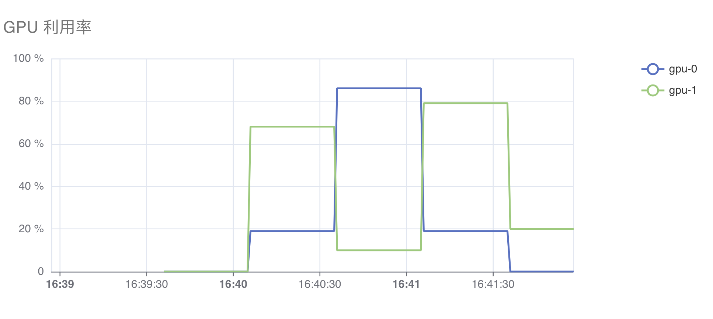

# 资源使用监控

在平台创建工作负载后，用户可以通过控制台或命令行工具查看工作负载的资源使用情况（<u>除了计算资源，还包括网络带宽和存储资源</u>）。

## 控制台

用户可以在下列控制台的工作负载的详情页面查看资源监测图表：

* Job Manager
* Service Manager

当用户定义工作负载时可以选择性地为每个容器设定所需要的资源数量，最常见的可设定资源是 CPU、内存和扩展资源。

以 PyTorchTrainingJob 为例，用户可以查看下面几类资源的使用情况。

### CPU / Memory / 扩展资源

CPU（内存）的资源监测图如下所示，图中包含三条折线：

* 请求量：工作负载声明的 `resources.requests.cpu`（`resources.requests.memory`）
* 上限：工作负载声明的 `resources.limits.cpu`（`resources.limits.memory`）
* 使用量：工作负载实际使用的 CPU（内存）资源量

<figure class="screenshot">
  
</figure>

<figure class="screenshot">
  
</figure>

当工作负载声明扩展资源时，显示扩展资源的资源监测图。

在本例中，PytorchTrainingJob 声明了扩展资源 `nvidia.com/gpu: 2`，页面显示了工作负载声明的 `resources.limits."nvidia.com/gpu"` 资源量。

<figure class="screenshot">
  
</figure>

### NVIDIA GPU

当工作负载声明的扩展资源是 `nvidia.com/gpu` 时，资源监测图会展示额外的 GPU 相关指标，包括：利用率、温度、功率、显存使用率、已用显存量、SM Clock、TensorCore 利用率。

下面是展示 GPU 利用率和显存使用率的图表：

<figure class="screenshot">
  
</figure>

<figure class="screenshot">
  
</figure>

### 网络带宽

网络带宽显示下面两项指标：
* 接收带宽：所有容器接收数据的网络带宽总计。
* 发送带宽：所有容器发送数据的网络带宽总计。

<figure class="screenshot">
  
</figure>

<figure class="screenshot">
  
</figure>

### 存储 I/O

存储 I/O 显示下面两项指标：
* IOPS（读+写）：所有容器在节点的物理磁盘上，进行读写的操作次数之和。
* 吞吐量（读+写）：所有容器在节点的物理磁盘上，读写数据的吞吐量。

<figure class="screenshot">
  
</figure>

<figure class="screenshot">
  
</figure>

## 命令行工具

用户可以在 JupyterLab、Terminal 等 App 的终端中，使用 `kubectl top` 命令查看 Pod 的 CPU 和 内存使用情况。例如：

```bash
(base) [/t9k/mnt t9kuser@managed-notebook-933f6-0]
$ kubectl top pods
NAME                                         CPU(cores)   MEMORY(bytes)   
managed-notebook-933f6-0                     25m          153Mi           
managed-project-event-ctl-854b96f4dd-f6hn8   1m           29Mi 
```

## 下一步

* 监控 [Job 的资源使用](../guide/train-model/dp-training.md#查看训练信息查看-pytorchtrainingjob-详情)
* 监控 [MLService 的资源使用](../guide/deploy-model/deploy-pytorch.md#查看推理服务信息查看-mlservice-详情)
* 了解使用资源后产生的[账单](../security/bills.md)
