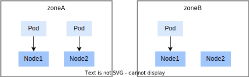

# kube-scheduler

kube-scheduler 是 Kubernetes 集群的默认调度器，也是平台的默认调度器。

下面将介绍 kube-scheduler 的一些常见的特性。如果想要更全面地了解 kube-scheduler，请参阅官方文档 <a target="_blank" rel="noopener noreferrer" href="https://kubernetes.io/zh-cn/docs/concepts/scheduling-eviction/"> 调度、抢占和驱逐</a>。

## 指定调度偏好

在创建 Pod 时，用户可以主动设置一些调度偏好，从而影响调度行为，约束 Pod 只能运行在指定的节点上。下面是一些可以设置的调度偏好。

<aside class="note">
<div class="title">注意</div>

在设置调度偏好之前，通常用户需要知道集群中存在的节点情况，包括：节点的名称、节点的标签、节点含有哪些扩展资源、节点的污点等等。如果用户有查看节点的权限，用户可以通过 kubectl 查看相关信息，如果用户没有权限查看节点信息，用户需要向管理员询问。

</aside>

### NodeSelector

nodeSelector 用于约束 Pod 只能运行在指定的节点上，用户通过设置 nodeSelector 来表明用户希望目标节点所具有的节点标签。Pod 只会被调度到拥有用户所指定的每个标签的节点上。

设置方式：通过 Pod 的 `spec.nodeSelector` 字段来设置 nodeSelector。字段类型是 map，定义了节点标签。

示例：当 Pod YAML 设置了下列 nodeSelector 时，节点需要同时有标签 `kubernetes.io/os: linux` 和 `kubernetes.io/arch: amd64`

```yaml
spec:
 nodeSelector:
   kubernetes.io/os: linux
   kubernetes.io/arch: amd64
```

### 亲和性

亲和性（affinity）用于影响 Pod 可以被调度到哪些节点上，亲和性分为两种类型：

* 节点亲和性：功能类似于 nodeSelector，但它的表达能力更强，并且允许用户指定软规则。
* Pod 间亲和性与反亲和性：使用户可以基于已经在节点上运行的 Pod 的标签来约束 Pod 可以调度到的节点，而不是基于节点上的标签。

<aside class="note">
<div class="title">软规则</div>

影响调度器的打分行为，Pod 倾向于被调度到指定的节点上。当没有节点满足软规则时，Pod 也可以被调度。

</aside>

#### 节点亲和性

节点亲和性使用户可以基于节点标签来约束 Pod 可以调度到的节点。节点亲和性有两种类型：

* requiredDuringSchedulingIgnoredDuringExecution： 调度器只有在规则被满足的时候才能执行调度。此功能类似于 nodeSelector， 但其语法表达能力更强。
* preferredDuringSchedulingIgnoredDuringExecution： 调度器会尝试寻找满足对应规则的节点。如果找不到匹配的节点，调度器仍然会调度该 Pod。

设置方式：

* 通过 Pod 的 `spec.affinity.nodeAffinity` 字段来设置节点亲和性（<a target="_blank" rel="noopener noreferrer" href="https://kubernetes.io/docs/reference/generated/kubernetes-api/v1.23/#nodeaffinity-v1-core">API 参考</a>）

示例：
```yaml
spec:
 affinity:
   nodeAffinity:
     requiredDuringSchedulingIgnoredDuringExecution:
       nodeSelectorTerms:
       - matchExpressions:
         - key: topology.kubernetes.io/zone
           operator: In
           values:
           - antarctica-east1
           - antarctica-west1
     preferredDuringSchedulingIgnoredDuringExecution:
     - weight: 1
       preference:
         matchExpressions:
         - key: node-role.kubernetes.io/compute
           operator: Exists
```

Pod 设置的上述 affinity 表明：

1. 可调度的节点上必须有标签 `topology.kubernetes.io/zone:antarctica-east1` 或 `topology.kubernetes.io/zone:antarctica-west1`
2. 倾向于将 Pod 调度到含有标签键 `node-role.kubernetes.io/compute` 的节点上

#### Pod 间亲和性与反亲和性

Pod 间亲和性与反亲和性使用户可以基于已经在节点上运行的 Pod 的标签来约束 Pod 可以调度到的节点，而不是基于节点上的标签。与节点亲和性类似，Pod 间亲和性与反亲和性也分为 requiredDuringSchedulingIgnoredDuringExecution 和 preferredDuringSchedulingIgnoredDuringExecution 两种类型。

Pod 间亲和性与反亲和性的规则格式为“如果 X 上已经运行了一个或多个满足规则 Y 的 Pod， 则这个 Pod 应该（或者在反亲和性的情况下不应该）运行在 X 上”。 这里的 X 可以是节点、机架、云提供商可用区或地理区域或类似的拓扑域，Y 则是 Kubernetes 尝试满足的规则。

* 拓扑域（X）：用户会通过 topologyKey 来表达拓扑域（X）的概念，其值是系统用来标示域的节点标签键。以 topologyKey `topology.kubernetes.io/zone` 为例，标签键 `topology.kubernetes.io/zone` 对应的值相同的节点会被认为是同一拓扑域。
* 规则（Y）：通过 Pod affinity 字段定义的标签筛选规则。

设置方式：

* 通过 `spec.affinity.podAffinity` 字段来设置 Pod 间亲和性，通过 `spec.affinity.podAntiAffinity` 字段来设置 Pod 间反亲和性（<a target="_blank" rel="noopener noreferrer" href="https://kubernetes.io/docs/reference/generated/kubernetes-api/v1.23/#affinity-v1-core">API 参考</a>）
* 必须设置 topologyKey 字段，以表达拓扑域（X）

示例：

```yaml
apiVersion: apps/v1
kind: Deployment
metadata:
 name: application-server
...
spec:
 template:
   metadata:
     labels:
       app: database
   spec:
     affinity:
       podAntiAffinity:
         requiredDuringSchedulingIgnoredDuringExecution:
         - labelSelector:
             matchExpressions:
             - key: app
               operator: In
               values:
               - database
           topologyKey: topology.kubernetes.io/zone
```

上述 Deployment 为他的 Pod 设置了:

* Pod 标签： `app: database`
* Pod 间亲和性：保证所有 Pod 可以运行在相同拓扑域（标签键是 `topology.kubernetes.io/zone`）的节点上。

### nodeName

Pod 含有 spec.nodeName 字段，用于表明 Pod 运行在哪个节点上。在创建 Pod 时：

* 未设置 nodeName 字段：调度器会根据调度规则自动为 Pod 设置 nodeName。
* 设置了 nodeName 字段：Pod 会绕过调度器的调度规则，直接被分配到指定的节点上运行。

<aside class="note warning">
<div class="title">警告</div>

不推荐使用 nodeName。nodeName 旨在供自定义调度器或需要绕过任何已配置调度器的高级场景使用。 如果已分配的 Node 负载过重，绕过调度器可能会导致 Pod 失败。 用户可以使用 [节点亲和性](#节点亲和性) 或 [nodeselector](#nodeselector) 字段将 Pod 分配给特定 Node，而无需绕过调度器。

</aside>

下面是设置 nodeName 的 Pod 示例：

```yaml
apiVersion: v1
kind: Pod
metadata:
 name: nginx
spec:
 containers:
 - name: nginx
   image: nginx
 nodeName: kube-01
```

上面的 Pod 只能运行在节点 kube-01 上。

### 污点与容忍度

污点（taint）是节点的一种属性，它可被用来使得某些类型的 Pod 不能被调度到该节点上（除非 Pod 明确说明其容忍该污点）。例如，当节点存在出现软硬件故障、网络不可用、磁盘空间不足等问题时，系统会自动为该节点添加一个污点。此外，当管理员发现节点存在问题或正在测试节点时，也可能为该节点添加污点。

容忍度（tolerations）是添加在一个 Pod 上的，如果 Pod 的容忍度与节点污点匹配，那么 Pod 可以被分配到含有污点的节点上。

#### 节点污点示例

如果用户有查看节点的权限，用户可以使用 `kubectl get node <nodeName> -o yaml` 查看节点的污点。否则用户需要向管理员咨询节点的污点信息。

下面是一个示例，节点的 `spec.taints` 字段定义了污点信息：

```yaml
spec:
  taints:
  - effect: NoSchedule
    key: key1
    value: value1
```

#### 容忍度

创建 Pod 时，通过 `spec.tolerations` (<a target="_blank" rel="noopener noreferrer" href="https://kubernetes.io/docs/reference/generated/kubernetes-api/v1.23/#toleration-v1-core">API 参考</a>) 字段来设置容忍度。

下面的容忍度设置可以忍受上述节点污点，从而 Pod 可以被调度到上述节点上：

```yaml
tolerations:
- key: "key1"
  operator: "Equal"
  value: "value1"
  effect: "NoSchedule"
```

### Pod 拓扑分布约束

拓扑分布约束（topology spread constraints）用于控制 Pod 在集群内的拓扑分布，通过 Pod 的 spec.`topologySpreadConstraints` 字段进行设置。详情请见 <a target="_blank" rel="noopener noreferrer" href="https://kubernetes.io/zh-cn/docs/concepts/scheduling-eviction/topology-spread-constraints/">Kubernetes 文档</a>。

下面是一个帮助用户理解拓扑分布约束的基本示例：

集群状态如下：

* 集群内有四个节点，通过节点标签 `zone: <区域名>` 划分为两个区域 zoneA 和 zoneB。
* 含有标签 `foo: bar` 的 3 个 Pod 分别运行在 node1、node2、node3 中。



用户若想创建一个新的 Pod，并且希望新来的 Pod 均匀分布在现有的可用区域，则可以按如下设置其清单：

```yaml
kind: Pod
apiVersion: v1
metadata:
 name: mypod
 labels:
   foo: bar
spec:
 topologySpreadConstraints:
 - maxSkew: 1
   topologyKey: zone
   whenUnsatisfiable: DoNotSchedule
   labelSelector:
     matchLabels:
       foo: bar
 containers:
 - name: pause
   image: registry.k8s.io/pause:3.1
```

`spec.topologySpreadConstraints` 下的子字段说明：

* `maxSkew`：值是 1，表明不同节点区域之间 Pod 数量的最大差值为 1。
* `topologyKey`：用于划分节点区域的节点标签的键值。
* `whenUnsatisfiable`：值是 DoNotSchedule，表明调度器无法找到满足拓扑约束的方式时，将 Pod 保持在 pending 状态。
* `labelSelector`：表明含有标签 `foo: bar` 的 Pod 会被统计，以确定相应拓扑域中 Pod 的数量。

综上，zoneA 上有 2 个 Pod，zoneB 上有 1 个 Pod，如果 mypod 被分配到 zoneA 上会导致 skew 为 2，违背 maxSkew=1，所以 mypod 会被调度器分配到 zoneB 中的 Node3 或 Node4 上。

## 优先级和抢占

<!-- kube-scheduler 和 T9k Scheduler 都有各自的优先级和抢占机制，用户可根据需求选用。 -->

kube-scheduler 的优先级和抢占机制请参阅 <a target="_blank" rel="noopener noreferrer" href="https://kubernetes.io/zh-cn/docs/concepts/scheduling-eviction/pod-priority-preemption/">Pod 优先级和抢占</a>。

## 参考

* <a target="_blank" rel="noopener noreferrer" href="https://kubernetes.io/zh-cn/docs/concepts/scheduling-eviction/kube-scheduler/">Kubernetes 调度器</a>
* <a target="_blank" rel="noopener noreferrer" href="https://kubernetes.io/zh-cn/docs/concepts/scheduling-eviction/assign-pod-node/">将 Pod 指派给节点</a>
* <a target="_blank" rel="noopener noreferrer" href="https://kubernetes.io/zh-cn/docs/concepts/scheduling-eviction/taint-and-toleration/">污点和容忍度</a>
* <a target="_blank" rel="noopener noreferrer" href="https://kubernetes.io/zh-cn/docs/concepts/scheduling-eviction/topology-spread-constraints/">Pod 拓扑分布约束</a>
