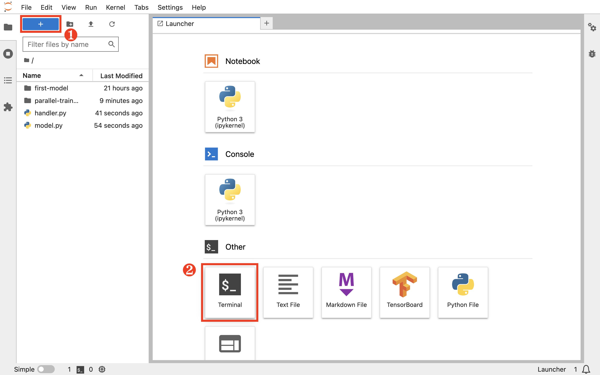
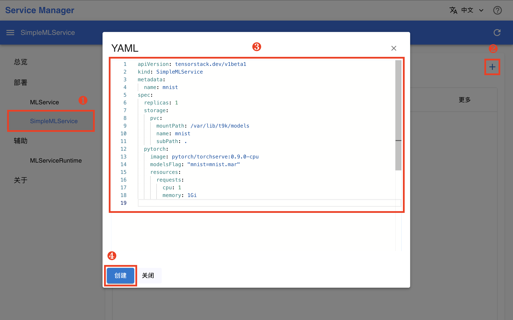
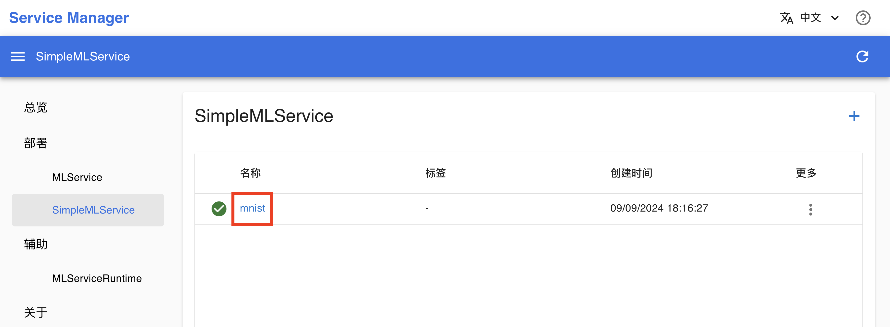
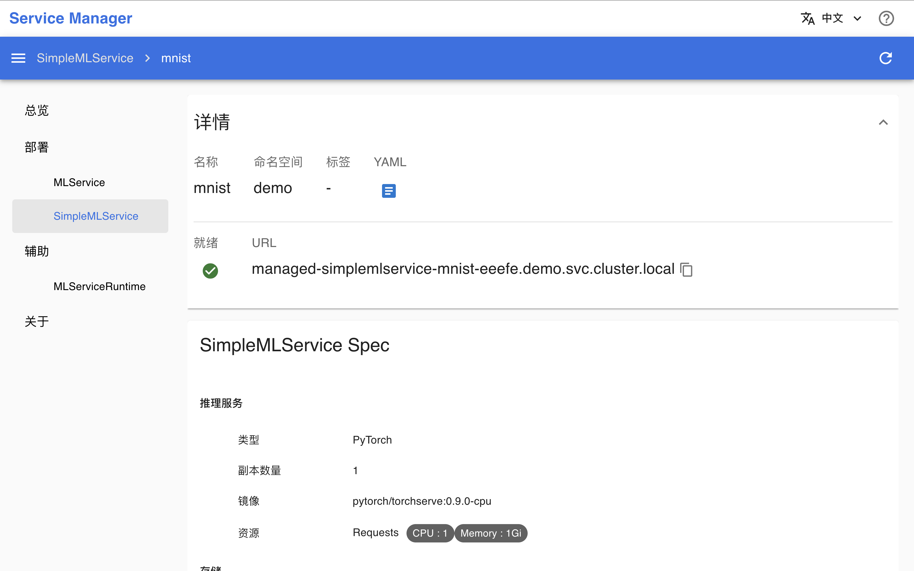

# 部署模型

本教程带领你部署模型为推理服务。

教程[训练你的第一个模型](./training-first-model.md)和[进行并行训练](./parallel-training.md)训练了相同架构的模型，并且都将模型参数保存为文件 `model_state_dict.pt`。本教程将这两个模型文件中的任意一个部署为推理服务。

## 准备模型文件

这里我们使用 <a target="_blank" rel="noopener noreferrer" href="https://github.com/pytorch/serve">TorchServe</a> 部署 PyTorch 模型。回到 JupyterLab (CPU) App 的网页 UI，在 HOME 目录（即左侧边栏文件浏览器显示的根目录 `/`）下新建以下文件：

<details><summary><code class="hljs">model.py</code></summary>

```python
{{#include ../assets/get-started/deployment/model.py}}
```

</details>

<details><summary><code class="hljs">handler.py</code></summary>

```python
{{#include ../assets/get-started/deployment/handler.py}}
```

</details>

点击左上角的 **+**，然后点击 Other 下的 **Terminal** 以新建一个终端。

<figure class="screenshot">
  
</figure>

执行以下命令以打包一个 torch 的模型包（model archive）：

```bash
# 使用 JupyterLab (CPU) App 中训练的模型
torch-model-archiver --model-name mnist \
  --version 1.0 \
  --model-file model.py \
  --handler handler.py \
  --serialized-file first-model/model_state_dict.pt

# 如果使用 Job 中训练的模型，切换参数
# --serialized-file parallel-training/model_state_dict.pt
```

## 部署推理服务

安装一个 Service Manager App，同样地，操作步骤参照[安装 JupyterLab (CPU) App](./training-first-model.md#安装-jupyterlab-cpu-app)，使用默认配置即可（无需修改任何字段）。

进入 Service Manager 的网页 UI（控制台），在左侧导航菜单点击**部署&nbsp;> SimpleMLService**，点击右上角的 **+** 弹出创建对话框，然后复制下面的 YAML 配置文件并粘贴到编辑框中，完成后点击**创建**。

<details><summary><code class="hljs">smls.yaml</code></summary>

```yaml
{{#include ../assets/get-started/deployment/smls.yaml}}
```

</details>

<figure class="screenshot">
  
</figure>

<aside class="note info">
<div class="title">SimpleMLService</div>

[SimpleMLService](../api/t9k-service/simplemlservice.md) 是平台提供的用于部署模型推理服务的 CRD。与同样用于部署推理服务的 [MLService](../api/t9k-service/mlservice.md) 相比，SimpleMLService 更加精简，适用于快速测试。

</aside>

在跳转回到 SimpleMLService 管理页面之后，等待刚才创建的 SimpleMLService 准备就绪。第一次拉取镜像可能会花费较长的时间，具体取决于集群的网络状况。点击右上角的**刷新按钮**以手动刷新 SimpleMLService 状态。

## 使用推理服务

### 查看推理服务地址

在 SimpleMLService 就绪之后，点击其**名称**进入详情页面。

<figure class="screenshot">
  
</figure>

页面中展示的 URL 即为推理服务地址，注意该地址<u>只能从集群内部访问</u>。

<figure class="screenshot">
  
</figure>

### 访问推理服务

回到 JupyterLab (CPU) App 的网页 UI，在终端中执行以下命令以下载测试数据，并向推理服务发送请求。注意变量 `URL` 的值需要修改为实际部署的推理服务的地址。

```sh
# 下载测试图像文件
wget https://t9k.github.io/ucman/latest/assets/get-started/deployment/{0,1,2}.png

ENDPOINT="http://<URL>/v1/models/mnist:predict"
curl -T 0.png $ENDPOINT    # 或使用 `1.png`, `2.png`
```

响应体应是一个类似于下面的 JSON，其预测了图片最有可能是的 5 个数字以及相应的概率：

```json
{
  "0": 1.0,
  "2": 1.7797361302828807e-16,
  "9": 6.094195260341553e-19,
  "6": 1.5410183526346253e-19,
  "5": 7.889719768364669e-20
}
```

最后，将当前教程产生的所有文件移动到名为 `deployment` 的新文件夹下。

## 下一步

* 了解 [T9k Service](../api/t9k-service/index.md)
* 进一步学习如何[部署模型推理服务](../guide/deploy-model/index.md)
