# 快速入门

欢迎使用“TensorStack AI 平台”！

本节将带领你快速体验通过 “User Console” 使用 TensorStack AI 平台的基本功能，并完成一个简单的 AI 项目，涵盖模型的构建、训练、部署等。

<aside class="note tip">

提示

在开始之前，你需要：

1. 拥有一个 [账户](../security/account.md)，以登录系统。
1. 成为一个 [项目](../security/project.md)的成员，以使用集群资源。

如果你没有账户或不是任何项目的成员，请联系平台的管理员。

</aside>

User Console 是用户的功能入口，基本使用流程如下：

1. 获得账号，登陆系统；
2. 安装各种 Apps，例如 Jupyter Notebook，Job Manager，TensorBoard，Ollama；
3. 使用多个 Apps 互相协同，调用 APIs，完成各项工作；
4. 卸载不再使用的 Apps，释放计算资源。

<figure class="screenarchitecture">
  
  <figcaption>图 1：用户在 “项目” 中安装并使用 Apps 以完成工作。1）使用 Jupyter 作为其交互式开发环境；2）Job Manager 管理 Jobs，查看 logs、status、资源、打开 terminal等；3）TensorBoard 可视化训练 metrics。 </figcaption>
</figure>

<aside class="note info">

项目

**项目（Project）** 是 TensorStack AI 平台提供的一种机制，旨在有效利用集群资源，实现多用户、多项目共享使用集群。项目可被视为为用户准备的“虚拟集群”。详细信息请参阅 [项目](../security/project.md)。

</aside>

<aside class="note info">

资源

在本手册及 Kubernetes 文档中，“资源”一词可以指：

* <b>API 资源（API resources）</b>：泛指 Kubernetes 管理的原生或通过 <a target="_blank" rel="noopener noreferrer" href="https://kubernetes.io/docs/concepts/extend-kubernetes/api-extension/custom-resources/">CRD</a> 扩展的实体（entity）类型（type，kind）。这些资源包括原生的标准类型，如 Pod、Deployment、Service、ConfigMap，以及通过 CRD 自定义的资源，例如 TensorStack AI 平台提供的 PyTorchTrainingJob。

* <b>计算资源（compute resources）</b>：应用程序运行所需的 CPU、内存、GPU 等。

* <b>存储资源（storage resources）</b>：应用程序数据持久化所需的存储空间和介质，包括本地存储、网络存储、云存储服务等，在 Kubernetes 中通过 PV 和 PVC 等 API 进行管理。

一般可根据上下文判断其具体所指。

正文中的“集群资源”指代上述全部资源。

</aside>

## 下一步

* [训练你的第一个模型](./training-first-model.md)
