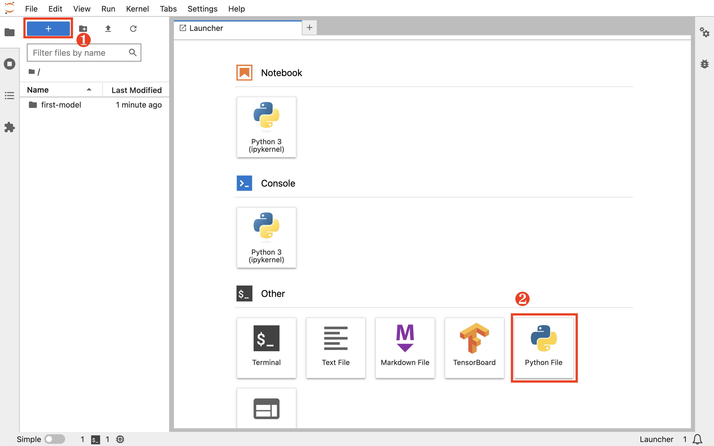
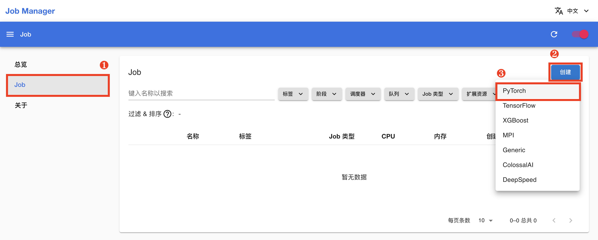
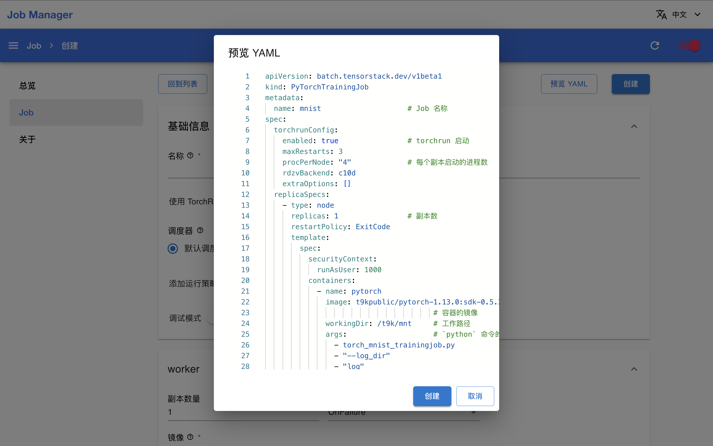
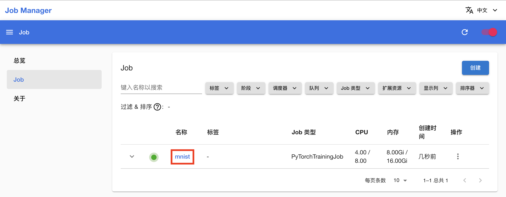
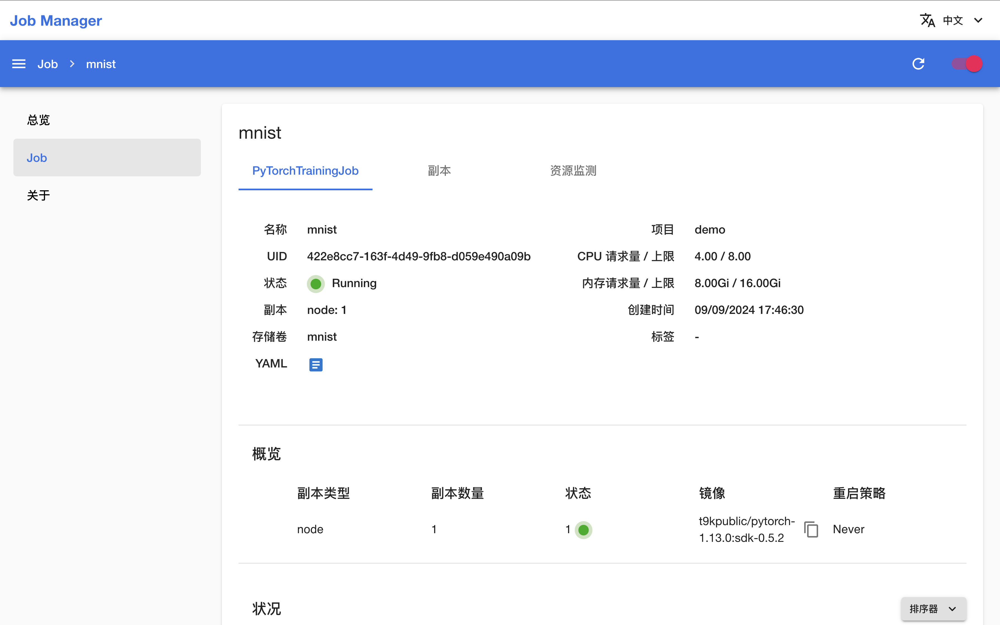
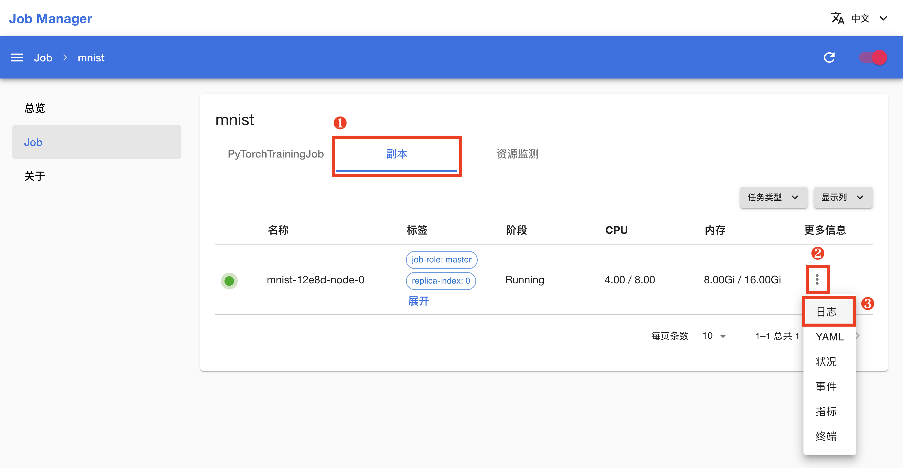
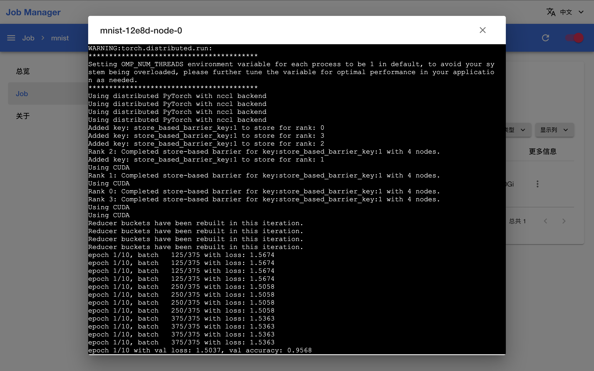

# 进行并行训练

本教程带领你将教程[训练你的第一个模型](./training-first-model.md)中的模型训练改进为使用 GPU 加速的数据并行训练。

## 准备并行训练

回到 JupyterLab (CPU) App 的网页 UI，在 HOME 目录（即左侧边栏文件浏览器显示的根目录 `/`）下，点击左上角的 **+**，然后点击 **Other** 下的 **Python File** 以新建一个 Python 脚本文件。

<figure class="screenshot">
  
</figure>

向该文件复制以下代码，并将其命名为 `torch_mnist_trainingjob.py`。该脚本在上一篇教程的脚本的基础上进行了修改以支持数据并行训练。

<details><summary><code class="hljs">torch_mnist_trainingjob.py</code></summary>

```python
{{#include ../assets/get-started/parallel-training/torch_mnist_trainingjob.py}}
```

</details>

## 创建 Job 进行并行训练

安装一个 Job Manager App，操作步骤参照[安装 JupyterLab (CPU) App](./training-first-model.md#安装-jupyterlab-cpu-app)，使用默认配置即可（无需修改任何字段）。

进入 Job Manager 的网页 UI（控制台），在左侧导航菜单点击 **Job** 进入 Job 管理页面，然后点击右上角的**创建 > PyTorch**：

<figure class="screenshot">
  
</figure>

<aside class="note info">
<div class="title">Job</div>

[Job](../api/t9k-job/index.md) 是平台提供的一组 Kubernetes CRD，用于支持各种规模的批处理计算任务。

PyTorchTrainingJob 是服务于 PyTorch 并行训练框架的 Job。

</aside>

为了简化操作，在 Job 创建页面，点击**预览 YAML**，然后直接复制下面的 YAML 配置文件并粘贴到编辑框中，完成后点击**创建**。

<details><summary><code class="hljs">job.yaml</code></summary>

```yaml
{{#include ../assets/get-started/parallel-training/job.yaml}}
```

</details>

<figure class="screenshot">
  
</figure>

在跳转回到 Job 管理页面之后，等待刚才创建的 Job 就绪。第一次拉取镜像可能会花费较长的时间，具体取决于集群的网络状况。待 Job 开始运行后，点击其**名称**进入详情页面。

<figure class="screenshot">
  
</figure>

可以看到，Job 及其创建的 1 个副本（Pod）正在运行。

<figure class="screenshot">
  
</figure>

切换到**副本**标签页，点击副本的**日志**会显示其命令行输出，可以看到并行训练的当前进度。

<figure class="screenshot">
  
</figure>

<figure class="screenshot">
  
</figure>

一段时间之后，Job 的状态变为 <span class="twemoji"><svg xmlns="http://www.w3.org/2000/svg" viewBox="0 0 24 24"><path d="M12 2C6.5 2 2 6.5 2 12s4.5 10 10 10 10-4.5 10-10S17.5 2 12 2m-2 15-5-5 1.41-1.41L10 14.17l7.59-7.59L19 8l-9 9Z"></path></svg></span> **Succeeded**，表示训练已经成功完成。回到 JupyterLab (CPU) App 的网页 UI，将当前教程产生的所有文件移动到名为 `parallel-training` 的新文件夹下。

## 下一步

* 将训练完成的模型[部署为推理服务](./deploy-model.md)
* 了解 [Job](../api/t9k-job/index.md)
* 进一步学习如何[训练模型](../guide/train-model/index.md)
