# 训练你的第一个模型

本教程带领你构建和训练一个最简单的 AI 模型。

本教程是一个小规模的训练，通过 JupyterLab App 即可完成，主要步骤如下：

1. 通过创建 PVC 申请集群存储空间，用于保存训练脚本、数据、及模型等；
2. 安装 JupyterLab App，使用其作为 IDE；
3. 在 JupyterLab 中创建训练脚本，并运行这个训练。

## 创建 PVC

首先需要创建一个用于存储文件的 PVC。进入 User Console，在左侧导航菜单点击**存储&nbsp;> 存储卷**进入 PVC 管理页面，然后点击右上角的**创建 PVC**：

<figure class="screenshot">
  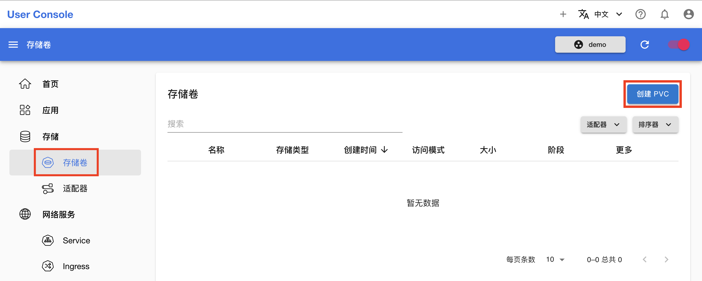
</figure>

<aside class="note info">
<div class="title">PVC</div>

[PVC](../api/storage/pvc.md) 是一种 Kubernetes 原生 API 资源，表示用户对存储的请求。

</aside>

在 PVC 创建页面，如下填写各个参数：

* **名称**填写 `mnist`。
* **存储**填写 `1Gi`。

其他参数保持默认即可。完成之后，点击右上角的**创建**。

<figure class="screenshot">
  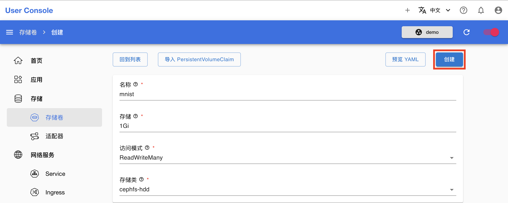
</figure>

在跳转回到 PVC 管理页面之后，等待 PVC 的状态变为 <span class="twemoji"><svg xmlns="http://www.w3.org/2000/svg" viewBox="0 0 24 24"><path d="M12 2C6.5 2 2 6.5 2 12s4.5 10 10 10 10-4.5 10-10S17.5 2 12 2m-2 15-5-5 1.41-1.41L10 14.17l7.59-7.59L19 8l-9 9Z"></path></svg></span>（这里打开了右上角的**自动刷新**开关，否则需要点击旁边的**刷新图标**来手动刷新 PVC 状态）：

<figure class="screenshot">
  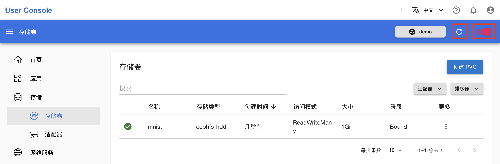
</figure>

## 安装 JupyterLab (CPU) App

在左侧导航菜单点击**应用**进入 App 管理页面，然后点击右上角的**安装**：

<figure class="screenshot">
  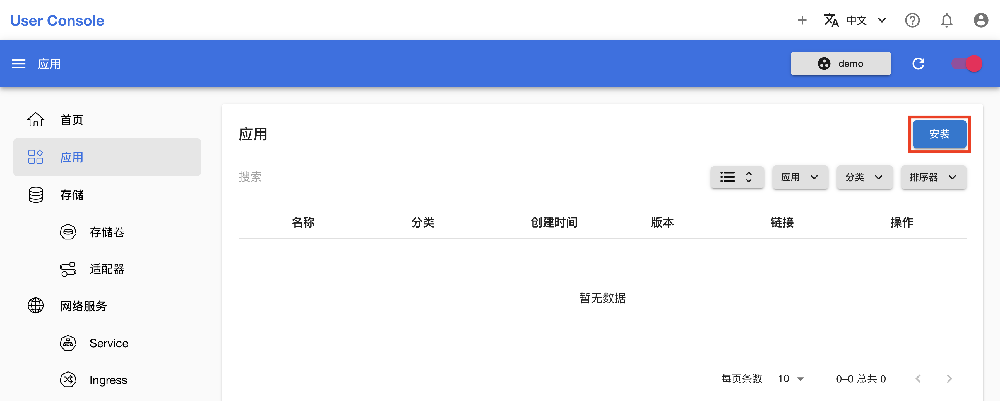
</figure>

在应用目录中找到 JupyterLab (CPU)，点击其卡片，再点击右上角的**立刻安装**：

<figure class="screenshot">
  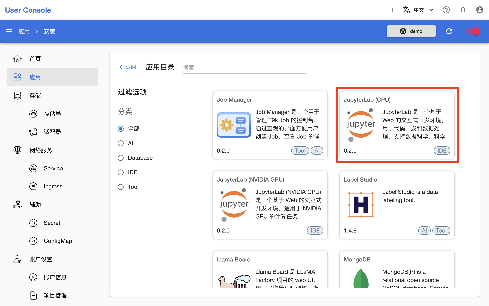
</figure>

<figure class="screenshot">
  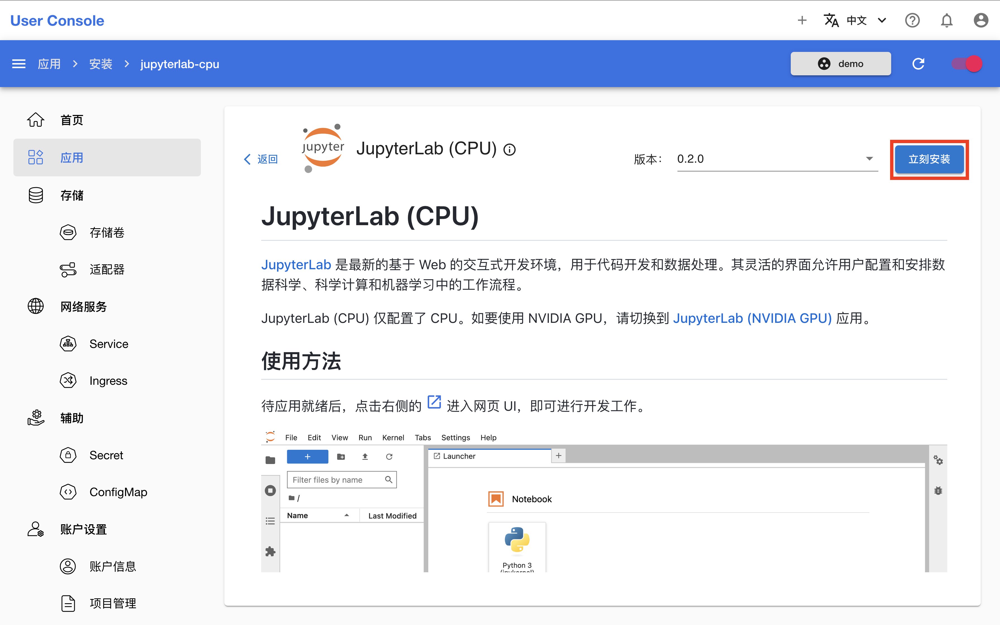
</figure>

<aside class="note info">
<div class="title">JupyterLab</div>

[JupyterLab](../app/jupyterlab.md) 是一个强大的交互式开发环境，为数据分析和科学计算提供了一站式解决方案。它集成了代码编辑、执行、可视化和文档编写等功能，使用户能够高效地进行数据探索和模型开发。

平台提供的 JupyterLab Apps 是一个系列，JupyterLab (CPU) App 是其中最简单（不支持加速设备）的。

</aside>

在安装页面，通过表单填写配置，填写 `pvc` 字段的值为 `mnist`，其他字段保持默认即可。完成之后，点击右上角的**安装**：

<figure class="screenshot">
  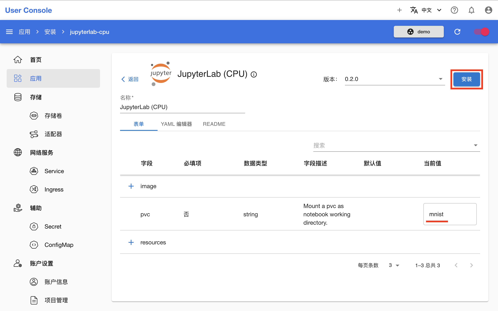
</figure>

在跳转回到 App 管理页面之后，等待刚才安装的 JupyterLab (CPU) App 准备就绪。第一次拉取镜像可能会花费较长的时间，具体取决于集群的网络状况。待 App 就绪后，点击右侧的 <span class="twemoji"><svg class="MuiSvgIcon-root MuiSvgIcon-colorPrimary MuiSvgIcon-fontSizeMedium css-jxtyyz" focusable="false" aria-hidden="true" viewBox="0 0 24 24" data-testid="OpenInNewIcon"><path d="M19 19H5V5h7V3H5c-1.11 0-2 .9-2 2v14c0 1.1.89 2 2 2h14c1.1 0 2-.9 2-2v-7h-2zM14 3v2h3.59l-9.83 9.83 1.41 1.41L19 6.41V10h2V3z"></path></svg></span> 进入网页 UI：

<figure class="screenshot">
  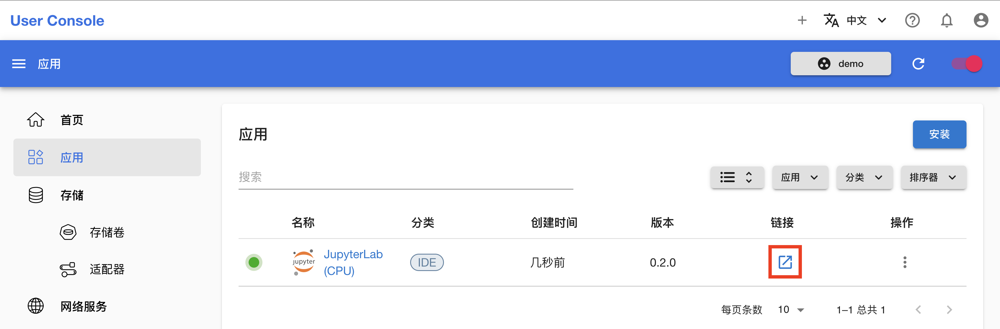
</figure>

接下来在这里进行模型的构建和训练：

<figure class="screenshot">
  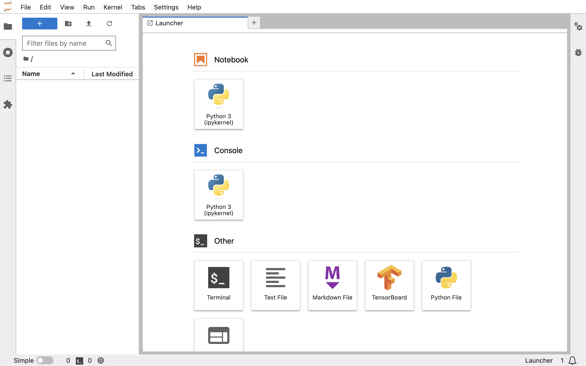
</figure>

## 构建和训练模型

<aside class="note tip">
<div class="title">提示</div>

如果你之前从未使用过 JupyterLab，建议在使用之前先阅读 <a target="_blank" rel="noopener noreferrer" href="https://jupyterlab.readthedocs.io/en/latest/">JupyterLab Documentation</a> 或<a target="_blank" rel="noopener noreferrer" href="https://jupyterlab.pythonlang.cn/en/latest/">它的中文版本</a>以熟悉 JupyterLab 的功能特性以及基本操作。

</aside>

点击左上角的 **+**，然后点击 Notebook 下的 **Python3** 以新建一个 `.ipynb` 文件。

<figure class="screenshot">
  
</figure>

复制下面的训练脚本到该 `.ipynb` 文件的代码框中。该脚本基于 PyTorch 框架，建立一个简单的卷积神经网络模型，并使用 MNIST 数据集的手写数字图像进行训练和测试。

<details><summary><code class="hljs">torch_mnist.py</code></summary>

```python
{{#include ../assets/get-started/training-first-model/torch_mnist.py}}
```

</details>

点击上方的运行按钮，可以看到训练开始进行：

<figure class="screenshot">
  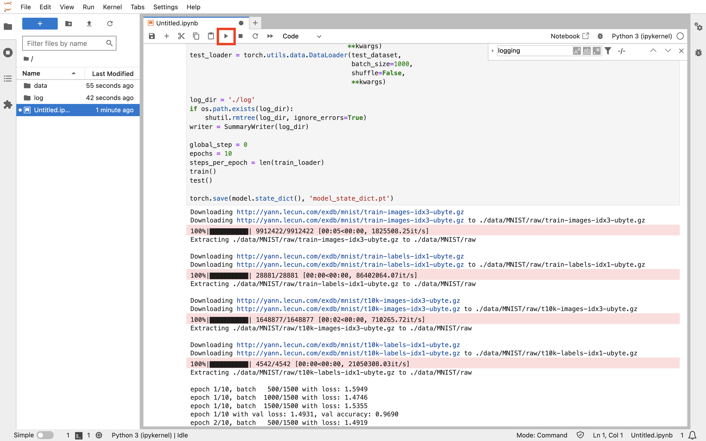
</figure>

训练结束后，点击左上角的**新建文件夹按钮**，为新文件夹命名 **first-model**，并将当前教程产生的所有文件拖拽移动到其中。

<figure class="screenshot">
  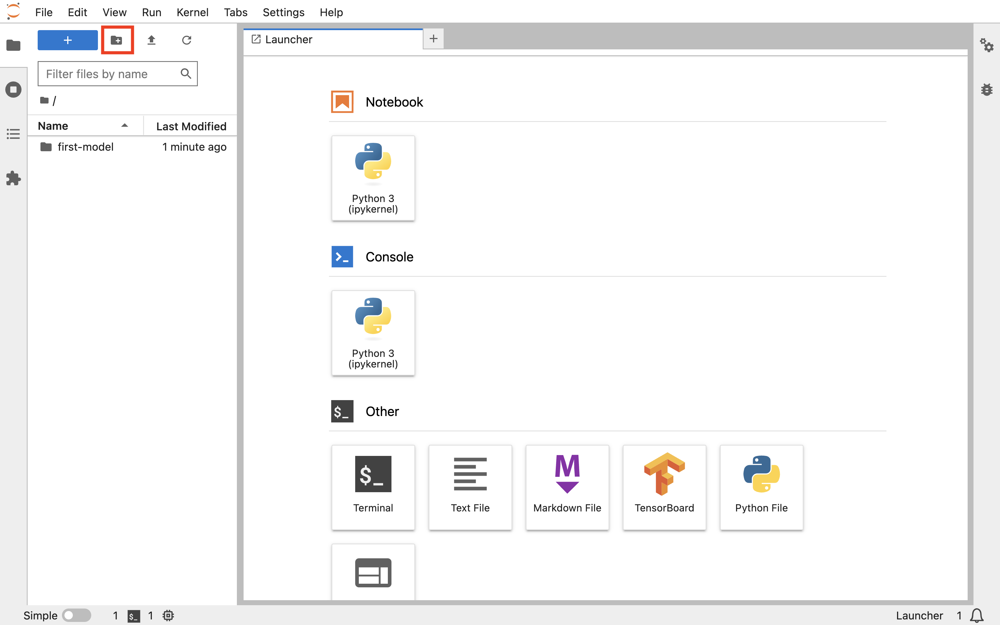
</figure>

## 下一步

* 针对同一个模型，[使用 Job 进行并行训练](./parallel-training.md)
