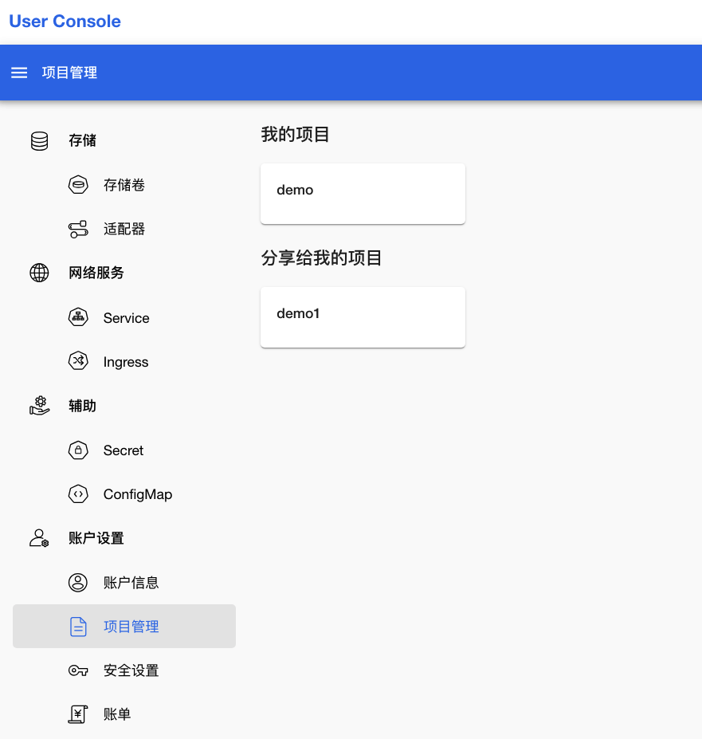
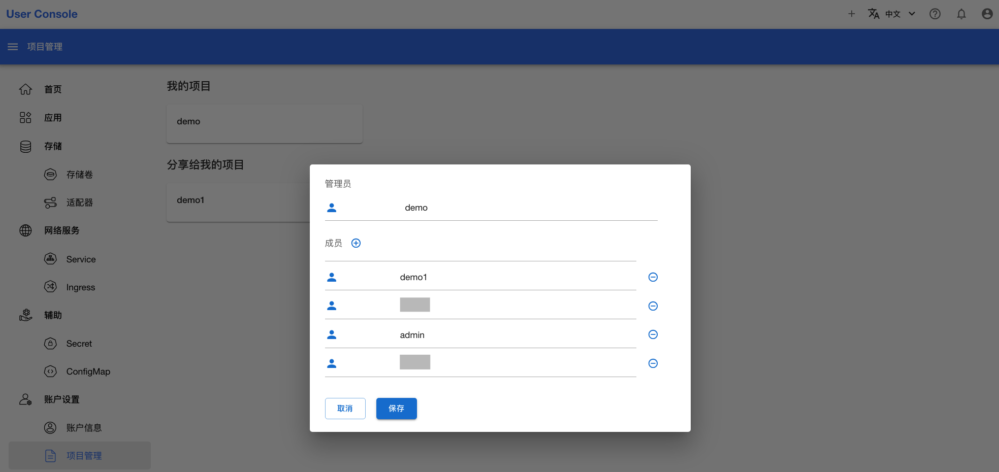

# 项目管理

点击左侧的**账户设置 > 项目管理**，展示了当前用户有权限访问的项目：

<figure class="screenshot">
  
</figure>

在**我的项目**部分，展示的都是当前用户作为项目管理员的项目。这些项目产生的所有费用，都将结算到当前用户的账单中。而在**分享给我的项目**部分展示的项目中，当前用户是项目的普通成员，不需要承担项目的费用。

点击项目名称，可以查看项目的管理员和成员。如果当前用户是项目管理员，还可以点击**成员**右侧的编辑按键调整项目成员：

<figure class="screenshot">
  
</figure>

点击**成员**右侧的加号，添加用户或者用户组为项目成员；点击已有成员右侧的减号，可以将该用户或者用户组移除项目成员：

<figure class="screenshot">
  
</figure>
