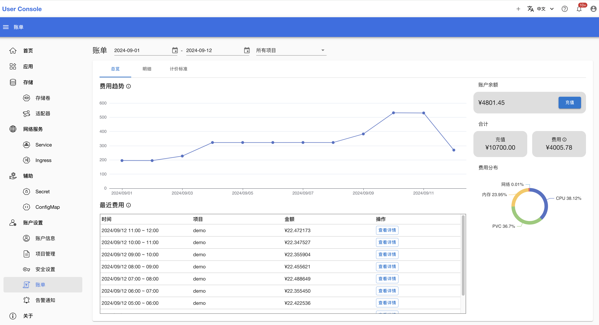
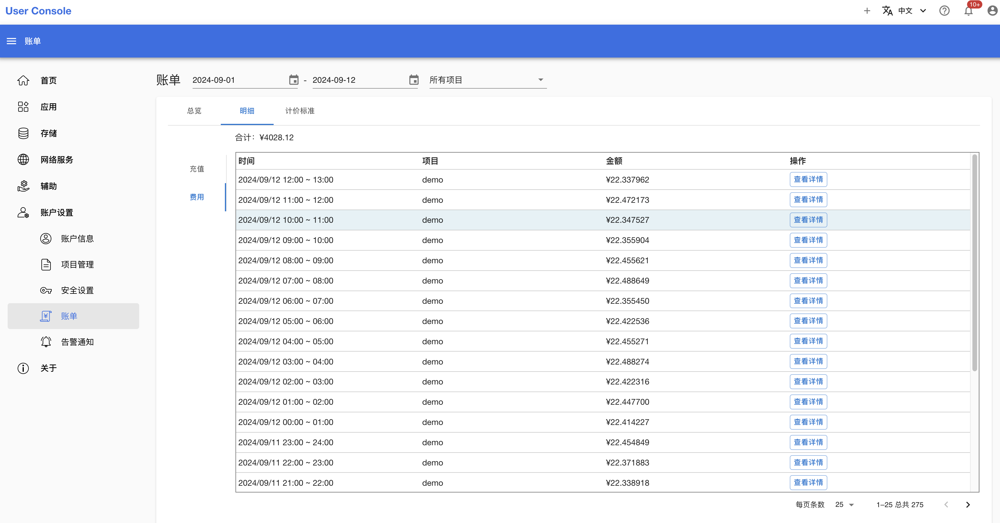
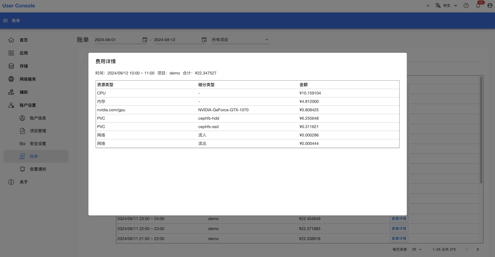
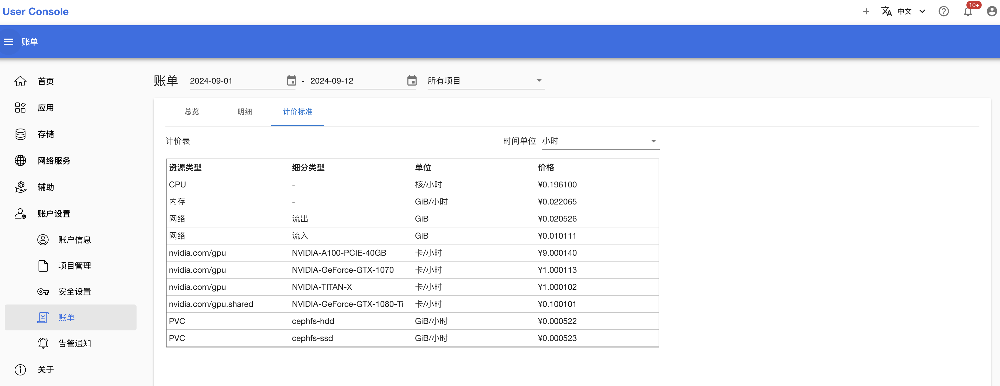

# 查看账单

点击左侧的**账户设置 > 账单**，可以查看账单页面：

<figure class="screenshot">
  
</figure>

通过最上方的日期选择框和项目选择框，你可以查看你所拥有的所有项目每天的费用。这些费用来源于你拥有的项目中使用的各种资源，包括计算资源（例如 CPU、GPU、内存）、存储资源（例如 PVC）和网络资源（例如流量）等。

点击**明细**，可以查看充值记录和费用记录：

<figure class="screenshot">
  
</figure>

对于某一条费用记录，点击**查看详情**，可以查看该条记录的详细情况：

<figure class="screenshot">
  
</figure>

点击**计价标准**，可以查看每种资源的单价：

<figure class="screenshot">
  
</figure>
