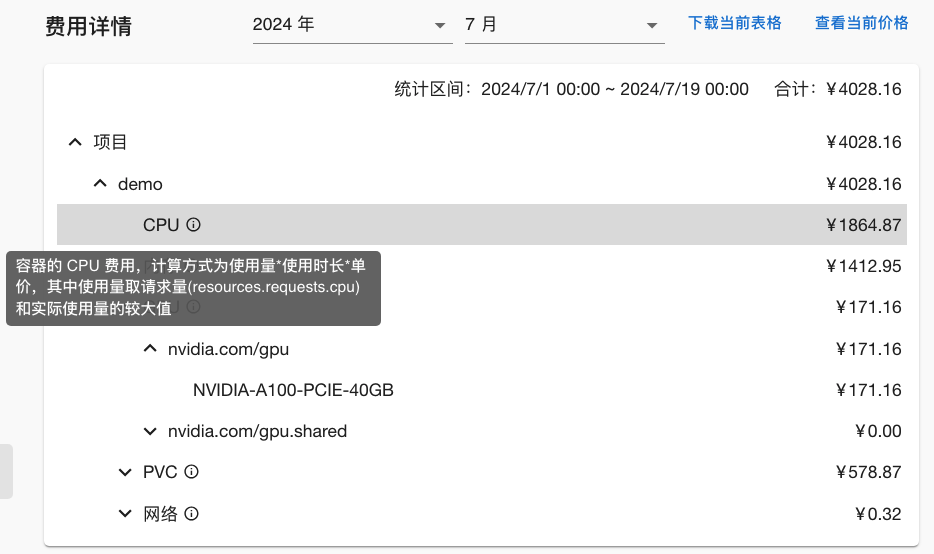
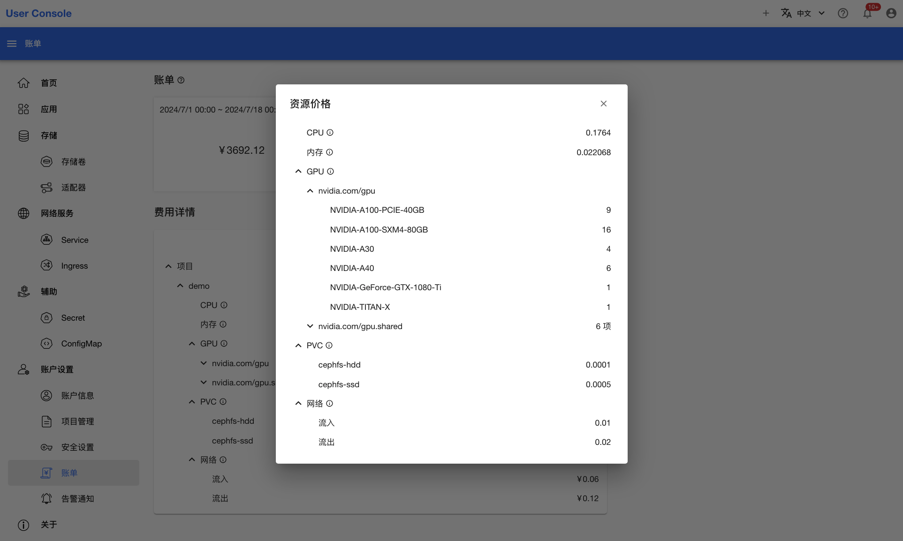

# 查看账单

点击左侧的**账户设置 > 账单**，可以查看账单页面：

<figure class="screenshot">
  
</figure>

**账单**显示了当前用户拥有的所有项目的各类费用总和。这些费用来源于你拥有的项目中使用的各种资源，包括计算资源（例如 CPU、GPU、内存）、存储资源（例如 PVC）和网络资源（例如流量）。注意：项目中所有资源的费用都由项目管理员负责，即使这个资源是其他项目成员创建的。

**费用详情**列出了费用的细分条目，即每一种资源产生的具体费用。如果你想了解某一种资源的计费方式，可以将鼠标放在该资源右侧的 感叹号 上：

<figure class="screenshot">
  
</figure>

点击**下载当前表格**，可以下载一个包含了**费用详情**信息的 csv 文件。

点击**查看当前价格**，可以查看每种资源的单价：

<figure class="screenshot">
  
</figure>
