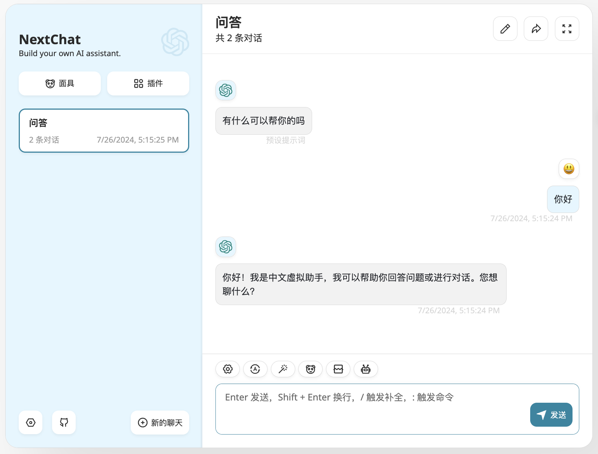

# 部署 LLM 推理服务和聊天服务

本教程演示使用 vLLM App 简单快速地将 Meta-Llama-3.1-8B-Instruct 模型部署为推理服务，再使用 NextChat App 提供一个简洁美观并且提供扩展功能的聊天 UI。

本教程的 Apps 架构如下图所示：

<figure class="architecture">
  
</figure>

## 准备工作

创建一个名为 vllm、大小 18GiB 的 PVC，然后安装一个任意的 JupyterLab App 挂载该 PVC。

进入 JupyterLab App，启动一个终端，执行以下命令以下载模型文件：

```bash
pip install modelscope

MODEL_NAME=Meta-Llama-3.1-8B-Instruct
modelscope download --model "LLM-Research/$MODEL_NAME" --exclude "original/*" --local_dir "./$MODEL_NAME"
```

## 安装 vLLM App

进入应用目录，点击 **vLLM** App，进入 README 页面：

<figure class="screenshot">
  
</figure>

README 给出了 Apps 介绍、使用方法、配置示例和参数说明，根据这些信息写出 YAML 配置如下：

```yaml
replicaCount: 1

image:
  registry: docker.io
  repository: vllm/vllm-openai
  tag: "v0.5.3.post1"
  pullPolicy: IfNotPresent

resources:
  limits:
    cpu: 4
    memory: 64Gi
    nvidia.com/gpu: 1

model:
  deployName: "llama3-1-8b"  # 模型以该名称被部署

  volume:
    existingClaim: "vllm"
    subPath: "Meta-Llama-3.1-8B-Instruct"

env: []
```

使用上述配置安装 vLLM App，待 App 就绪后，查看其信息：

<figure class="screenshot">
  
</figure>

回到 JupyterLab，在终端中执行上述命令：

<figure class="screenshot">
  
</figure>

可以看到推理服务正常返回响应。

<aside class="note tip">
<div class="title">提示</div>

上述操作同时记载于 vLLM (Llama 3.1) App 的使用方法，该 App 是 vLLM App 的变体，专门用于部署 Llama 3.1 系列模型。本教程选择更加通用的 vLLM App 作为演示，vLLM App 可以部署大多数流行的开源模型。

</aside>

## 安装 NextChat App

为了让聊天有一个简洁而美观的 UI，我们可以使用 NextChat App。进入应用目录，点击 **NextChat** App：

<figure class="screenshot">
  
</figure>

根据 README 写出 YAML 配置如下：

```yaml
replicaCount: 1

image:
  registry: docker.io
  repository: yidadaa/chatgpt-next-web
  tag: v2.12.2
  pullPolicy: IfNotPresent

service:
  type: ClusterIP
  port: 3000

resources:
  limits:
    cpu: 1
    memory: 2Gi

llm:
  provider: "openai"
  apiKey: "any"
  openai:
    baseUrl: "http://<ENDPOINT>"  # 根据 vLLM App 的信息获取服务端点

env: []
```

使用上述配置安装 NextChat App，待 App 就绪后，查看其信息：

<figure class="screenshot">
  
</figure>

在本地的终端中执行上述命令，然后在浏览器中访问相应的地址进入 UI，在设置中填写模型被部署的名称并选择该模型：

<figure class="screenshot" style="text-align: center;">
  
</figure>

然后就可以开始聊天了！

<figure class="screenshot" style="text-align: center;">
  
</figure>

## 参考

* NextChat：<a target="_blank" rel="noopener noreferrer" href="https://github.com/ChatGPTNextWeb/ChatGPT-Next-Web">https://github.com/ChatGPTNextWeb/ChatGPT-Next-Web</a>
* vLLM：<a target="_blank" rel="noopener noreferrer" href="https://github.com/vllm-project/vllm">https://github.com/vllm-project/vllm</a>
