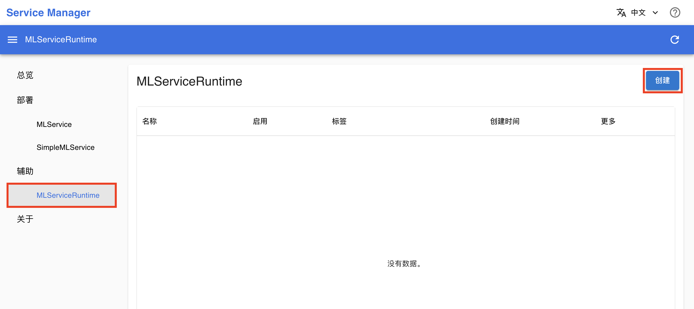
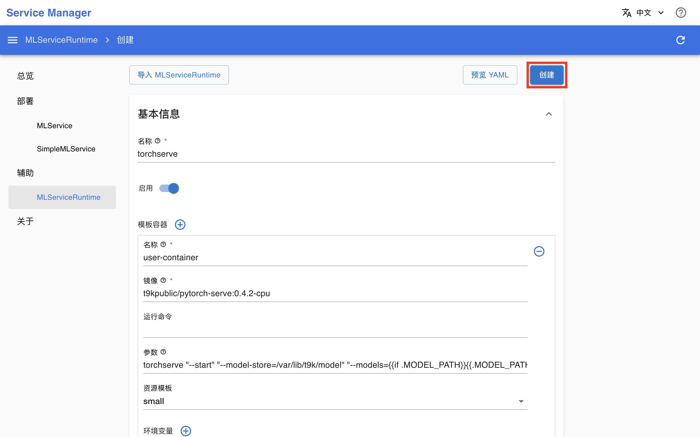
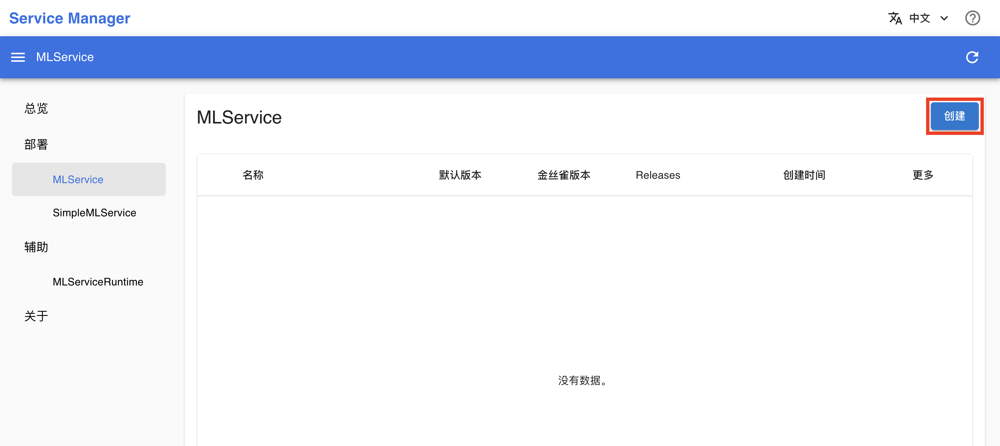
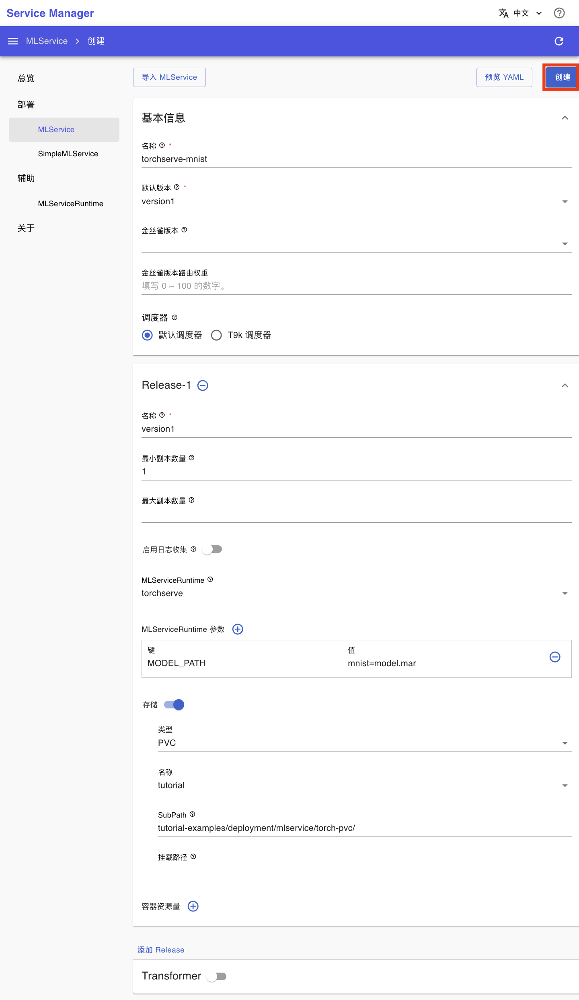
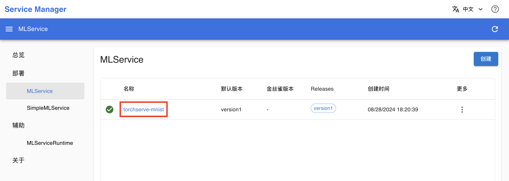
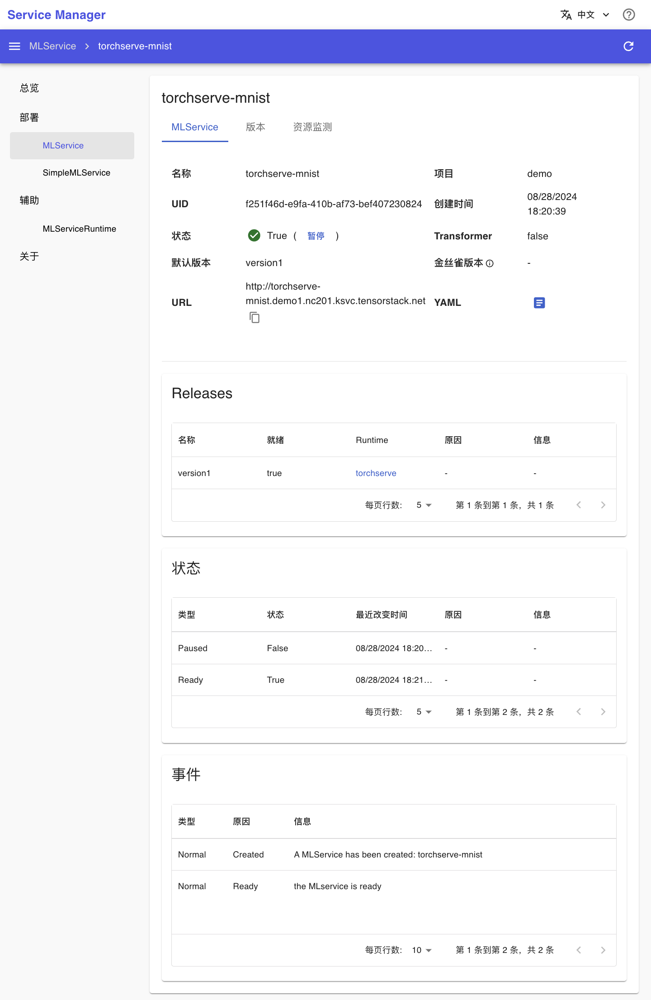
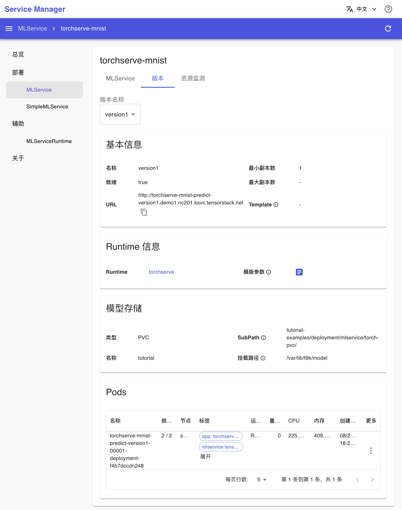
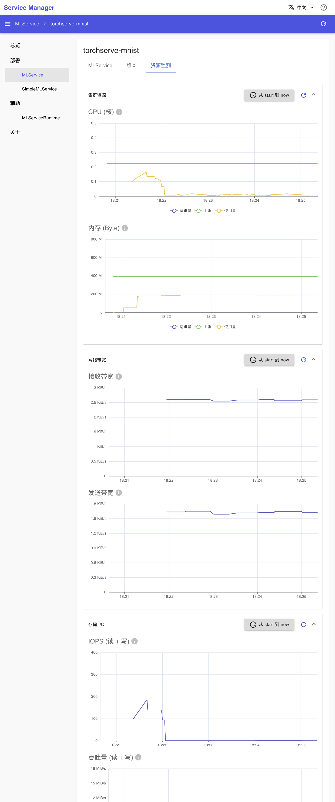
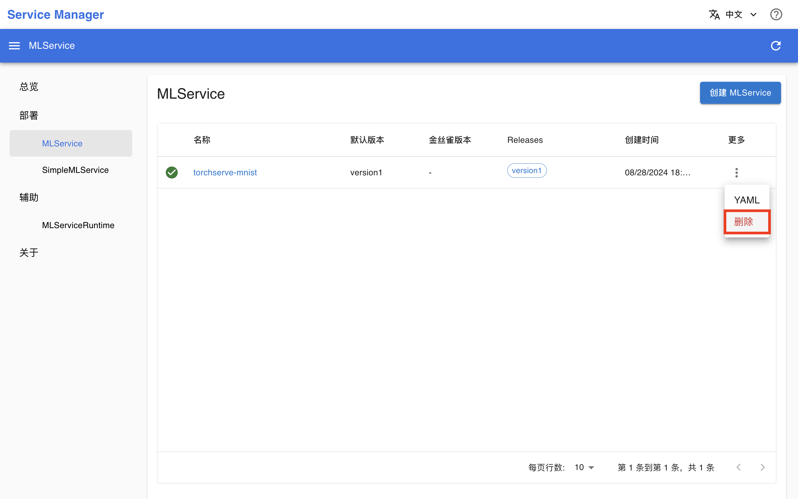

# 部署 PyTorch 模型

本教程演示使用 [MLService](../../api/t9k-service/mlservice.md) 将 PyTorch 模型归档（model archive）文件部署为推理服务（使用 <a target="_blank" rel="noopener noreferrer" href="https://github.com/pytorch/serve">TorchServe</a> 工具）。本教程对应示例<a target="_blank" rel="noopener noreferrer" href="https://github.com/t9k/tutorial-examples/tree/master/deployment/mlservice/torch-pvc">部署用于生产环境的模型推理服务（PyTorch 模型）</a>。

本教程的 Apps 架构如下图所示：

<figure class="architecture">
  
</figure>

## 准备工作

创建一个名为 tutorial、大小 1 Gi 的 [PVC](../../api/storage/pvc.md)，然后安装一个同样名为 tutorial 的 [JupyterLab](../../app/jupyterlab.md) App 挂载该 PVC，镜像和资源不限。

进入 JupyterLab，启动一个终端，执行以下命令以克隆 `t9k/tutorial-examples` 仓库：

```bash
cd ~
git clone https://github.com/t9k/tutorial-examples.git
```

<aside class="note tip">
<div class="title">提示</div>

如果你在另一篇教程中完成过上述准备工作，直接复用即可。

</aside>

## 创建 MLServiceRuntime

安装一个 [Service Manager](../../app/service-manager.md) App（如有 Service Manager 则直接复用），进入 Service Manager 的网页 UI（控制台）。在左侧导航菜单点击 **MLServiceRuntime** 进入 MLServiceRuntime 管理页面，这里展示了所有已创建的 MLServiceRuntime。点击右上角的**创建**进入创建页面：

<figure class="screenshot">
    
</figure>

在 MLServiceRuntime 创建页面，填写配置如下：

* **名称**填写 `torchserve`
* 打开**启用**
* **镜像**填写 `t9kpublic/pytorch-serve:0.4.2-cpu`
* **参数**填写 `torchserve "--start" "--model-store=/var/lib/t9k/model" "--models={{if .MODEL_PATH}}{{.MODEL_PATH}}{{else}}all{{end}}"`
* **资源模板**选择 `small`

然后点击**创建**：

<figure class="screenshot">
    
</figure>

## 启动推理服务（创建 MLService）

在左侧导航菜单点击 **MLService** 进入 MLService 管理页面。点击右上角的**创建**进入创建页面：

<figure class="screenshot">
    
</figure>

在 MLServiceRuntime 创建页面，填写配置如下：

* 基本信息部分：
    * **名称**填写 `torchserve-mnist`
    * **默认版本**选择 `version1`（需要先填写 Release-1 部分的名称）
* Release-1 部分：
    * **名称**填写 `version1`
    * **最小副本数量**填写 `1`
    * **MLServiceRuntime**选择 `torchserve`
    * 添加一个 **MLServiceRuntime 参数**，**键**填写 `MODEL_PATH`，**值**填写 `mnist=model.mar`
    * 打开**存储**，**类型**选择 `PVC`，**名称**选择 `tutorial`，**子路径**填写 `tutorial-examples/deployment/mlservice/torch-pvc/`。

然后点击**创建**：

<figure class="screenshot">
    
</figure>

## 查看推理服务信息（查看 MLService 详情）

回到 MLService 管理页面，可以看到名为 **torchserve-mnist** 的 MLService，点击其**名称**进入详情页面：

<figure class="screenshot">
    
</figure>

可以看到刚才创建的 MLService 的基本信息，以及 Release、状况和事件信息：

<figure class="screenshot">
    
</figure>

点击上方的**版本**标签页，进一步查看各个版本的详细信息，包括 Runtime 信息、模型存储和 Pod 信息：

<figure class="screenshot">
    
</figure>

点击上方的**资源监测**标签页，查看 MLService 运行过程中使用集群计算资源、网络资源和存储资源的情况：

<figure class="screenshot">
    
</figure>

若 MLService 的状态为 <span class="twemoji"><svg xmlns="http://www.w3.org/2000/svg" viewBox="0 0 24 24"><path d="M13 13h-2V7h2m0 10h-2v-2h2M12 2A10 10 0 0 0 2 12a10 10 0 0 0 10 10 10 10 0 0 0 10-10A10 10 0 0 0 12 2Z"></path></svg></span> False，且原因不是 PredictorNotReady，则需要根据状态和事件信息部分给出的错误信息进行问题排查。

## 测试推理服务

待 MLService 的状态为 <span class="twemoji"><svg xmlns="http://www.w3.org/2000/svg" viewBox="0 0 24 24"><path d="M12 2C6.5 2 2 6.5 2 12s4.5 10 10 10 10-4.5 10-10S17.5 2 12 2m-2 15-5-5 1.41-1.41L10 14.17l7.59-7.59L19 8l-9 9Z"></path></svg></span> True 后，回到 JupyterLab，在终端中执行以下命令，注意将 `<MLSERVICE_URL>` 替换为 MLService 的 URL（在 MLService 的详情页面复制得到）：

```bash
cd ~/tutorial-examples/deployment/mlservice/torch-pvc
curl -T test_data/0.png <MLSERVICE_URL>/v1/models/mnist:predict # or use `1.png`, `2.png`
```

响应体应是一个类似于下面的 JSON，其预测了图片最有可能是的 5 个数字以及相应的概率：

```
{
  "0": 1.0,
  "2": 1.3369878815172598e-10,
  "6": 7.102208632401436e-14,
  "5": 5.859716330864836e-14,
  "9": 3.2580891499658536e-15
}
```

## 关闭推理服务（删除 MLService）

回到 MLService 管理页面，点击 MLService 右侧的 <span class="twemoji"><svg xmlns="http://www.w3.org/2000/svg" viewBox="0 0 24 24"><path d="M12 16a2 2 0 0 1 2 2 2 2 0 0 1-2 2 2 2 0 0 1-2-2 2 2 0 0 1 2-2m0-6a2 2 0 0 1 2 2 2 2 0 0 1-2 2 2 2 0 0 1-2-2 2 2 0 0 1 2-2m0-6a2 2 0 0 1 2 2 2 2 0 0 1-2 2 2 2 0 0 1-2-2 2 2 0 0 1 2-2Z"></path></svg></span> **> 删除**，确认以删除 MLService：

<figure class="screenshot">
    
</figure>

<aside class="note tip">
<div class="title">提示</div>

上述关于 MLService（和 MLServiceRuntime）的操作全部在 Service Manager 中进行。你也可以参照<a target="_blank" rel="noopener noreferrer" href="https://github.com/t9k/tutorial-examples/tree/master/deployment/mlservice/torch-pvc">本教程对应的示例</a>的 README 文档进行操作，继续在 JupyterLab 的终端中使用 `kubectl` 命令创建 MLServiceRuntime 和 MLService、监控服务状态、测试推理服务以及删除 MLService。

</aside>
