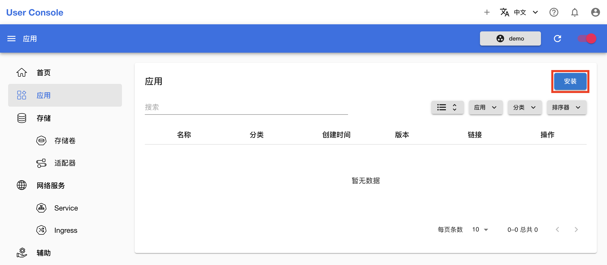
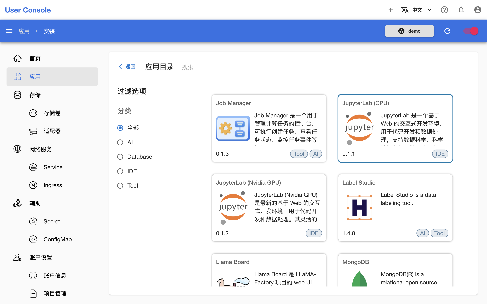
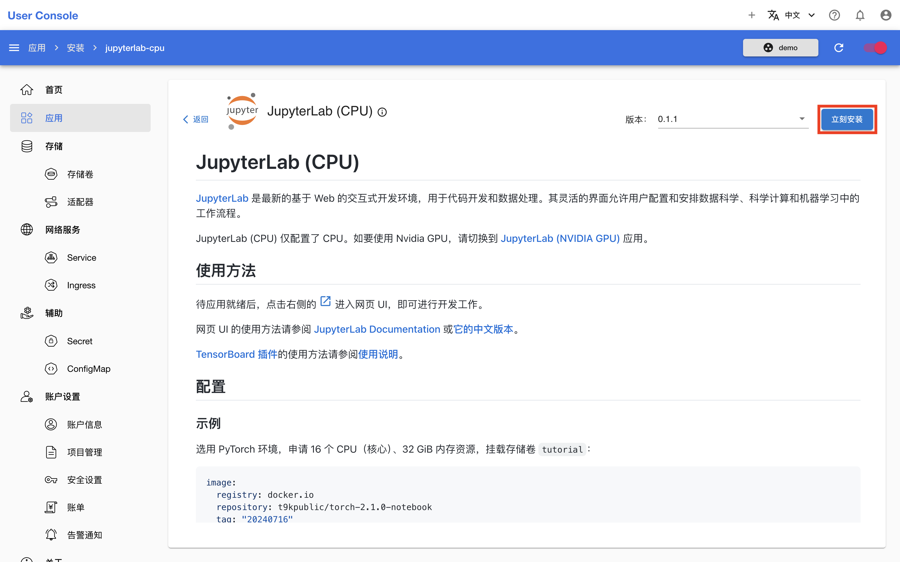
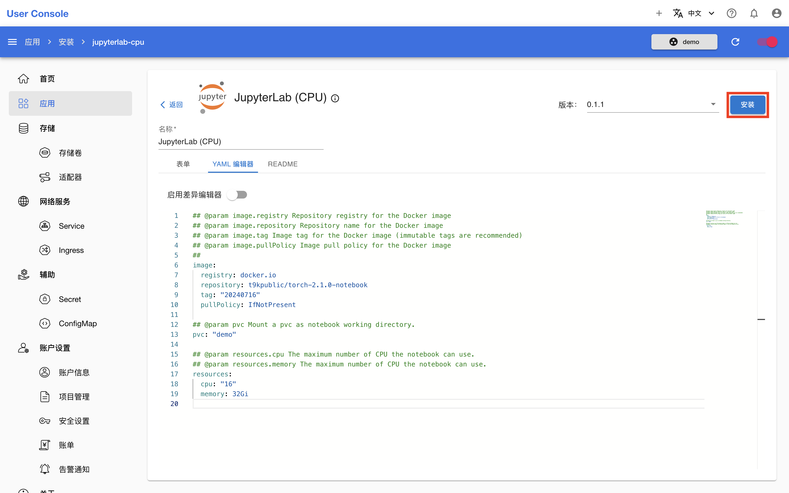
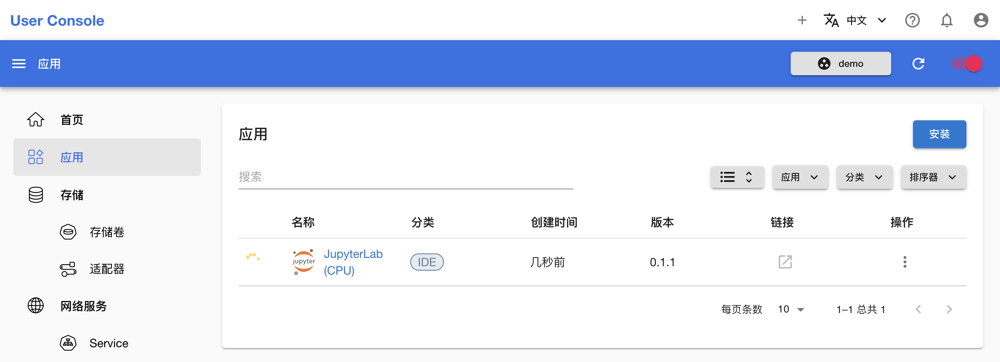
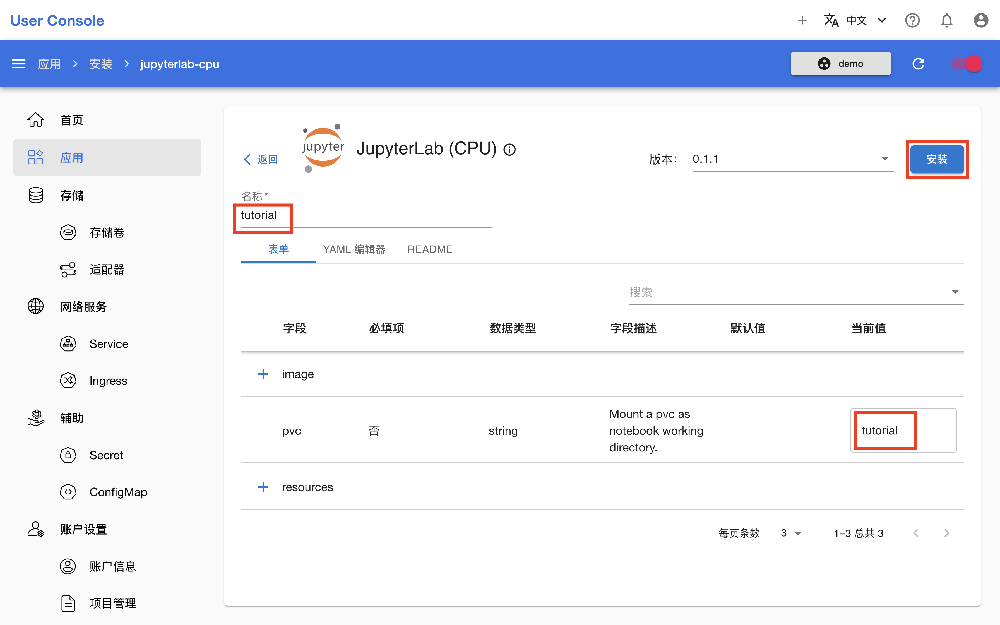

# 安装 Apps

本教程演示如何安装 Apps。

## 查看可安装的 Apps

在左侧导航菜单点击**应用**进入 Apps 管理页面，这里展示了所有运行中的 Apps。点击右上角的**安装**进入应用目录：

<figure class="screenshot">
  
</figure>

应用目录展示了所有可安装的 Apps 和它们的简介，你可以点击左侧的**过滤选项**过滤显示的 App，或在上方的**搜索栏**输入名称以快速查找：

<figure class="screenshot">
  
</figure>

## 选择并了解 App

如果你想要进一步了解某个 App 的功能和使用方法是否满足需求，点击以查看它的 README 文档。这里以最常用的交互式开发环境（IDE）App JupyterLab (CPU) 为例，点击 **JupyterLab (CPU) 卡片**进入 README 文档页面：

<figure class="screenshot">
  
</figure>

App 的 README 主要包含三个方面的信息：

1. 对于 App 的简短介绍：介绍 App 是什么，用来做什么，有什么特性。

    * 介绍的第一个链接是指向原项目的，你可以点击前往了解原项目的详情。

2. App 的使用方法：指导如何进行具体操作。

    * 使用方法可能会链接到官方文档。
    * 对于操作简单的网页 UI，可能不提供具体的使用方法。
    * 有时会附上一些网页 UI 的截图拱参考。

3. App 的配置方法：如果你确认 App 满足你的需求并着手安装时，接下来就需要参考此部分学习如何配置 App，根据配置示例和字段说明，确定符合需求的配置。

    * 可能提供额外的配置说明。
    * 对于有多个可选镜像的 App，还会提供镜像列表。

点击右上角的**立刻安装**进入安装页面：

<figure class="screenshot">
  
</figure>

## 配置和安装 App

在安装页面，填写配置可以通过**表单**或者 **YAML 编辑器**。前者提供了一个详细的字段设置界面，可以直接编辑各个字段；后者则需要编辑 YAML 文件，适合熟悉 YAML 格式的用户。

假定为 JupyterLab (CPU) App 选用 PyTorch 环境，申请 16 个 CPU（核心）、32 GiB 内存资源，挂载存储卷 `demo`。通过表单配置：

<figure class="screenshot">
  
</figure>

通过 YAML 编辑器配置：

<figure class="screenshot">
  
</figure>

不论以哪种方式，填写配置完成后，点击右上角的**安装**：

<aside class="note tip">

提示

填写配置的过程中可以点击 **README** 标签页再次查看 App 的配置方法，已经填写的内容会被保留。

</aside>

## 等待 App 就绪

安装完成后，等待 App 就绪。等待时间可能受以下因素影响：

1. 是否需要拉取镜像，以及镜像的大小和下载速度；
2. 应用的复杂程度（例如 K8s 和 T9k 资源的数量和依赖关系）；
3. 应用启动后是否需要初始化（例如下载数据集、加载模型文件等）

<figure class="screenshot">
  
</figure>

## 开始使用 App

待 App 就绪后，按照 README 提供的 App 的使用方法开始使用。对于 JupyterLab (CPU) App，即点击右侧的 <svg class="MuiSvgIcon-root MuiSvgIcon-colorPrimary MuiSvgIcon-fontSizeMedium css-jxtyyz" focusable="false" aria-hidden="true" viewBox="0 0 24 24" data-testid="OpenInNewIcon"><path d="M19 19H5V5h7V3H5c-1.11 0-2 .9-2 2v14c0 1.1.89 2 2 2h14c1.1 0 2-.9 2-2v-7h-2zM14 3v2h3.59l-9.83 9.83 1.41 1.41L19 6.41V10h2V3z"></path></svg> 进入网页 UI，参阅 <a target="_blank" rel="noopener noreferrer" href="https://jupyterlab.readthedocs.io/en/latest/">JupyterLab Documentation</a> 或<a target="_blank" rel="noopener noreferrer" href="https://jupyterlab.pythonlang.cn/en/latest/">它的中文版本</a>进行操作。

<figure class="screenshot">
  
</figure>

## 克隆 App

如要安装一个与运行中的某个 App 配置相同或相似的 App，可以选择克隆该运行中的 App，而无需重复上面的操作。

假定再安装一个 JupyterLab (CPU) App，挂载存储卷 `tutorial`，其他配置不变。点击运行中的 JupyterLab (CPU) App 右侧的 <svg xmlns="http://www.w3.org/2000/svg" viewBox="0 0 24 24"><path d="M12 16a2 2 0 0 1 2 2 2 2 0 0 1-2 2 2 2 0 0 1-2-2 2 2 0 0 1 2-2m0-6a2 2 0 0 1 2 2 2 2 0 0 1-2 2 2 2 0 0 1-2-2 2 2 0 0 1 2-2m0-6a2 2 0 0 1 2 2 2 2 0 0 1-2 2 2 2 0 0 1-2-2 2 2 0 0 1 2-2Z"></path></svg> **> 克隆**，进入安装页面，此时配置已经按照该 App 填写，因此修改 `pvc` 字段的值为 `tutorial` 即可。然后为了便于辨识，修改其**名称**为 `tutorial`。最后点击右上角的**安装**：

<figure class="screenshot">
  
</figure>

<figure class="screenshot">
  
</figure>

<figure class="screenshot">
  
</figure>

<aside class="note">

注意

用户可以修改 App 的默认名称，该名称仅有便于用户辨识的作用，并不是 App 的唯一标识符；App 的名称可以任意重名。这可以类比到在某些智能手机系统或桌面中，你可以安装两个微信，并且可以将第二个微信重命名为“微信”、“微信2”、“QQ”或其他任意的名称。

本文档将上面安装的第一个 App 称为“JupyterLab (CPU) App”，第二个 App 称为“名称为 `tutorial` 的 JupyterLab (CPU) App”。

</aside>
