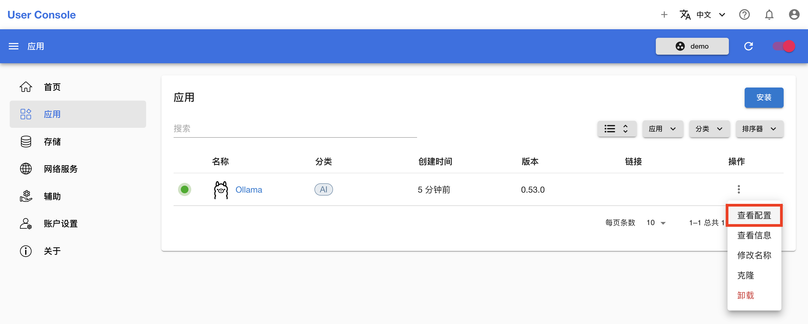
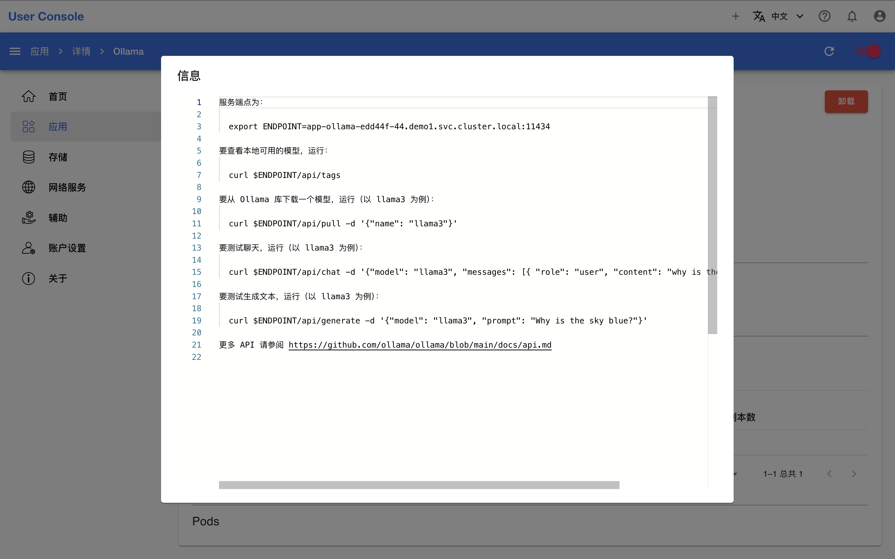

# 查看 App 详情

本教程演示查看一个 App 的详细信息。

App 管理页面已经展示了 App 的部分信息，包括状态、图标、名称、分类、创建时间和版本。点击 App 的名称进入其详情页面：

<figure class="screenshot">
  
</figure>

App 的详情页面展示了 App 的基本信息、网络配置、安装清单和 Pod 信息，下面将展开介绍：

<figure class="screenshot">
  
</figure>

## 基本信息

**基本信息**包含 App 的名称、App 的图标和原始名称、当前状态、资源请求和限制、创建时间等。点击**配置**右侧的 <svg viewBox="0 0 24 24"><path d="M19 3H5c-1.1 0-2 .9-2 2v14c0 1.1.9 2 2 2h14c1.1 0 2-.9 2-2V5c0-1.1-.9-2-2-2m-5 14H7v-2h7zm3-4H7v-2h10zm0-4H7V7h10z"></path></svg>，可以查看 App 安装时的配置：

<figure class="screenshot">
  
</figure>

<figure class="screenshot">
  
</figure>

<aside class="note tip">

提示

另一种方法是回到 App 管理页面，点击 App 右侧的 <svg xmlns="http://www.w3.org/2000/svg" viewBox="0 0 24 24"><path d="M12 16a2 2 0 0 1 2 2 2 2 0 0 1-2 2 2 2 0 0 1-2-2 2 2 0 0 1 2-2m0-6a2 2 0 0 1 2 2 2 2 0 0 1-2 2 2 2 0 0 1-2-2 2 2 0 0 1 2-2m0-6a2 2 0 0 1 2 2 2 2 0 0 1-2 2 2 2 0 0 1-2-2 2 2 0 0 1 2-2Z"></path></svg> **> 查看配置**：

<figure class="screenshot">
  
</figure>

</aside>

<aside class="note tip">

提示

如果你想要使用该配置再次安装，直接[克隆](./install-app.md#克隆-app)即可。

</aside>

点击**信息**右侧的 <svg viewBox="0 0 24 24"><path d="M19 3H5c-1.1 0-2 .9-2 2v14c0 1.1.9 2 2 2h14c1.1 0 2-.9 2-2V5c0-1.1-.9-2-2-2m-5 14H7v-2h7zm3-4H7v-2h10zm0-4H7V7h10z"></path></svg>，可以查看 App（可能）提供的信息：

<figure class="screenshot">
  
</figure>

<figure class="screenshot">
  
</figure>

<aside class="note tip">

提示

另一种方法是回到 App 管理页面，点击 App 右侧的 <svg xmlns="http://www.w3.org/2000/svg" viewBox="0 0 24 24"><path d="M12 16a2 2 0 0 1 2 2 2 2 0 0 1-2 2 2 2 0 0 1-2-2 2 2 0 0 1 2-2m0-6a2 2 0 0 1 2 2 2 2 0 0 1-2 2 2 2 0 0 1-2-2 2 2 0 0 1 2-2m0-6a2 2 0 0 1 2 2 2 2 0 0 1-2 2 2 2 0 0 1-2-2 2 2 0 0 1 2-2Z"></path></svg> **> 查看信息**：

<figure class="screenshot">
  
</figure>

</aside>

对于部分 App，信息包含了访问网页 UI、获取服务端点或进行功能测试的方法。

如果 App 处于 NotReady 状态，可以点击**状态**右侧的**诊断**查看诊断结果以尝试定位原因：

<figure class="screenshot">
  
</figure>

<figure class="screenshot">
  
</figure>

对于上图中的示例，诊断结果显示 Pod 的 `spec.volumes[0].persistentVolumeClaim.claimName` 字段的值是必需的却没有提供，这提示着没有为 JupyterLab (CPU) App 绑定一个 PVC。

<aside class="note tip">

提示

分析诊断结果可能需要具备一定的 Kubernetes 基础并且了解 App 的资源清单，如果你有任何疑问，请询问平台的管理员。

</aside>

## 网络配置

**网络配置**提供了分别从集群内部和外部访问 App 服务的地址。外部地址对应 App 管理页面的链接，没有外部地址的 App 也就没有链接。

## 安装清单

**安装清单**列出了 App 创建的所有 [API](../../api/index.md) 资源。

## Pod 信息

**Pods** 部分列出了 App（间接）创建的所有 Pod。点击 Pod 右侧的 <svg xmlns="http://www.w3.org/2000/svg" viewBox="0 0 24 24"><path d="M12 16a2 2 0 0 1 2 2 2 2 0 0 1-2 2 2 2 0 0 1-2-2 2 2 0 0 1 2-2m0-6a2 2 0 0 1 2 2 2 2 0 0 1-2 2 2 2 0 0 1-2-2 2 2 0 0 1 2-2m0-6a2 2 0 0 1 2 2 2 2 0 0 1-2 2 2 2 0 0 1-2-2 2 2 0 0 1 2-2Z"></path></svg> 可以进行更多操作，例如查看 Pod 的日志，在 Pod 的容器终端中执行命令以进行调试等：

<figure class="screenshot">
  
</figure>

<figure class="screenshot">
  
</figure>

<figure class="screenshot">
  
</figure>
