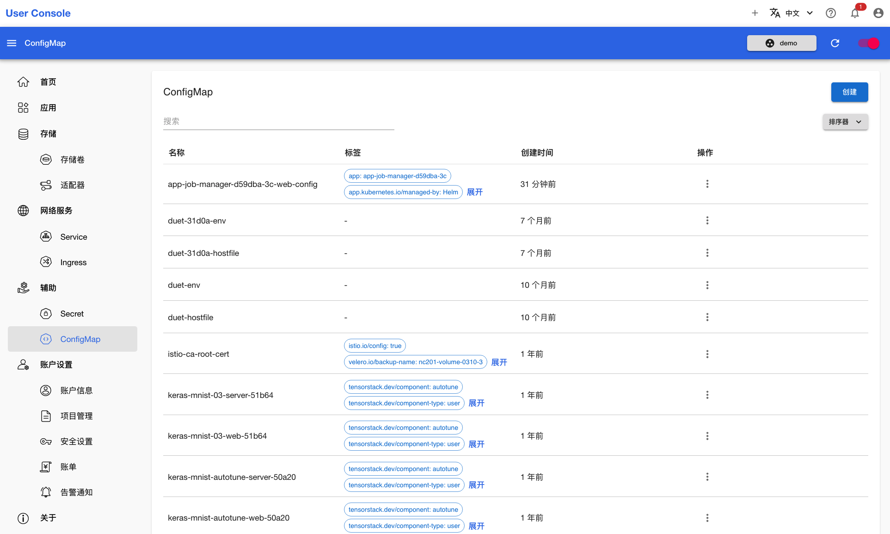

# 创建 ConfigMap

<a target="_blank" rel="noopener noreferrer" href="https://t9k.github.io/user-manuals/latest/modules/auxiliary/configmap.html">ConfigMap</a> 是一种 API 对象，用来将非机密性的数据保存到键值对中。本章演示创建 ConfigMap 来保存 Ceph 服务的信息。

<aside class="note">

注意

本章的示例是用户创建一个保存了 Ceph 配置信息的 ConfigMap 作为自己的私有配置。在实际使用中，也可以让管理员创建一个 ConfigMap 作为所有用户的公共配置。

</aside>

点击**辅助 > ConfigMap**，查看已有的 ConfigMap：

<figure class="screenshot">
  
</figure>

点击右上角的**创建**，进入创建页面。填写 ConfigMap 名称、标签和数据（这些数据的值来自于管理员），点击右上角的**创建**，即可完成 ConfigMap 的创建：

<figure class="screenshot">
  
</figure>
