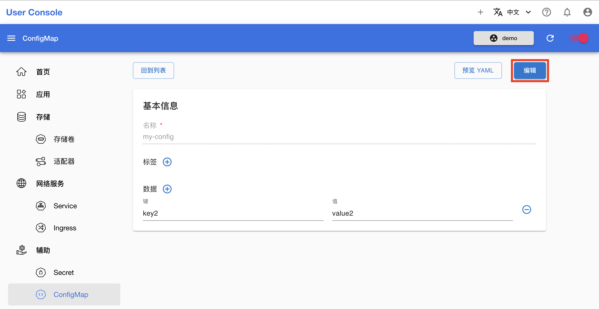

# 管理 ConfigMap

本教程演示创建、查看、修改和删除 [ConfigMap](../../api/auxiliary/configmap.md)。

## 准备工作

* 了解 ConfigMap 的<a target="_blank" rel="noopener noreferrer" href="https://kubernetes.io/zh/docs/concepts/configuration/configmap/">概念</a>和 <a target="_blank" rel="noopener noreferrer" href="https://kubernetes.io/docs/reference/kubernetes-api/config-and-storage-resources/config-map-v1/">Kubernetes API</a>。

## 创建 ConfigMap

在左侧导航菜单点击**辅助 > ConfigMap** 进入 ConfigMap 管理页面，这里展示了所有存在的 ConfigMap。点击右上角的**创建**进入创建页面：

<figure class="screenshot">
  
</figure>

在 ConfigMap 创建页面，填写名称和要存储的数据，然后点击**创建**：

<figure class="screenshot">
  
</figure>

## 使用 ConfigMap

ConfigMap 的使用方式与 Secret 类似，这里不再赘述。

## 查看和编辑 ConfigMap

在 ConfigMap 管理页面，点击 ConfigMap 右侧的 <svg xmlns="http://www.w3.org/2000/svg" viewBox="0 0 24 24"><path d="M12 16a2 2 0 0 1 2 2 2 2 0 0 1-2 2 2 2 0 0 1-2-2 2 2 0 0 1 2-2m0-6a2 2 0 0 1 2 2 2 2 0 0 1-2 2 2 2 0 0 1-2-2 2 2 0 0 1 2-2m0-6a2 2 0 0 1 2 2 2 2 0 0 1-2 2 2 2 0 0 1-2-2 2 2 0 0 1 2-2Z"></path></svg> **> 编辑**进入编辑页面：

<figure class="screenshot">
  
</figure>

在 ConfigMap 编辑页面可以查看和修改数据（但是不能重命名 ConfigMap），修改完成后点击**编辑**以保存：

<figure class="screenshot">
  
</figure>

## 删除 ConfigMap

在 ConfigMap 管理页面，点击 ConfigMap 右侧的 <svg xmlns="http://www.w3.org/2000/svg" viewBox="0 0 24 24"><path d="M12 16a2 2 0 0 1 2 2 2 2 0 0 1-2 2 2 2 0 0 1-2-2 2 2 0 0 1 2-2m0-6a2 2 0 0 1 2 2 2 2 0 0 1-2 2 2 2 0 0 1-2-2 2 2 0 0 1 2-2m0-6a2 2 0 0 1 2 2 2 2 0 0 1-2 2 2 2 0 0 1-2-2 2 2 0 0 1 2-2Z"></path></svg> **> 删除**，确认以删除 ConfigMap：

<figure class="screenshot">
    
</figure>

<aside class="note tip">

提示

和 Secret 一样，许多 Apps 和 APIs 会自动创建所需的 ConfigMap，例如上图中的 ConfigMap app-service-manager-dab483-6d-web-config 和 pep-config-app-service-manager-dab483-6d 就是由 Service Manager App 自动创建。这样的 ConfigMap 的生命周期同样由创建它的 App 或 API 管理，也就是说，删除创建它的 App 或 API，它也会被随之删除，因此你无需管理这种 ConfigMap。

</aside>
