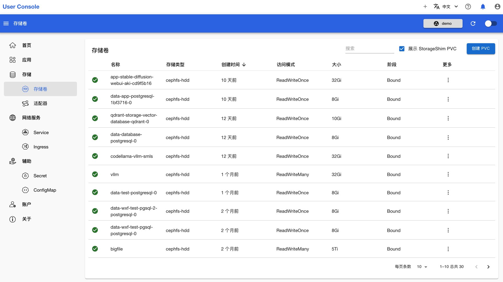
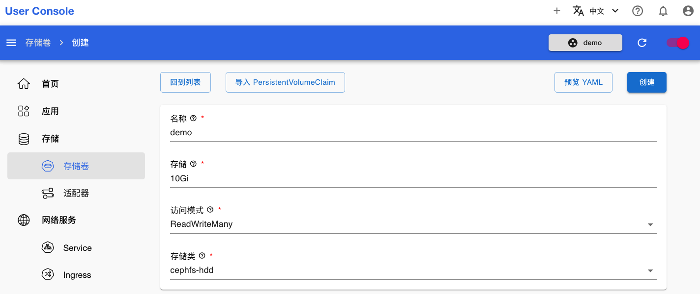
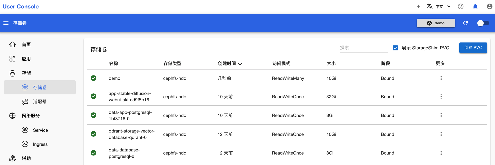

# 创建 PVC

<a target="_blank" rel="noopener noreferrer" href="https://t9k.github.io/user-manuals/latest/modules/storage/pvc.html">PVC</a> 是一种 Kubernetes 原生资源，是对存储的需求声明。用户可以请求特定大小和访问模式的存储，而不必关心存储的具体实现。本章演示创建一个 PVC。

点击菜单**存储 > 存储卷**，打开 PVC 的列表页面。然后点击右上角**创建 PVC**，进入 PVC 创建页面：

<figure class="screenshot">
  
</figure>

填写 PVC 的名称、存储空间大小，选择访问模式、存储类，确认右上角选择的项目，然后点击右上方的**创建**：

<figure class="screenshot">
  
</figure>

回到存储卷列表，可以看到刚创建的 PVC：

<figure class="screenshot">
  
</figure>

## 下一步

- [安装 Apps](../app/index.md)
- 或者，了解 [创建存储适配器（StorageShim)](./adapter.md)
