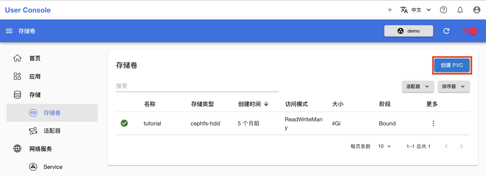
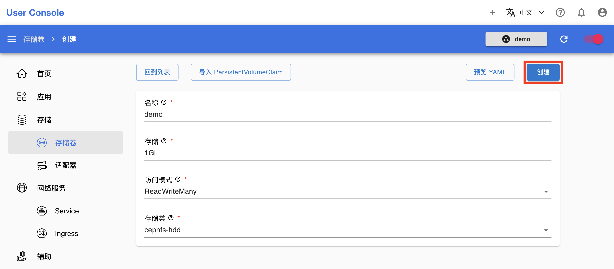
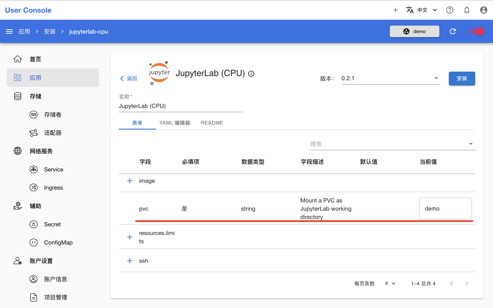
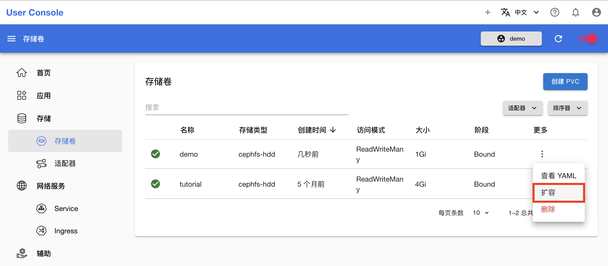
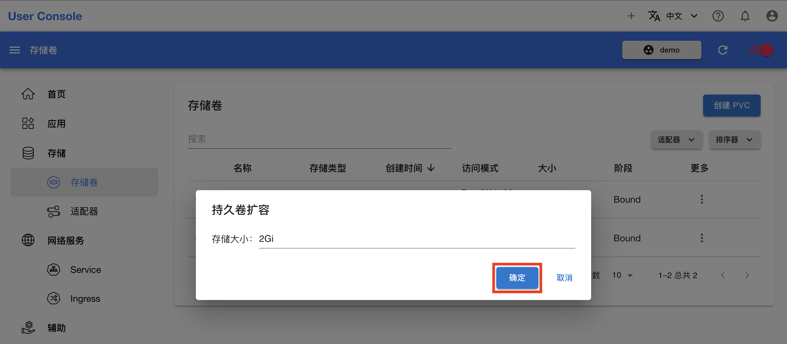
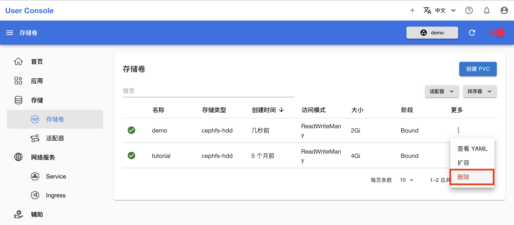

# 管理 PVC

本教程演示创建、扩容和删除 [PVC](../../api/storage/pvc.md)。

## 准备工作

* 了解 PVC 的<a target="_blank" rel="noopener noreferrer" href="https://kubernetes.io/zh/docs/concepts/storage/persistent-volumes/">概念</a>和 <a target="_blank" rel="noopener noreferrer" href="https://kubernetes.io/docs/reference/kubernetes-api/config-and-storage-resources/persistent-volume-claim-v1/">Kubernetes API</a>。

## 创建 PVC

在左侧导航菜单点击**存储 > 存储卷**进入 PVC 管理页面，这里展示了所有存在的 PVC。点击右上角的**创建 PVC**进入创建页面：

<figure class="screenshot">
  
</figure>

在 PVC 创建页面，填写名称和存储卷大小，选择存储卷访问模式和存储类，然后点击**创建**。

<figure class="screenshot">
  
</figure>

<aside class="note tip">
<div class="title">提示</div>

你可以点击左上角的**导入 PersistentVolumeClaim** 以加载当前存在的某个 PVC 的配置。

</aside>

## 使用 PVC

PVC 的使用方式是作为存储卷挂载到 Pod 的容器中。例如在配置 JupyterLab App 时，你[必须为其挂载一个 PVC](../../app/jupyterlab.md#挂载-pvc) 作为工作空间：

<figure class="screenshot">
  
</figure>

最终 PVC 被挂载到运行 JupyterLab 服务的容器的 `/t9k/mnt` 路径下。

下列文档提供了一些使用 PVC 的具体案例，供用户参考：

* [进行数据并行训练](../train-model/dp-training.md)
* [部署 PyTorch 服务](../deploy-model/deploy-pytorch.md)
* [上传和下载文件](../theme/upload-and-download-file.md)

## 扩容 PVC

在 PVC 管理页面，点击 PVC 右侧的 <span class="twemoji"><svg xmlns="http://www.w3.org/2000/svg" viewBox="0 0 24 24"><path d="M12 16a2 2 0 0 1 2 2 2 2 0 0 1-2 2 2 2 0 0 1-2-2 2 2 0 0 1 2-2m0-6a2 2 0 0 1 2 2 2 2 0 0 1-2 2 2 2 0 0 1-2-2 2 2 0 0 1 2-2m0-6a2 2 0 0 1 2 2 2 2 0 0 1-2 2 2 2 0 0 1-2-2 2 2 0 0 1 2-2Z"></path></svg></span> **> 扩容**：

<figure class="screenshot">
  
</figure>

填写新的存储大小（必须大于原大小），点击**确定**以扩容 PVC：

<figure class="screenshot">
  
</figure>

<aside class="note">
<div class="title">注意</div>

部分存储类型不支持扩容。

</aside>

## 删除 PVC

在 PVC 管理页面，点击 PVC 右侧的 <span class="twemoji"><svg xmlns="http://www.w3.org/2000/svg" viewBox="0 0 24 24"><path d="M12 16a2 2 0 0 1 2 2 2 2 0 0 1-2 2 2 2 0 0 1-2-2 2 2 0 0 1 2-2m0-6a2 2 0 0 1 2 2 2 2 0 0 1-2 2 2 2 0 0 1-2-2 2 2 0 0 1 2-2m0-6a2 2 0 0 1 2 2 2 2 0 0 1-2 2 2 2 0 0 1-2-2 2 2 0 0 1 2-2Z"></path></svg></span> **> 删除**，确认以删除 PVC：

<figure class="screenshot">
    
</figure>

<aside class="note warning">
<div class="title">警告</div>

删除 PVC 后，PVC 中的文件会全部丢失，无法找回。请确认你不再需要这个 PVC 中的任何文件后再删除 PVC。

</aside>

<aside class="note">
<div class="title">注意</div>

正在被挂载到一个或多个 Pod 上的 PVC 不能被删除。如果你试图删除这样的 PVC，它会进入 Terminating 阶段，继续存在但不能再被挂载；一旦挂载它的所有 Pod 都被删除，它也会被随之删除。

</aside>

## 在终端操作

你也可以在 JupyterLab、Terminal 等 App 的终端使用 `kubectl` 命令完成上述操作，例如查看当前项目下的所有 PVC：

```
[/ root@app-terminal-a0cf62-73-57b676fcc4-bh8zc]
# kubectl get pvc
NAME    STATUS   VOLUME                                     CAPACITY   ACCESS MODES   STORAGECLASS   AGE
demo    Bound    pvc-805d660d-f03a-4893-910c-7c8b06922de8   1Gi        RWX            cephfs-hdd     18m
mnist   Bound    pvc-0a272431-97b0-4b9d-9a91-2fa49859d219   1Gi        RWX            cephfs-hdd     3d6h
```

查看一个 PVC 的详细信息：

```
[/ root@app-terminal-a0cf62-73-57b676fcc4-bh8zc]
# kubectl get mnist
Name:          mnist
Namespace:     demo
StorageClass:  cephfs-hdd
Status:        Bound
Volume:        pvc-0a272431-97b0-4b9d-9a91-2fa49859d219
Labels:        <none>
Annotations:   pv.kubernetes.io/bind-completed: yes
               pv.kubernetes.io/bound-by-controller: yes
               volume.beta.kubernetes.io/storage-provisioner: cephfs-hdd.csi.ceph.com
               volume.kubernetes.io/storage-provisioner: cephfs-hdd.csi.ceph.com
Finalizers:    [kubernetes.io/pvc-protection]
Capacity:      1Gi
Access Modes:  RWX
VolumeMode:    Filesystem
Used By:       managed-simplemlservice-mnist-7fdfd-765d94c499-5kcfk
               mnist-84350-node-0
Events:        <none>
```

删除一个 PVC：

```
[/ root@app-terminal-a0cf62-73-57b676fcc4-bh8zc]
# kubectl delete pvc demo
persistentvolumeclaim "demo" deleted
```
