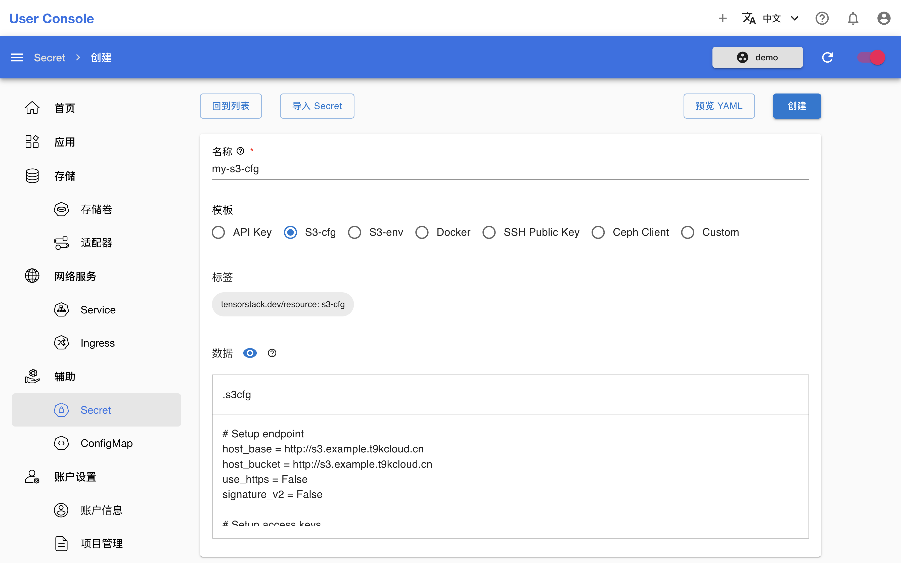
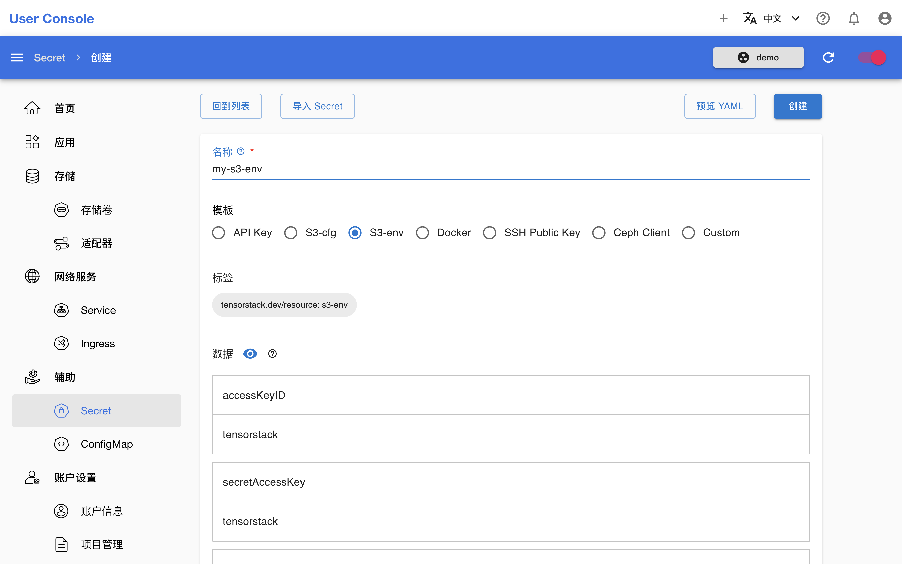

# S3 场景

当 App 或 API 需要连接 S3 存储服务时，可以创建 S3-cfg 或 S3-env 类型的 Secret 存储访问凭证，并将其提供给这些 App 或 API。S3-cfg 类型以 [.s3cfg 文件](https://s3tools.org/kb/item14.htm)的形式存储和提供，而 S3-env 类型则以环境变量的形式存储和提供，这两种类型的 Secret 都能让 App 或 API 安全地访问和操作 S3 存储服务。

## 创建 Secret

### S3-cfg 类型

在 Secret 创建页面，填写名称，选择**模板** `S3-cfg`，填写 .s3cfg 文件的内容（可以在模板内容的基础上进行修改），然后点击**创建**：

<figure class="screenshot">
  
</figure>

### S3-env 类型

在 Secret 创建页面，填写名称，选择**模板** `S3-env`，填写或修改各个数据的值，然后点击**创建**：

<figure class="screenshot">
  
</figure>

## 使用 Secret

下列文档提供了一些使用这些类型的 Secret 配置 App 或 API 的具体案例，供用户参考：

* [创建 S3 类型的 StorageShim](./storageshim.md#s3-类型)
* [使用 DataCube 在云存储与 PVC 之间复制或同步文件](../theme/upload-and-download-file.md#datacube)
* [TensorBoard App 使用 S3 服务作为数据源](../../app/tensorboard.md#数据源)
