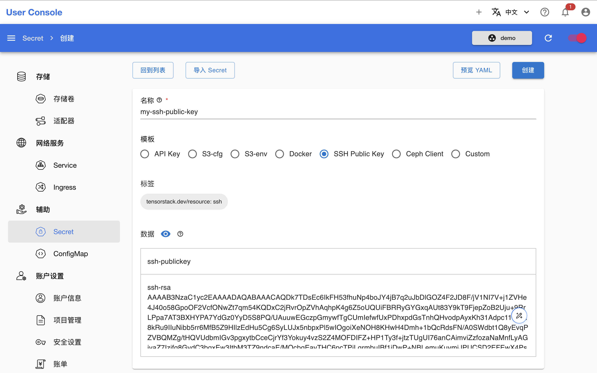

# SSH 场景

当用户需要在本地通过 SSH 远程连接 App 时，可以创建 SSH Public Key 类型的 Secret 存储本地系统的 SSH 公钥，并将其提供给启用 SSH 服务的 App（如 JupyterLab 和 RStudio），从而实现在本地远程连接和操作这些 App。

## 创建 Secret

在 Secret 创建页面，填写名称，选择**模板** `SSH Public Key`，填写公钥文本，然后点击**创建**：

<figure class="screenshot">
  
</figure>

<aside class="note info">

信息

如果你不知道如何生成密钥对，或者不知道从哪里获取公钥，请参阅：

* <a target="_blank" rel="noopener noreferrer" href="https://www.ssh.com/academy/ssh/keygen">How to Use ssh-keygen to Generate a New SSH Key?</a>
* <a target="_blank" rel="noopener noreferrer" href="https://learn.microsoft.com/zh-cn/windows-server/administration/openssh/openssh_keymanagement#user-key-generation">用户密钥生成</a>（对于 Windows 用户）

</aside>

## 使用 Secret

下列文档提供了一些使用此类型的 Secret 配置 App 并远程连接的具体案例，供用户参考：

* [如何通过 SSH 远程连接](../../reference/faq/faq-in-ide-usage.md#如何通过-ssh-远程连接)
