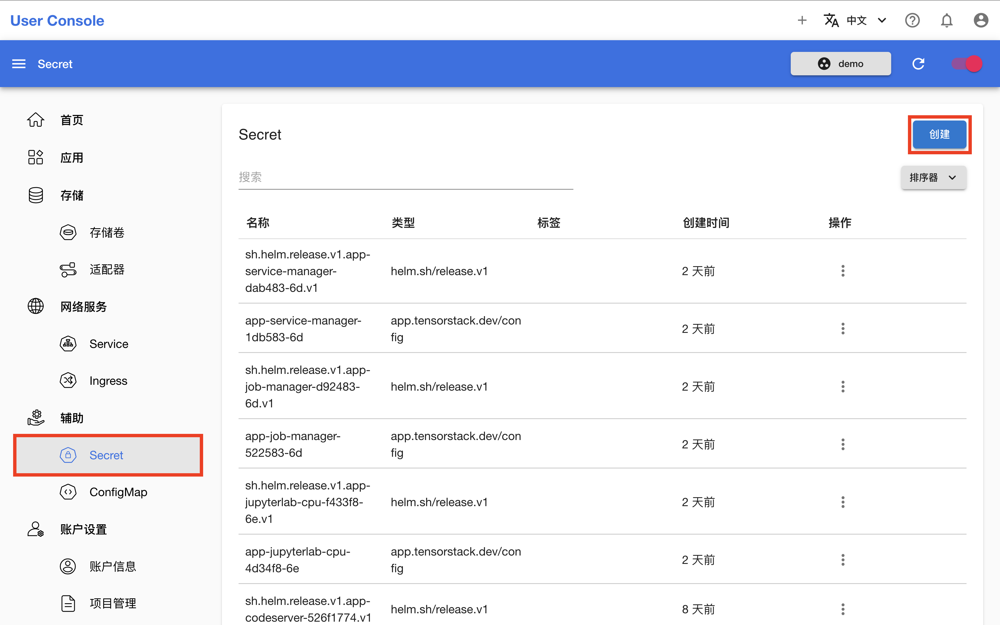
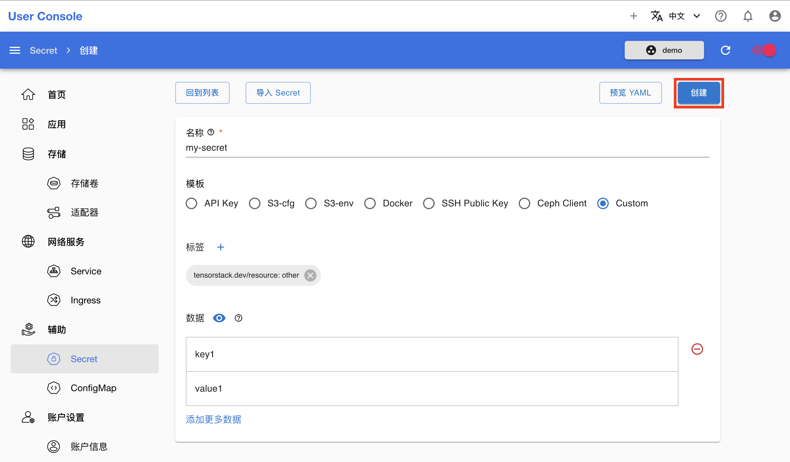
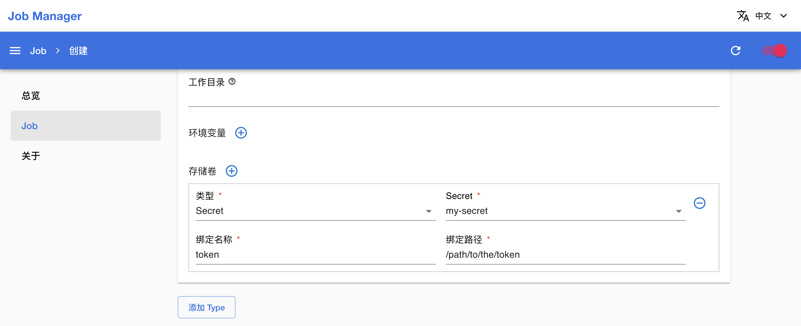
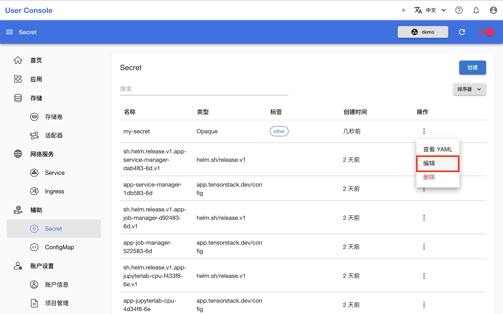
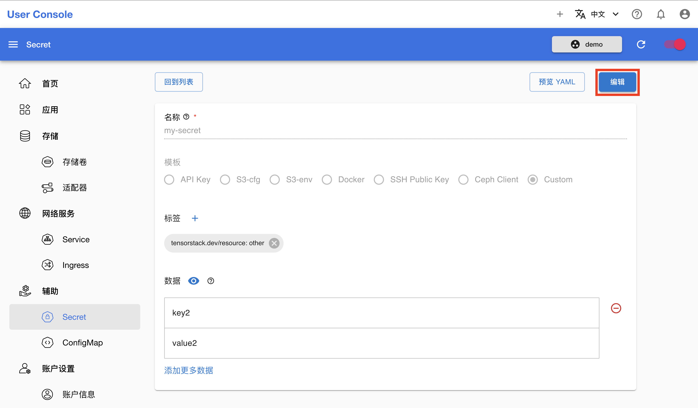
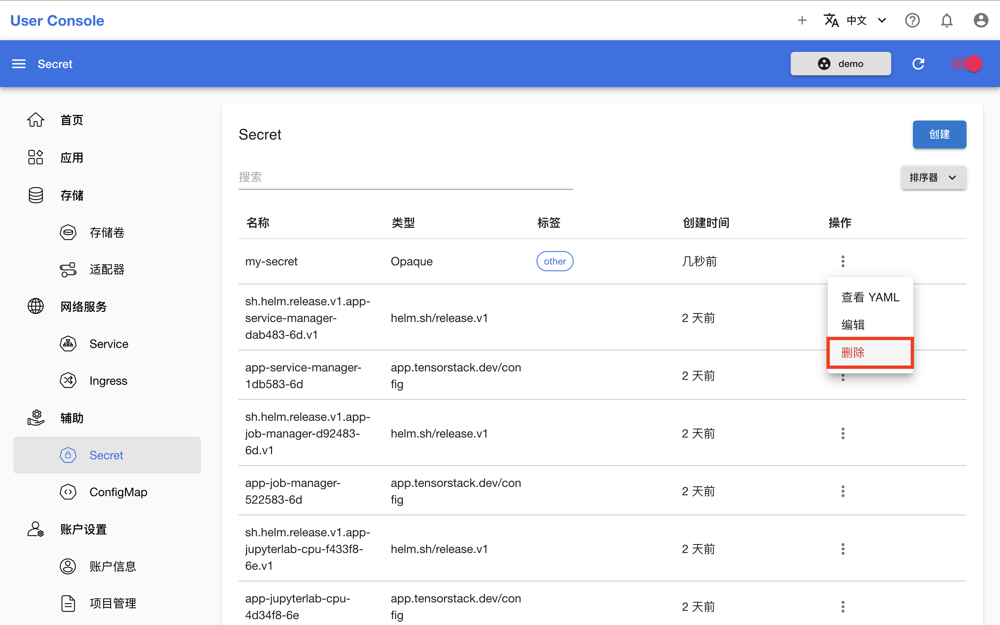

# 管理 Secret

本教程演示创建、查看、修改和删除 [Secret](../../api/auxiliary/secret.md)。

## 准备工作

* 了解 Secret 的<a target="_blank" rel="noopener noreferrer" href="https://kubernetes.io/zh/docs/concepts/configuration/secret/">概念</a>和 <a target="_blank" rel="noopener noreferrer" href="https://kubernetes.io/docs/reference/kubernetes-api/config-and-storage-resources/secret-v1/">Kubernetes API</a>。

## 创建 Secret

在左侧导航菜单点击**辅助 > Secret** 进入 Secret 管理页面，这里展示了所有存在的 Secret。点击右上角的**创建**进入创建页面：

<figure class="screenshot">
  
</figure>

在 Secret 创建页面，填写名称和要存储的数据，然后点击**创建**：

<figure class="screenshot">
  
</figure>

<aside class="note info">
<div class="title">Secret 类型模板</div>

Secret 创建页面为每个[类型](../../api/auxiliary/secret.md#secret-类型)提供单独的模板，请根据 UI 和文本提示提供相应的数据。其中自定义（Custom）模板是一个通用的模板，其支持扩展以适应各种需求。

</aside>

<aside class="note tip">
<div class="title">提示</div>

你可以点击左上角的**导入 Secret** 以加载当前存在的某个 Secret 的配置。

</aside>

## 使用 Secret

Secret 通过两种方式在 Pod 中使用：文件系统挂载和环境变量注入。具体来说，Secret 可以作为卷挂载到容器的指定路径。例如在 Job 创建页面，你可以添加存储卷并选择 Secret 类型：

<figure class="screenshot">
  
</figure>

这样配置的效果是，Secret 作为卷挂载到指定目录，Secret 的每个数据条目都会作为该目录下的一个文本文件，键为文件名，值为文件内容。

Secret 数据也可以直接配置为容器的环境变量。例如对于 DataCube 的 YAML 配置，设置[源存储服务](../../api/datacube.md#设置源存储服务)和[目标存储服务](../../api/datacube.md#设置目标存储服务)都是通过引用 Secret 的数据条目来提供凭据（以 Hugging Face 类型为例）：

```yaml
spec:
  source:
    type: huggingface
    options:
    - name: token
      valueFrom:
        secretKeyRef:
          name: hf
          key: token
```

这样的 DataCube 所创建的 Pod 就会将该数据条目赋值给环境变量 `TOKEN`：

```yaml
spec:
  containers:
    env:
    - name: TOKEN
      valueFrom:
        secretKeyRef:
          name: hf
          key: token
```

对于 App（如 [Tensorboard](https://github.com/t9k/apps/blob/master/user-console/tensorboard/chart/README.md)）和部分 API（如 [StorageShim](../../api/datacube.md)），你只需要参照配置或 YAML 配置的说明，在指定字段提供满足要求的 Secret 的名称即可，App 或 API 会处理好内部的配置。

下列文档提供了一些使用 Secret 的具体场景：

* [SSH 场景](./secret-ssh.md)
* [S3 场景](./secret-s3.md)

## 查看和编辑 Secret

在 Secret 管理页面，点击 Secret 右侧的 <span class="twemoji"><svg xmlns="http://www.w3.org/2000/svg" viewBox="0 0 24 24"><path d="M12 16a2 2 0 0 1 2 2 2 2 0 0 1-2 2 2 2 0 0 1-2-2 2 2 0 0 1 2-2m0-6a2 2 0 0 1 2 2 2 2 0 0 1-2 2 2 2 0 0 1-2-2 2 2 0 0 1 2-2m0-6a2 2 0 0 1 2 2 2 2 0 0 1-2 2 2 2 0 0 1-2-2 2 2 0 0 1 2-2Z"></path></svg></span> **> 编辑**进入编辑页面：

<figure class="screenshot">
  
</figure>

在 Secret 编辑页面可以查看和修改数据（但是不能重命名 Secret），修改完成后点击**编辑**以保存：

<figure class="screenshot">
  
</figure>

## 删除 Secret

在 Secret 管理页面，点击 Secret 右侧的 <span class="twemoji"><svg xmlns="http://www.w3.org/2000/svg" viewBox="0 0 24 24"><path d="M12 16a2 2 0 0 1 2 2 2 2 0 0 1-2 2 2 2 0 0 1-2-2 2 2 0 0 1 2-2m0-6a2 2 0 0 1 2 2 2 2 0 0 1-2 2 2 2 0 0 1-2-2 2 2 0 0 1 2-2m0-6a2 2 0 0 1 2 2 2 2 0 0 1-2 2 2 2 0 0 1-2-2 2 2 0 0 1 2-2Z"></path></svg></span> **> 删除**，确认以删除 Secret：

<figure class="screenshot">
    
</figure>

<aside class="note tip">
<div class="title">提示</div>

许多 Apps 和 APIs 会自动创建所需的 Secret，例如上图中的 Secret sh.helm.release.v1.app-service-manager-dab483-6d.v1	 和 app-service-manager-1db583-6d 就是由 Service Manager App 自动创建。这种 Secret 的生命周期由创建它的 App 或 API 管理，也就是说，删除创建它的 App 或 API，它也会被随之删除，因此你无需管理这种 Secret。

</aside>
