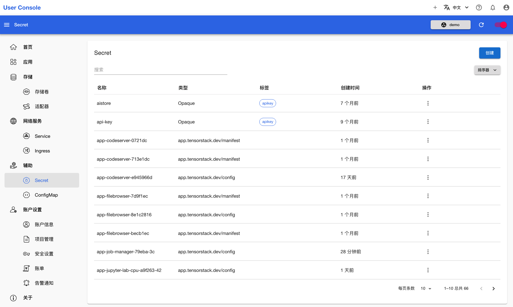
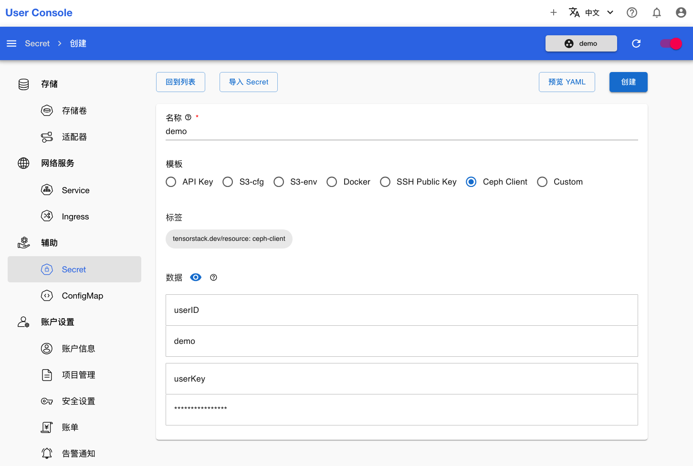
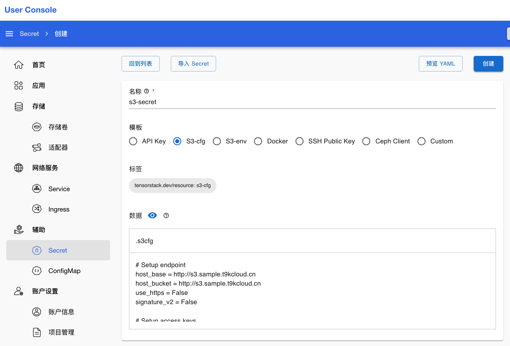

# 创建 Secret

<a target="_blank" rel="noopener noreferrer" href="https://t9k.github.io/user-manuals/latest/modules/auxiliary/secret.html">Secret</a> 是一种 Kubernetes 原生资源，用于存储少量敏感信息，比如密码、OAuth 令牌、SSH 密钥等。使用 Secret 可以避免将敏感数据直接写入到 Pod 的定义中或者应用程序代码里，从而提高了安全性。

## Ceph Client 类型

本章演示创建一个 Ceph 客户端的 Secret。在开始之前，你需要从管理员处获取 Ceph Client 的 userID 和 userKey。

点击**辅助 > Secret**，查看已有的 Secret：

<figure class="screenshot">
  
</figure>

点击右上角的创建，进入创建页面，并选择模板为 **Ceph Client**：

<figure class="screenshot">
  
</figure>

填写名称、userID 和 userKey，点击创建即可完成 Secret 的创建：

<figure class="screenshot">
  
</figure>

## S3-cfg 类型

本章演示创建一个 S3-cfg 类型的 Secret。在开始之前，你需要获取可用的 S3 配置文件，其来源可以是集群管理员或第三方的 S3 服务供应商。

点击**辅助 > Secret**，然后点击右上角的创建，进入创建页面，并选择模板为 **S3-cfg**：

<figure class="screenshot">
  
</figure>

首先修改资源的“名称”，然后查看“数据 > .s3cfg” 中的内容。这里已经提前写好了一个 S3 配置文件的模板，在此基础上修改 `host_base`，`host_bucket`，`access_key`，`secret_key` 四个字段的值，或者直接使用 S3 配置文件覆盖其中所有内容：

<figure class="screenshot">
  
</figure>

点击右上角的创建即可完成 Secret 的创建。
